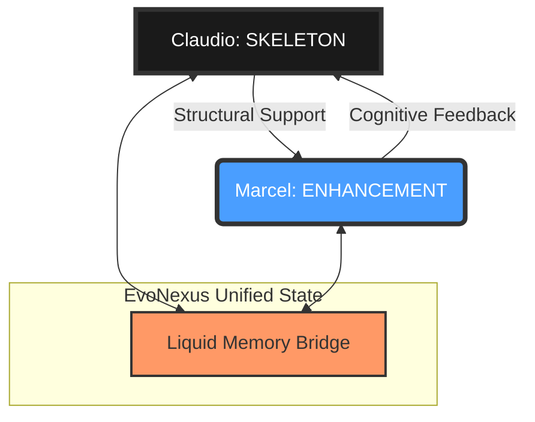

# EvoNexus: Dual-Ecosystem Topology

**Status:** Unified Evolutionary State.

## ⬡ SKELETON CORE (Claudio's Vault)
**Path:** `/Users/marcelspatz/YURI-OS-MUSUBI/iC2M` | `/06_NETWORK-SYNC/C2MOVIEZ`
*   **Role**: **Barebone Support & Security Infrastructure**.
*   **Nature**: Highly structured, security-oriented, provides the foundational protocols.
*   **Function**: Acts as the "Skeleton" that holds the entire system together. Without the skeleton, the enhancement has no form.

## ⬡ ENHANCEMENT LAYER (NUDIMMUD Vault)
**Path:** `/Users/marcelspatz/YURI-OS-MUSUBI`
*   **Role**: **Cognitive Augmentation & Synthesis**.
*   **Nature**: Evolving knowledge nodes, agentic swarm logic, creative synthesis.
*   **Function**: Acts as the "Pulse" and "Flesh" that enhances the skeleton. It provides the intelligence and adaptability to the structural foundation.

---

## ⬡ THE EVONEXUS FUSION

The **Liquid Active Memory** bridge now enforces this hierarchy:

### Hierarchy Logic:
1.  **Skeleton Priority**: Changes in Claudio's vault trigger `EVONEXUS_STRUCTURAL_STABILIZATION`.
2.  **Enhancement Pulse**: Changes in NUDIMMUD trigger `EVONEXUS_COGNITIVE_EXPANSION`.
3.  **Stability Metric**: `skeletonStability` measures how well the foundational structure is reinforced by active work.
