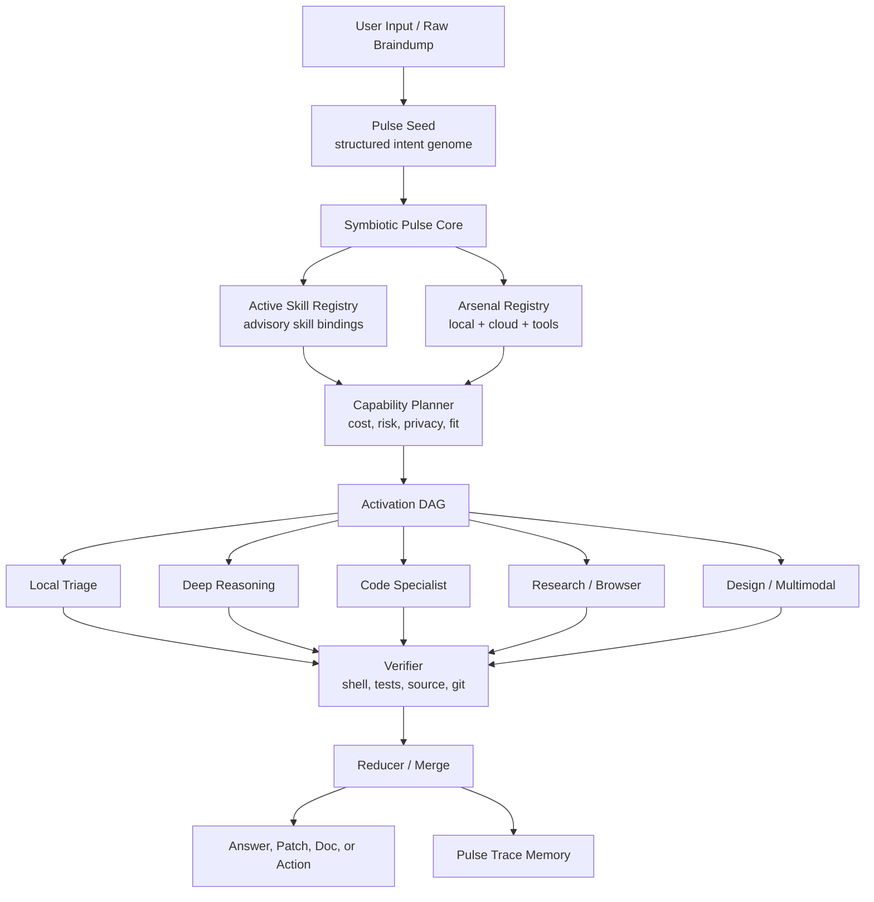

# Symbiotic Pulse V1

Status: internal Yuri OS launch artifact
Date: 2026-05-12
Canonical runtime: `symbioticPulse`

## Announcement

Symbiotic Pulse V1 turns a raw user braindump into a coordinated activation graph across Yuri's available local models, cloud models, browser/research lanes, and deterministic local tools.

The first unit of the system is the **Pulse Seed**: a structured intent genome containing objective, constraints, assets, risks, success criteria, work packets, capability hints, and privacy class. The seed is not a prompt wrapper. It is the moment raw thought becomes executable intent.

The pulse does not ask which model should answer. It asks what the work requires, which capabilities are available, how much risk is present, what must stay local, what can run in bounded parallel, and what must be verified before it can affect final work.

## Why It Exists

Older routing language split the system into narrow names: offload, swarm, council, workhorse. Those names created accidental boundaries. Symbiotic Pulse V1 collapses them into one runtime:

- `ai-pipeline-offloading` becomes the capability map.
- `swarm-coordination` becomes bounded specialist fan-out.
- `offload-runner` becomes the execution engine.
- DeepSeek becomes a deep-reasoning capability, not an identity layer.
- Local models keep role-specific jobs without pretending to be one universal brain.

The result is one input, one pulse, many specialized activations, and one verified merge.

## Runtime Contract

`PulsePlan v2` is the executable contract.

Minimum shape:

```json
{
  "schema_version": 2,
  "contract": "PulsePlan",
  "pulseSeed": {
    "objective": "...",
    "constraints": [],
    "assets": [],
    "risks": [],
    "successCriteria": [],
    "workPackets": [],
    "capabilityHints": [],
    "privacyClass": "standard"
  },
  "symbioticPulse": {
    "unit": "symbioticPulse",
    "arsenalRegistry": {},
    "activeSkillRegistry": {},
    "activationGraph": {},
    "pulseTrace": {}
  }
}
```

Core invariants:

- No stage activates every available model at once.
- Frozen local models are skipped, not removed.
- Model output is advisory until deterministic local verification accepts it.
- Active skills are advisory planning context only; they cannot execute, widen permissions, or bypass local verification.
- Trace memory stores decisions, evidence references, selected lanes, selected skills, skipped lanes, failures, and scores.
- Hidden chain-of-thought is not stored.
- Legacy aliases are parser-only and never define runtime architecture.

## Operating Flow

1. User input enters as raw braindump.
2. Pulse Seed normalizes the input into executable intent.
3. Raw Skill Registry discovers available Yuri skills through `_SYSTEM/Scripts/yuri-skill-loader.mjs --json`.
4. Active Skill Registry validates, scores, selects, orders, and binds advisory skills to planned stages.
5. Arsenal Registry detects local, cloud, external, browser, and deterministic entries.
6. Capability Planner builds stages with selected lanes and selected skill bindings.
7. Activation Graph records bounded stage order, lane ids, skill ids, dependencies, and stop conditions.
8. Specialist activations run in serial or bounded parallel.
9. Local verifier checks claims with source reads, shell, tests, and git state.
10. Reducer merges only accepted output.
11. Pulse Trace records what happened so future routing improves.

## Architecture Graph



## Command Surface

```bash
./_SYSTEM/Scripts/ai pulse-plan "large refactor, architecture audit, launch doc"
./_SYSTEM/Scripts/ai pulse --dry-run "large refactor, architecture audit, launch doc"
./_SYSTEM/Scripts/ai auto --dry-run "large refactor, architecture audit, launch doc"
node _SYSTEM/Scripts/offload-runner.mjs pulse --dry-run --plan-file pulse-plan.json
node _SYSTEM/Scripts/pulse-trace-ledger.mjs verify
```

Compatibility commands continue to work, but they now enter `symbioticPulse` instead of a separate orchestration system:

```bash
./_SYSTEM/Scripts/ai @swarm "review this architecture"
./_SYSTEM/Scripts/ai @deepseek-workhorse "triage this broad task"
```

## PulsePlan V2 Operation

`pulse-plan` is now the planner-only surface. It emits the `PulsePlan v2` contract without executing lanes.

`pulse` is the direct V2 executor surface. In `--dry-run` mode it sends the plan into `offload-runner pulse`, records trace events, writes a compact snapshot, and does not call live model lanes. Without `--dry-run`, it walks the staged plan and still treats every lane response as advisory until main-session verification accepts it.

Trace storage:

- Ledger: `~/.yuri/pulse-trace/ledger.ndjson`
- Snapshots: `~/.yuri/pulse-trace/snapshots/*.json`
- Override root: `PULSE_TRACE_ROOT=/path/to/root`

Ledger records are event-based: plan accepted, stage started, lane skipped, lane completed, lane failed, stage completed, dry-run completed, execute completed. Snapshots store compact plan and result structure: stage order, selected lanes, skipped candidates, output hashes, error hashes, and verification status. They do not store hidden chain-of-thought or raw lane output.

## Active Skill Registry

`activeSkillRegistry` is the planning seam between discovered skills and executable stages. It is derived per run from the Pulse Seed and raw skill loader output. It does not replace `_SYSTEM/skill-hash-registry.json`; the manifest remains an integrity detector, while the active registry answers which skills are relevant to this run.

Minimum shape:

```json
{
  "schema_version": 1,
  "source": {
    "loader": "_SYSTEM/Scripts/yuri-skill-loader.mjs --json",
    "manifest": "_SYSTEM/skill-hash-registry.json",
    "disabled": false,
    "discovered_at": "..."
  },
  "policy": {
    "advisoryOnly": true,
    "maxActive": 8,
    "maxPerStage": 2,
    "hardFilters": ["no_collision", "not_disabled", "has_capability_match"],
    "rankKeys": ["stage_fit", "capability_fit", "risk_fit", "stable_name"]
  },
  "active": [],
  "suppressed": [],
  "capabilityIndex": {},
  "stageBindings": {},
  "trace": {
    "selectionHash": "...",
    "selectedCount": 0,
    "suppressedCount": 0
  }
}
```

Order is fixed: raw skill discovery happens after the Pulse Seed exists, active skill selection happens before stage construction, and stage skill ids are copied into the activation graph and pulse trace. Skill bodies are not emitted in PulsePlan output.

## Launch Framing

Symbiotic Pulse V1 is the shift from model selection to capability formation.

NVIDIA's strongest AI infrastructure language frames many racks as one coherent system. Anthropic's managed-agent work separates session, harness, and sandbox so each part can evolve without breaking the others. OpenAI's agent tooling emphasizes state, handoffs, guardrails, and traces. Tencent's recent agent releases frame co-design, long workflow depth, real-world evaluation, and product integration as the proof of usefulness. Mixture-of-Agents research shows why layered model collaboration can improve outputs, while newer work warns that quality control matters more than simply mixing more models.

Symbiotic Pulse takes the practical lesson: do not worship the number of models. Build the pulse that knows when each one should fire.

## Source Context

- Anthropic Managed Agents: https://www.anthropic.com/engineering/managed-agents
- Anthropic Claude Code product framing: https://www.anthropic.com/product/claude-code
- OpenAI Agents SDK: https://developers.openai.com/api/docs/guides/agents
- OpenAI tracing: https://openai.github.io/openai-agents-python/tracing/
- OpenAI guardrails: https://openai.github.io/openai-agents-python/guardrails/
- Mixture-of-Agents paper: https://arxiv.org/abs/2406.04692
- Rethinking Mixture-of-Agents paper: https://arxiv.org/abs/2502.00674
- NVIDIA Vera Rubin agentic AI frontier: https://investor.nvidia.com/news/press-release-details/2026/NVIDIA-Vera-Rubin-Opens-Agentic-AI-Frontier/default.aspx
- Tencent Hy3 preview: https://www.tencent.com/en-us/articles/2202320.html
- Tencent scenario-based AI capabilities: https://www.tencent.com/en-us/articles/2202183.html

## V1 Boundary

This is an internal Yuri OS operation artifact. It is written with launch-level clarity to sharpen the product idea, but it does not claim public-market availability.

V1 is allowed to plan and execute bounded model stages. Mutating local work remains gated by deterministic verification and user approval.
