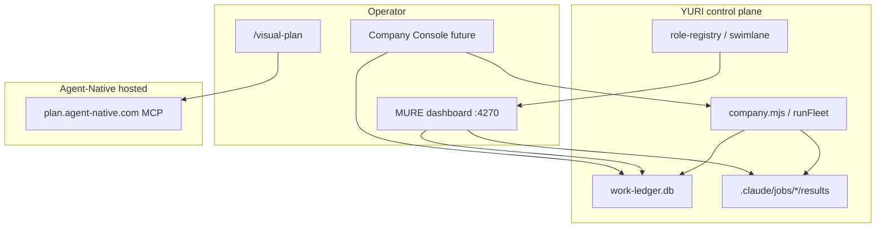

# Agent-Native Integration — YURI Company Visual Control

**Date:** 2026-06-29  
**Source:** [BuilderIO/agent-native](https://github.com/BuilderIO/agent-native) (trusted vendor; local checkout at `integrations/agent-native/`, gitignored)  
**Status:** Phase 1 installed — Plans skill + hosted MCP registered for Cursor/Claude

---

## Why this fits YURI

Agent-Native's core thesis matches MURE: **agents and UI share one SQL-backed state, one action layer, one observability surface**. YURI already has:

| YURI surface | Role today |
| --- | --- |
| `_SYSTEM/mure/dashboard.html` + `work-dashboard.mjs` | Realtime company overview (runs, job pool, doctrine axes, role constellation) |
| `_SYSTEM/mure/role-swimlane.mjs` | Static MURE org/swimlane HTML |
| `_SYSTEM/mure/company.mjs` | 20-role fleet orchestration (DISARMED-first) |
| `.claude/jobs/<runId>/results/*.json` | Blackboard artifacts per run |
| `_SYSTEM/src/` BrainBoard | Trading observatory (pattern for rich live boards) |

Agent-Native adds **reviewable visual plans**, **dispatch-grade control UI**, **analytics dashboards**, and **design/prototype surfaces** — the missing layer for *direct* operator control over what agents are doing.

---

## Install state (2026-06-29)

```bash
# Local reference clone (shallow, ~8k files — never commit)
git clone --depth 1 https://github.com/BuilderIO/agent-native integrations/agent-native

# Skill + MCP (ran successfully)
npx @agent-native/core@latest skills add visual-plan --no-connect
```

**Registered:**

- Skill: `.claude/skills/visual-plan/` (updated from upstream)
- MCP URL: `https://plan.agent-native.com/_agent-native/mcp` (Cursor, Claude Code, OpenCode, GitHub Copilot)
- Slash commands: `/visual-plan`, `/visual-recap`

**Owner step — authenticate hosted Plans (optional, for shareable review links):**

```bash
npx @agent-native/core@latest connect https://plan.agent-native.com --client all --scope user
```

Reload Cursor → MCP → Authenticate on the `plan` server.

**Bootstrap helper:**

```bash
node _SYSTEM/Scripts/agent-native-bootstrap.mjs install-skills
node _SYSTEM/Scripts/agent-native-bootstrap.mjs clone
node _SYSTEM/Scripts/agent-native-bootstrap.mjs status
```

---

## BuilderIO repo triage (useful for YURI)

| Repo | Stars | YURI fit | Notes |
| --- | ---: | --- | --- |
| [agent-native](https://github.com/BuilderIO/agent-native) | 3013 | **Primary** | Framework: actions, dispatch, plans, analytics, design |
| [skills](https://github.com/BuilderIO/skills) | 2880 | High | App-backed skills catalog; visual-plan source |
| [micro-agent](https://github.com/BuilderIO/micro-agent) | 4314 | Medium | Lightweight code-writing agent; could sidecar narrow tasks |
| [ai-shell](https://github.com/BuilderIO/ai-shell) | 5269 | Medium | NL→shell; overlaps YURI llm-compat lanes |
| [builder](https://github.com/BuilderIO/builder) | 8743 | Low–Med | Visual React CMS; less direct for fleet control |
| [figma-html](https://github.com/BuilderIO/figma-html) | 3635 | Med | Design import; useful with Design template |
| [gpt-crawler](https://github.com/BuilderIO/gpt-crawler) | 22254 | Low | Site crawl for knowledge; YURI has curated-research pipeline |

**Skip for company control:** mitosis, shopify starters, framework-benchmarks, blog examples.

---

## Agent-Native templates → YURI mapping

| Template | What it is | YURI integration target |
| --- | --- | --- |
| **Plans** | `/visual-plan`, `/visual-recap`, diagrams, wireframes | Helmsman/envoy phase planning; MURE run packets before dispatch |
| **Dispatch** | Full ops console: agents, approvals, audit, metrics, chat, apps | **Target command center** — maps to MURE blackboard + job pool + owner-gated actions |
| **Analytics** | Prompt-built dashboards over SQL sources | Fleet router ledger, token-ledger, work-ledger trends |
| **Design** | Branded HTML prototypes | Company UI surfaces, dashboard redesign |
| **Clips** | Screen record + transcript + agent debug | Incident replay for failed MURE runs |
| **Content** | MDX editor + agent blocks | Public research / guide authoring |
| **Slides** | React presentations | Stakeholder recaps, release briefings |

Reference paths in local clone:

- `integrations/agent-native/templates/dispatch/` — routes: `overview`, `agents`, `approvals`, `audit`, `metrics`, `chat`, `team`, `apps`
- `integrations/agent-native/templates/analytics/` — chart/dashboard actions
- `integrations/agent-native/templates/plan/` — hosted + local plan serve/check

---

## Recommended rollout (visual company control)

### Phase 1 — Now (done)

- [x] Clone agent-native locally
- [x] Install `visual-plan` skill + register Plan MCP
- [x] Document mapping (this file + user guide)

**Use immediately:** Before large MURE runs or UI work, invoke `/visual-plan` with the task packet. After land, `/visual-recap` on the diff.

### Phase 2 — MURE dashboard upgrade (1–2 sessions)

Extend existing `work-dashboard.mjs` API (no new framework yet):

- Add `/api/run/:id` drill-down → blackboard JSON from `.claude/jobs/`
- Embed agent-native-style approval queue stub (owner-gated roles from roster)
- Link out to hosted visual plans when a run has an associated plan slug

Existing starter:

```bash
node _SYSTEM/Scripts/work-dashboard.mjs --serve
# → http://localhost:4270
```

### Phase 3 — Dispatch fork as YURI Company Console (multi-session)

Scaffold from `templates/dispatch` **headless-first**, wire actions to:

- `work-ledger.mjs` / `job-pool.mjs` (read)
- `runFleet.mjs` / `mure.mjs` (DISARMED dry-run default; live dispatch owner-gated)
- `fleet-router-mlp.mjs` (advisory route metadata)

Keep YURI governance: no live dispatch without explicit arm + keys.

### Phase 4 — Analytics layer

Port Analytics template patterns to ingest:

- `_SYSTEM/state/fleet-router-ledger.json` (or SQLite ledger)
- `token-ledger.mjs` output
- MURE role productivity from `work-ledger.mjs`

Charts: throughput, convergence, lane cost, router confidence.

### Phase 5 — Design + Clips

- **Design template** for prototyping new dashboard panels before `_SYSTEM/mure/dashboard.html` edits
- **Clips** for recording operator sessions when debugging agent failures

---

## Architecture sketch



---

## Governance constraints

- `integrations/` is **gitignored** — vendor checkout stays local; docs live in `_SYSTEM/reports/` and `02_RESOURCES/GUIDES/`
- Hosted Plan MCP is **read/write to plan artifacts**, not YURI repo — safe for review; do not paste secrets into plans
- Dispatch live actions must respect DISARMED default and owner-gated roster entries
- Do not commit `.env`, API keys, or blackboard paths with PII into agent-native apps

---

## Next actions (owner)

1. Authenticate Plan MCP if shareable review links are wanted
2. Run `/visual-plan` on the next multi-role MURE packet (e.g. public-release follow-ups)
3. Choose Phase 2 vs Phase 3 priority: **dashboard drill-down** (quick) vs **Dispatch fork** (bigger visual control payoff)
4. Optional: `node _SYSTEM/Scripts/agent-native-bootstrap.mjs clone` on fresh machines

---

## Residual risk

- Local clone CLI requires `pnpm install && pnpm build` in monorepo before `agent-native` bin works offline; prefer `npx @agent-native/core@latest` for skills
- Hosted Plans need account auth for commenting; local plan mode (`plan local serve`) works without auth
- Dispatch template is a full SaaS app — fork scope must stay bounded to YURI actions, not a second product
