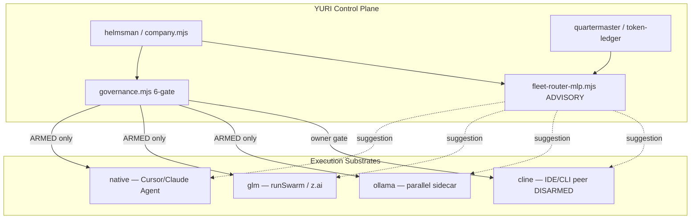

# Cline Pass Integration — YURI MURE / MLP Fleet

**Date:** 2026-06-29  
**Owner:** Marcel (active ClinePass — 0.5 credits, renews 2026-07-29)  
**Authority:** Advisory research + minimal metadata wiring (DISARMED)  
**RESULT_LABEL:** `CLINE_PASS_INTEGRATION_X_PASS_COMMITTED`

---

## Executive summary

ClinePass is a **flat $9.99/month subscription provider** inside the Cline IDE/CLI ecosystem — separate from Cline usage-billing (pay-as-you-go OAuth). It bundles curated open coding models with **2–5× API rate limits** vs standard access, measured on rolling 5-hour, weekly, and monthly windows.

For YURI, Cline fits as a **fourth advisory execution substrate** — an IDE/CLI peer lane alongside native (Cursor/Claude Agent), GLM (z.ai via runSwarm), and Ollama Cloud (parallel sidecar). It is **not** a drop-in replacement for `llm-lane.mjs` today; wiring should follow the same pattern as ollama sidecar: metadata first, owner-gated live dispatch, quartermaster credit budget.

**Recommended posture:** DISARMED metadata + task packet (Phase 4+). No live Cline spend until owner documents credit budget and runs `cline auth`.

---

## What ClinePass gives

| Dimension | ClinePass | Cline (usage-billing) | Cursor native | z.ai GLM (YURI glm lane) |
|-----------|-----------|----------------------|---------------|--------------------------|
| **Billing** | Flat $9.99/mo | Pay-as-you-go credits | Cursor subscription | Z.ai Coding Plan |
| **Auth** | OAuth via `cline auth` → provider `clinepass` | OAuth Google/GitHub/email | Cursor session | Keychain / env |
| **Install** | `npm i -g cline` | Same CLI | Cursor IDE | `llm-lane.mjs` / runSwarm |
| **Rate limits** | 2–5× vs standard API | Credit-based | Weekly pool (Anthropic) | Plan quotas |
| **Models** | Curated open coding set | Multi-provider | Opus/Sonnet/Haiku | glm-5.2, glm-4.7, etc. |
| **Tooling** | Full Cline agent (IDE + CLI, MCP, auto-approve) | Same | Cursor Agent tool | runSwarm leaves |
| **YURI control plane** | `.clinerules` + `.cline/rules/` (exists) | N/A | CLAUDE.md / Cursor rules | governance.mjs + 6-gate |

### Included models (ClinePass provider)

| Model | Model ID |
|-------|----------|
| GLM-5.2 | `glm-5.2` |
| Kimi K2.7 Code | `kimi-k2.7-code` |
| Kimi K2.6 | `kimi-k2.6` |
| DeepSeek V4 Pro | `deepseek-v4-pro` |
| DeepSeek V4 Flash | `deepseek-v4-flash` |
| MiMo-V2.5 | `mimo-v2.5` |
| MiMo-V2.5-Pro | `mimo-v2.5-pro` |
| MiniMax M3 | `minimax-m3` |
| Qwen3.7 Max | `qwen3.7-max` |
| Qwen3.7 Plus | `qwen3.7-plus` |

Reference per-1M-token prices appear in docs for quota understanding; ClinePass is flat-rate — usage counts against rolling windows, not per-call billing.

### CLI integration points

```bash
npm i -g cline          # global install (owner action — not run by build agent)
cline auth              # OAuth; select ClinePass provider
cline -P clinepass -m glm-5.2 "prompt"   # one-shot headless
cline --json --cwd /path/to/repo "task"  # JSON message stream for harness
cline config            # interactive settings
cline doctor            # diagnose auth/config
```

Key flags: `-P/--provider clinepass`, `-m/--model`, `-c/--cwd`, `--json`, `--auto-approve`, `--plan` (plan mode).

Docs: [ClinePass](https://docs.cline.bot/getting-started/clinepass) · [Authorization](https://docs.cline.bot/getting-started/authorizing-with-cline) · [CLI Reference](https://docs.cline.bot/cli/cli-reference)

---

## Existing YURI surfaces

| Surface | State |
|---------|-------|
| `.cline/rules/system-memory.md` | PUBLIC_CONTEXT tier map; Cline reads by exact path |
| `.cline/rules/closeout.md` | Closeout reference |
| `.cline/README.md` | Repo-local control folder doctrine |
| `_SYSTEM/yuri-origin.md` | Lists `.clinerules` as thin adapter |
| `_SYSTEM/yuri-content-governance.md` | `.cline/rules/` = operating reference |
| `_SYSTEM/mure/role-registry.mjs` | Substrates: `native`, `glm`, `either` — **no `cline` yet** |
| `_SYSTEM/Scripts/fleet-router-mlp.mjs` | Encodes `native|glm|ollama` in option vector — **no `cline` yet** |
| `_SYSTEM/Scripts/llm-lane.mjs` | deepseek / mimo / ollama-cloud / glm-* — **separate from Cline CLI** |
| `_SYSTEM/mure/company.mjs` | Tri-substrate plan + ollama sidecar metadata |

No `.clinerules` at repo root (rules live under `.cline/rules/`). No tracked Cline runtime state in repo (correct — secrets/state stay in `~/.cline`).

---

## Where Cline fits in MURE / MLP



### Integration options (minimal → full)

| Tier | Scope | Files | Posture |
|------|-------|-------|---------|
| **M0 — Metadata** | Document Cline as advisory substrate; task packet | `company.mjs` ADVISORY_SUBSTRATES, this report, WS-G task JSON | **Done (this session)** |
| **M1 — Quartermaster ledger** | Log ClinePass window usage from CLI `--json` output | `token-ledger.mjs`, quartermaster hooks | DISARMED read-only |
| **M2 — runFleet sidecar** | Generate `cline-tasks.json` like ollama sidecar; spawn via `cline --json` | `runFleet.mjs`, `cline-fleet.mjs`, `company.mjs`, `helmsman-run.mjs` | **Done (2026-06-29)** — DISARMED default; `--cline-sidecar`; `planCompany.clineSidecar`; tests 145/145; dry-run `cline-fleet.mjs` + `runFleet.mjs` on `mure-buildout-ws-b-fleet.json` emits `clineSidecar` |
| **M3 — llm-compat bridge** | Optional `cline-pass` lane in models.json if Cline exposes stable HTTP | `.claude/config/models.json`, `llm-lane.mjs` | Only if API contract stable |
| **M4 — MLP feature + roster** | Add `cline` substrate to role-registry; extend `encodeOption` | `role-registry.mjs`, `fleet-router-mlp.mjs`, `fleet-roles.json` | Advisory scoring |
| **M5 — MURE role assignment** | Cast engineer/mechanic/scout to Cline when quotaPressure high + bulk work | `company.mjs` planCompany | Owner-gated live dispatch |

**Recommendation:** M0–M2 shipped (metadata + sidecar wiring DISARMED); live arm ceremony (Phase 4+) before spend; defer M3 until Cline documents a headless API beyond CLI spawn.

---

## MLP router scoring (current vs proposed)

### Current (`fleet-router-mlp.mjs`)

- **Features:** complexity, blastRadius, capabilityMatch, quotaPressure, isBulkCensus, isNativeOnly, etc.
- **Candidates:** per-leaf `{ native, glm, ollama }` only
- **Bias:** high `quotaPressure` → favor ollama/flash; low pressure → slight glm-max boost
- **Authority:** advisory — governance + role-registry lane pins win

### Proposed Cline scoring (Phase 4+)

| Signal | Route toward Cline |
|--------|-------------------|
| `quotaPressure > 0.7` | Yes — flat sub vs GLM/z.ai marginal cost |
| `isBulkCensus === 1` (scout, artificer) | Yes — parallel Cline CLI workers |
| `isNativeOnly === 1` | No — keep Cursor Agent (MCP/browser) |
| `isHeavyReasoning === 1` (adjudicator, architect) | No — prefer native Opus or glm-max |
| Role `engineer` / `mechanic` + LOW blast | Yes — implementation tasks |
| Owner credit < 0.2 remaining | **HOLD** — quartermaster block |

Add 4th bit to `encodeOption`: `sub.includes('cline') ? 1 : 0`. Cold weights → deterministic fallback until ledger feedback.

### Overlap with existing lanes

| Model on ClinePass | Already on YURI lane | Notes |
|--------------------|---------------------|-------|
| glm-5.2 | z.ai `glm-5.2` via runSwarm | Duplicate path — ClinePass may win on rate limit when z.ai quota tight |
| mimo-v2.5 | `llm-lane.mjs mimo` | Different wire protocol; Cline wraps agent loop |
| deepseek-v4-* | `llm-lane.mjs deepseek` | Same consideration |
| kimi-k2.7-code | ollama-cloud `:cloud` variants | ClinePass = bundled rate limits |

**Quartermaster rule:** prefer z.ai GLM when Coding Plan healthy; route overflow to ClinePass when `quotaPressure` high and Cline credits available.

---

## Recommended rollout (Phase 4+)

| Phase | Action | Roles / tasks |
|-------|--------|---------------|
| **4a** | Owner: `npm i -g cline`, `cline auth`, select ClinePass | — |
| **4b** | Document credit budget in `_SYSTEM/reports/CLINE_CREDIT_BUDGET.md` (owner) | quartermaster |
| **4c** | Smoke: `cline -P clinepass -m glm-5.2 --cwd $REPO "echo RESULT_LABEL smoke"` | oracle |
| **4d** | Wire `cline-fleet.mjs --dry-run` sidecar in runFleet | mechanic |
| **4e** | MLP encodeOption + held register entry `cline-live-dispatch` | kernelsmith, steward |
| **5+** | Route scout/artificer bulk census to Cline when armed | scout, artificer |

### Tasks that should route to Cline (when armed)

- Bulk file census, grep-heavy audits (scout, artificer)
- Medium-blast implementation with repo-local edits (engineer, mechanic) — **if** owner enables `--auto-approve false` or review queue
- Overflow when GLM quota pressure high and Cline monthly window has headroom

### Tasks that should NOT route to Cline

- Owner-gated: helmsman finalize, steward gates, evolver, sentinel arm actions
- Native-only: MCP/browser/computer-use, Cursor-specific Agent tool flows
- Protected-path touches (backend/data, .env, .claude/state)
- Anything with secrets in prompts

---

## Governance

| Rule | Enforcement |
|------|-------------|
| **DISARMED default** | No `cline` spawn from runFleet/company until owner arm token |
| **Credit budget** | quartermaster reads owner doc; block live dispatch at <20% monthly window |
| **No secrets** | Sentinel pre-arm checklist; Cline tasks use path refs only |
| **Advisory MLP** | Cline suggestion never overrides governance.mjs |
| **Auth location** | OAuth tokens in `~/.cline/data/settings` — never commit; no `.env` reads |
| **Install** | `npm i -g cline` is owner-only; document in report, do not auto-install |

---

## Owner actions (next)

1. **Install CLI:** `npm i -g cline` (global; owner machine)
2. **Authenticate:** `cline auth` → select **ClinePass** provider
3. **Verify credits:** Cline settings or app.cline.bot dashboard (0.5 credits noted; monthly renew 2026-07-29)
4. **Smoke (manual):** `cline -P clinepass -m glm-5.2 -c /Users/marcelspatz/YURI-OS-MUSUBI "List 3 files in _SYSTEM/mure/; end with RESULT_LABEL CLINE_SMOKE_X_PASS_COMMITTED"`
5. **Credit budget doc:** create `_SYSTEM/reports/CLINE_CREDIT_BUDGET.md` with monthly ceiling + alert thresholds
6. **Approve WS-G task packet** when ready for M2 sidecar wiring

---

## References

- `_SYSTEM/mure/company.mjs` — `ADVISORY_SUBSTRATES.cline`
- `02_RESOURCES/TASKS/mure-buildout-ws-g-cline-pass.json`
- `_SYSTEM/reports/MURE_COMPANY_BUILD_04_ARM_CEREMONY.md`
- `.cline/rules/system-memory.md`
- `_SYSTEM/Scripts/fleet-router-mlp.mjs`
- `_SYSTEM/Scripts/llm-lane.mjs` (doc stub — Cline is CLI peer, not llm-compat lane yet)

---

*Produced DISARMED. No Cline CLI invoked; no npm global install; no live spend.*
