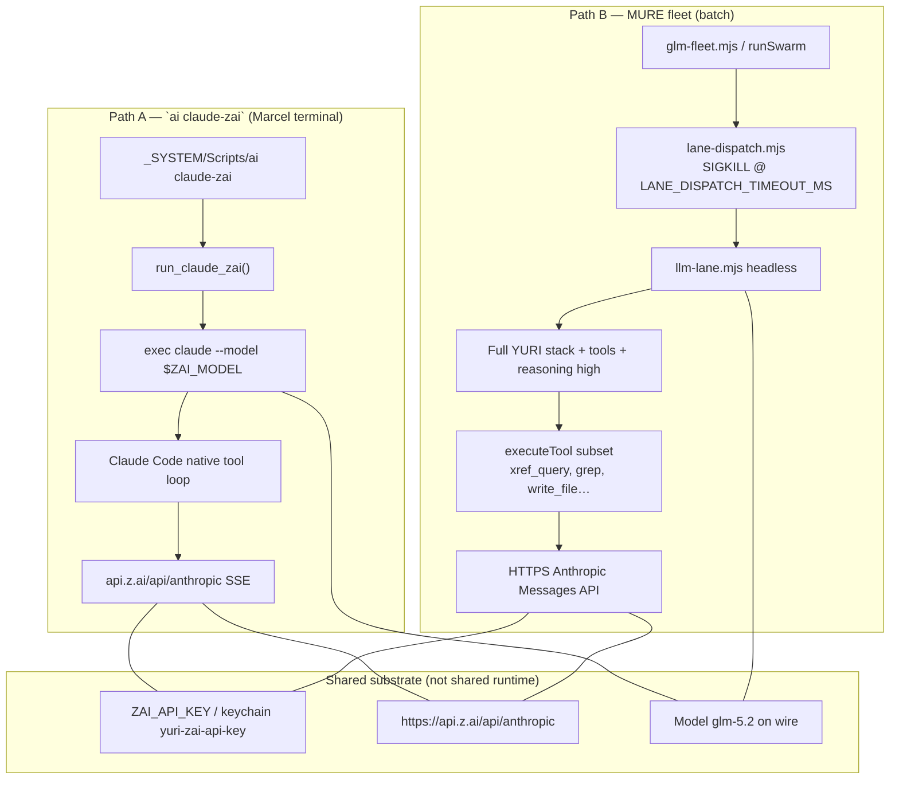

# GLM dispatch vs `ai claude-zai` — debug report

**Date:** 2026-06-30  
**Priority:** HIGH (MURE fleet WS-F / WS-C blocked)  
**Author:** Cursor debug pass (smoke-verified)

## Executive summary

`ai claude-zai` and MURE `glm-fleet → lane-dispatch → llm-lane` are **different wires**. Simple headless pings work on both; **fleet failures are not auth or model-alias bugs**. They are **timeout + workload-shape failures**: headless `glm-max` leaves run the full ~675-line YURI stack, `--reasoning high`, tools enabled, and open-ended MURE role prompts. They enter long tool loops (e.g. `xref_query`) and are **SIGKILL'd by `lane-dispatch` outer timeout** before `--out` is written. `exit_null` = child exit code `null` = **SIGKILL**, not an HTTP error.

**Top root cause:** Outer orchestration timeout (`LANE_DISPATCH_TIMEOUT_MS`) kills long headless tool loops; the working path is an interactive Claude Code session with a **50 min** API envelope and a different tool runtime.

**Recommended rework:** **Hybrid D** — keep headless `llm-lane` for cheap/no-tools bulk; route **glm-max orchestration leaves** through a **`zai-tmux` adapter** (`yuri-spawn-worker.sh` / `ai claude-zai`) with fleet-compatible result packets. Short-term mitigations from **A** unblock stubs while D is built.

---

## Architecture — side by side



---

## Exact divergence table

| Dimension | `ai claude-zai` | Fleet `glm-fleet → lane-dispatch → llm-lane` |
|-----------|-----------------|-----------------------------------------------|
| **Entry** | `_SYSTEM/Scripts/ai` → `run_claude_zai()` | `glm-fleet.mjs` → `spawn node lane-dispatch.mjs` → `spawn node llm-lane.mjs` |
| **Process** | Long-lived interactive PTY (`exec claude`) | Ephemeral headless Node child per attempt |
| **Model default** | `ZAI_MODEL` env, else **`glm-4.7`** in `run_claude_zai` | Alias `glm-max` → **`glm-5.2`** via `llm-lane.mjs` `ALIAS` + `models.json` |
| **Endpoint** | `ZAI_BASE_URL` → `https://api.z.ai/api/anthropic` | Same (`models.json` `glm-5.2.endpoint_default`) |
| **Auth** | `ANTHROPIC_AUTH_TOKEN` = keychain `yuri-zai-api-key` | `Authorization: Bearer` via `cfg.auth_header: bearer` + keychain hydrate in `llm-lane` |
| **API timeout** | `API_TIMEOUT_MS=${ZAI_TIMEOUT_MS:-3000000}` (**50 min**) | Per-request `req.setTimeout(0)` on HTTPS; **outer** `lane-dispatch` SIGKILL at **30 min** (`glm-max`) or **10 min** (`glm-turbo`) |
| **System prompt** | Claude Code session defaults + in-session context | **Full YURI stack** (~675 lines: origin, SOUL, nano-swarm-persona, INDEX) + OPERATING_DIRECTIVE |
| **Tools** | Full Claude Code tool surface | `llm-lane` subset: read/grep/search/**xref_query**/bash/write_file/edit_file/… |
| **Reasoning** | `--effort max` in CC | Fleet passes `--reasoning high` from `company.mjs` `buildLeaf` |
| **Concurrency** | One interactive session | `glm-fleet` semaphore default **3** parallel `lane-dispatch` children |
| **Success signal** | Human sees pane output | `--out` file must be non-empty; `lane-dispatch` treats empty as failure |
| **Retries** | User / session | `lane-dispatch`: 4 attempts default; **2** for `glm-max` (`glm-fleet` `LANE_DISPATCH_ATTEMPTS_HEAVY`) |
| **Cost pool** | N/A (CC billing) | `cost-reservation-pool.mjs` — **DISARMED** by default; not blocking |
| **Local concurrency** | N/A | `local-concurrency.mjs` — **only local lanes**; GLM cloud unaffected |

---

## What `exit_null` means

In `lane-dispatch.mjs` line 94:

```javascript
lastWhy = last.code !== 0 ? `exit_${last.code}` : ...
```

When `child.kill('SIGKILL')` fires at `LANE_DISPATCH_TIMEOUT_MS`, Node reports `code === null` → reason string **`exit_null`**.

This is **not** `llm-lane` returning exit 0 with empty stdout (that maps to `reason=empty`). It is **forcible process termination** before `llm-lane` finishes and writes `--out`.

---

## Failure artifact evidence

### `swarm-mr0ovkup-c9facd` (WS-F router, primary)

| Leaf | durationMs | Failure | Notes |
|------|------------|---------|-------|
| WS-F-R1-mlp-stub | 3,184,709 | `exit_null` ×2 @ 1,800,000 ms | `.out` shows `[tool] xref_query` then SIGKILL |
| WS-F-D1-deliberator-policy | 3,184,706 | same | No tool stderr in packet |

≈ **53 min wall** = 2 × 30 min attempts (matches `glm-fleet` `LANE_DISPATCH_ATTEMPTS_HEAVY=2`).

### `swarm-mr0lc4yx-736fc2`

Both leaves `exit_null` @ 1,800,000 ms; total ~3,600,817 ms.

### `swarm-mr0nqgvh-568153`

Empty results dir — parent killed ~30 min, round 0 only (per `MURE_PARTIAL_REAPPLY_2026-06-30.md`).

### WS-C partial (`glm-turbo`)

`exit_null` ×4 @ `timeoutMs=600000` (~40 min) — same SIGKILL class on faster tier.

---

## Smoke test results (2026-06-30 live)

| ID | Command | Exit | Duration | Output |
|----|---------|------|----------|--------|
| **A** | `node llm-lane.mjs glm-5.2 "Reply OK only" --no-tools --out /tmp/glm-smoke-a.json` | **0** | **4s** | `OK` |
| **B** | `node lane-dispatch.mjs glm-max "Reply OK only" --no-tools --out /tmp/glm-smoke-b.json` | **0** | **4s** | `OK` |
| **C** | `_SYSTEM/Scripts/ai llm glm-5.2 "Reply OK only" --no-tools --out /tmp/glm-smoke-c.json` | **0** | **8s** | `OK` |
| **D** | `lane-dispatch glm-max` + **tools**, medium reasoning, simple list-dir task | **0** | **16s** | Listed 2 `glm-*` scripts |
| **E** | `lane-dispatch glm-max` + **tools**, **full stack**, high reasoning, grep task, `TIMEOUT_MS=180000` | **fail** | **>180s** | `LANE_DISPATCH_RETRY 1/4 reason=exit_null` — killed before completion |

**Interpretation:** Auth, endpoint, and `glm-max` → `glm-5.2` mapping are **healthy**. Failure mode appears when **full YURI stack + high reasoning + tools** combine — first API turn alone can exceed practical outer timeouts on fleet-shaped work.

---

## Root causes (ranked)

| Rank | Cause | Confidence | Evidence |
|------|-------|------------|----------|
| **1** | **Outer SIGKILL timeout** (`exit_null`) before headless tool loop completes | **HIGH** | Artifacts: exact 1,800,000 ms / 600,000 ms budgets; `exit_null` not `empty` or `LLM_COMPAT_FAIL` |
| **2** | **Workload mismatch**: full stack + `--reasoning high` + open-ended MURE prompts → deep tool loops (`xref_query` ~4s/call, multi-turn) | **HIGH** | WS-F stub `.out` shows `xref_query`; smoke E fails with full stack |
| **3** | **Different runtime** — CC session vs headless `executeTool` batch; Marcel path not reproducible via fleet | **HIGH** | Architecture table; `ai claude-zai` never goes through `lane-dispatch` |
| **4** | **Timeout envelope gap** — CC `API_TIMEOUT_MS` 50 min vs fleet outer 30 min (`glm-max`) | **MEDIUM** | `run_claude_zai` vs `glm-fleet.mjs` `LANE_TIMEOUT_MS` |
| **5** | **Parallel glm-max fan-out** (concurrency 3) amplifies Z.ai latency / queueing | **MEDIUM** | Two leaves fail in parallel with identical ~30 min walls |
| **6** | **Only 2 heavy retries** for glm-max | **MEDIUM** | `LANE_DISPATCH_ATTEMPTS_HEAVY=2` — less recovery than default 4 |
| **7** | Wrong model default (`glm-4.7` vs `glm-5.2`) | **LOW / ruled out** | Fleet uses `glm-max`→`glm-5.2`; smokes pass; Marcel sets `ZAI_MODEL=glm-5.2` for CC |
| **8** | Auth / missing `ZAI_API_KEY` | **RULED OUT** | Smokes succeed without manual export (keychain hydrate) |
| **9** | Cost admission pool blocking | **RULED OUT** | DISARMED unless dual-armed + cap |

---

## Functional matrix

| Capability | `ai claude-zai` | Headless `llm-lane` no-tools | Headless `llm-lane` tools light | Fleet `glm-max` MURE leaf |
|------------|-----------------|------------------------------|----------------------------------|---------------------------|
| Z.ai API reachability | ✅ | ✅ | ✅ | ✅ (starts tools) |
| glm-5.2 model id | ✅ (if `ZAI_MODEL` set) | ✅ | ✅ | ✅ |
| Short Q&A | ✅ | ✅ | ✅ | N/A (not fleet-shaped) |
| Repo tools | ✅ (CC native) | — | ✅ ~16s | ❌ SIGKILL @ 30 min |
| Full YURI stack dispatch | ✅ (session) | — | — | ❌ |
| RESULT_LABEL packet | manual | ✅ if prompted | ✅ | ❌ (no `--out` in time) |
| MURE convergence | N/A | N/A | N/A | ❌ WS-F/WS-C RED |

---

## Rework options

### A) Fix headless `llm-lane` path (minimal)

- Align outer timeout with CC: `LANE_DISPATCH_TIMEOUT_MS` ≥ `ZAI_TIMEOUT_MS` (50 min) for `glm-max`.
- Fleet stubs: pass `--light`, cap `--max-iters` (e.g. 25), front-load `--context` instead of `xref_query` discovery.
- Serialize `glm-max` concurrency to **1** in `glm-fleet` for heavy tier.
- Restore 4 dispatch attempts for glm-max (revisit `LANE_DISPATCH_ATTEMPTS_HEAVY`).

**Pros:** Smallest diff. **Cons:** Still not parity with CC; full-stack first turn may remain slow.

### B) Route fleet GLM leaves through tmux `ai claude-zai` workers

- New `zai-tmux-fleet.mjs` (spec in `02_RESOURCES/TASKS/glm-dispatch-rework-ws-l.json` WS-L-R1/R2).
- Spawn via `yuri-spawn-worker.sh`; inject task with `tmux send-keys`; poll pane or results dir for `RESULT_LABEL`.
- Emit same packet schema as `glm-fleet.mjs` (`validatePacket` / `extractResultLabel`).

**Pros:** Uses Marcel's proven wire. **Cons:** Needs tmux + Terminal; harder to DISARM/dry-run; polling contract.

### C) Hybrid substrate routing

- Bulk census / stubs → `glm-turbo` or `ollama-flash` with `--no-tools` or `--light`.
- Heavy synthesis → **B** (tmux zai) or native Opus Agent specs.
- Drop `glm-max` from automated fleet for stub-class tasks in `company.mjs` router.

**Pros:** Cost-aware. **Cons:** Router complexity.

### D) Single dispatch adapter wrapping what Marcel uses (**recommended core**)

- `zai-session-dispatch.mjs`: one entry that chooses headless vs tmux-zai by task class (tools? stack? timeout budget?).
- `glm-fleet` calls adapter instead of `lane-dispatch` directly for `glm-max` / `glm-sub-orch`.
- Headless remains for `glm` / `glm-turbo` / `glm-flash` no-tools paths.

**Pros:** One owner-facing contract; incremental. **Cons:** Two implementations to maintain until headless catches up or is retired for heavy tier.

---

## Recommendation

**Primary: D + B**, with **A mitigations** for immediate MURE unblock:

1. **Now (A):** For WS-F/WS-C retries — `glm-turbo`/`glm-flash` stubs with `--light --max-iters 20`; single `glm-max` concurrency; bump outer timeout to 3,600,000 ms to match observed 53 min waste.
2. **Next (D/B):** Implement `zai-tmux-fleet.mjs`; wire `company.mjs` / `runFleet` so `glm-max` + `glm-sub-orch` use tmux adapter when `YURI_ZAI_TMUX_FLEET=1`.
3. **Verify (L3):** Measured bakeoff per `glm-dispatch-rework-ws-l.json` WS-L-V1.

**Do not** treat headless fleet as drop-in replacement for `ai claude-zai` until bakeoff proves parity on tool-heavy MURE leaves.

---

## Phased tasks (GLM lane)

| Phase | Task | Owner |
|-------|------|-------|
| L0 | This report + smoke matrix | ✅ Done |
| L1 | Spec + implement `zai-tmux-fleet.mjs` | WS-L-R1/R2 |
| L1 | Emergency A mitigations in `glm-fleet` / `company.mjs` | Optional quick patch |
| L2 | `substrate-pre-dispatch.mjs` scorer | WS-L-P0 |
| L3 | 10-prompt measured bakeoff | WS-L-V1 |

Task file: `02_RESOURCES/TASKS/glm-dispatch-rework-ws-l.json`

---

## Code anchors

| File | Role |
|------|------|
| `_SYSTEM/Scripts/ai` `run_claude_zai` | Interactive CC + Z.ai env |
| `_SYSTEM/Scripts/llm-lane.mjs` | Headless dispatch, GLM aliases, tools |
| `_SYSTEM/Scripts/lane-dispatch.mjs` | Retry wrapper; **`exit_null` = SIGKILL** |
| `_SYSTEM/Scripts/glm-fleet.mjs` | Parallel fan-out, tier timeouts, 2 heavy attempts |
| `_SYSTEM/mure/company.mjs` `buildLeaf` | `reasoning: high`, role prompts |
| `.claude/config/models.json` | `glm-5.2` lane config |
| `_SYSTEM/Scripts/voice/yuri-spawn-worker.sh` | Proven tmux + `ai claude-zai` spawn |

---

## Residual risk

- Increasing timeout alone may **increase spend** without guaranteeing convergence on open-ended prompts.
- tmux adapter needs robust **pane capture** and **liveness** (existing `yuri-spawn-worker.sh` self-heal).
- Z.ai plan concurrency limits under 3× parallel `glm-max` not live-probed this session.

---

## Checks run

- `xref-query.mjs` context scan
- Live smokes A–E (Z.ai network)
- Artifact read: `swarm-mr0ovkup-c9facd`, `swarm-mr0lc4yx-736fc2`
- Cross-read: `MURE_PARTIAL_REAPPLY_2026-06-30.md`

**Trivial smoke-fix:** None applied — model alias and auth verified correct.
