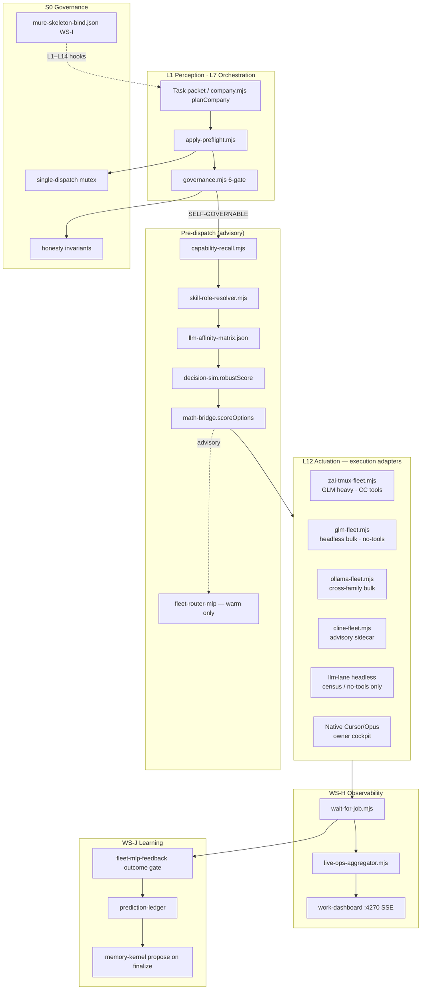
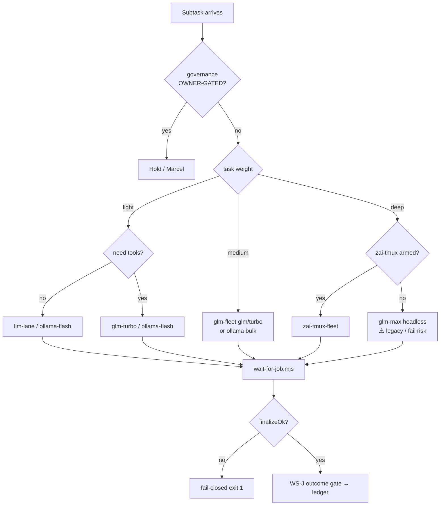

# GLM Long-Term Substrate Architecture

**Date:** 2026-06-30  
**Owner:** Marcel  
**Authority:** Master architecture — Cursor plans/commits; GLM/Ollama/Cline execute via `02_RESOURCES/TASKS/glm-longterm-substrate-ws-l-master.json`  
**Inputs (all arrived):**

| Report | Agent / ref |
|--------|-------------|
| `_SYSTEM/reports/GLM_MECHANICAL_WIRING_AUDIT_2026-06-30.md` | `e3145e7e` |
| `_SYSTEM/reports/GLM_ADAPTER_DECISION_2026-06-30.md` | `3797ea79` |
| `_SYSTEM/reports/GLM_DISPATCH_VS_CLAUDE_ZAI_DEBUG_2026-06-30.md` | `cef9fc6d` / `1c54cb42` |
| `_SYSTEM/reports/GLM_SUBSTRATE_OPTIONS_BAKEOFF_2026-06-30.md` | bakeoff |
| `_SYSTEM/reports/GLM_MAX_TIMEOUT_DEBUG_2026-06-30.md` | timeout tier fix |
| `_SYSTEM/reports/MURE_ENFORCEMENT_MINIMUM_2026-06-30.md` | S0–S5 honesty floor |
| `_SYSTEM/reports/YURI_ACTIVE_LEARNING_MEMORY_2026-06-30.md` | WS-J learn loop |
| `_SYSTEM/reports/YURI_SKILLS_ORCHESTRATION_UPGRADE_2026-06-30.md` | WS-K affinity/bindings |
| `_SYSTEM/reports/YURI_DIGITAL_COMPANY_SKELETON_2026-06-30.md` | WS-I 14-layer bind |

**Decision headline (unchanged from adapter decision):** Wiring for `glm-max` → `glm-5.2` is **GREEN**. Fleet failures at scale are **runtime / workload-shape**, not model misroute. Long-term fix = **quad-substrate orchestration plane** with **zai-tmux-fleet** for GLM heavy work, not more headless timeout patches.

---

## 1. Problem statement

### 1.1 Why headless fleet fails at scale

MURE today routes most GLM leaves through:

```
company.mjs → runSwarm → glm-fleet → lane-dispatch → llm-lane (headless HTTP)
```

This path is **mechanically correct** for API reachability (smokes A–D pass in &lt;20s) but **operationally wrong** for orchestration-scale work:

| Failure mode | Mechanism | Evidence |
|--------------|-----------|----------|
| **`exit_null`** | `lane-dispatch` SIGKILL at `LANE_DISPATCH_TIMEOUT_MS` before `--out` written | WS-F/WS-C artifacts @ exactly 1,800,000 ms |
| **Tool-loop exhaustion** | Full YURI stack (~675 lines) + `--reasoning high` + `xref_query` multi-turn | Smoke E fails; stub `.out` shows `[tool] xref_query` then kill |
| **No session persistence** | Cold headless child per attempt; CC session retains warm context | Bakeoff §D |
| **Concurrency amplification** | 3× parallel `glm-max` → queueing + identical timeout walls | `swarm-mr0ovkup-c9facd` |
| **Dead metadata** | `substrateHint` on task JSON never consumed by `castRole` | Wiring audit W-P1-1 |
| **False-green manifests** | `applied` while `finalizeOk: false`; MLP on empty labels | MURE enforcement §B |

**Root cause class:** **orchestration timeout + workload mismatch**, not auth, wrong model ID, or broken Z.ai endpoint.

### 1.2 Why `ai claude-zai` works

Marcel's proven path:

```
yuri-spawn-worker.sh → ai claude-zai → native Claude Code → api.z.ai (glm-5.2)
```

| Dimension | claude-zai | Headless fleet |
|-----------|------------|----------------|
| Runtime | Long-lived PTY, full CC tool loop | Ephemeral Node HTTP adapter |
| API envelope | `API_TIMEOUT_MS` up to **50 min** | Outer SIGKILL **30 min** (`glm-max`) |
| Tools | Full CC surface | Guarded subset in `llm-lane` |
| Output | Live pane + Marcel visibility | `--out` file mandatory |
| Success signal | Human observes completion | Non-empty `--out` + `RESULT_LABEL` |

Same API key, same `glm-5.2` on the wire — **different execution substrate**.

### 1.3 Wiring vs workload

| Layer | Status | Implication |
|-------|--------|-------------|
| **Wiring** (`glm-max` → `glm-5.2`, endpoint, auth) | **GREEN** | Do not chase alias bugs; P0 adversarial 120s cap **fixed** |
| **Workload** (stack depth, tools, reasoning, concurrency) | **RED at fleet scale** | Route heavy leaves to tmux-zai; slim headless for census |
| **Governance** (honesty invariants, polling) | **PARTIAL** | S0 floor must land before smart routing |

**Verdict:** Short-term timeout bumps (30 min tier) were necessary **mitigations**; they are not a 3–5 year strategy. The scalable fix is **substrate-aware dispatch** with honest observability and outcome-gated learning.

---

## 2. Target architecture (3–5 year scalable)

### 2.1 Quad-substrate orchestration plane



### 2.2 Execution adapters (roles)

| Adapter | Entry | Best for | Armed by | Concurrency model |
|---------|-------|----------|----------|-------------------|
| **zai-tmux-fleet** | `node zai-tmux-fleet.mjs --tasks-file …` | GLM Opus-tier: multi-tool builds, kernelsmith/deliberator/adjudicator, Marcel-visible | `YURI_ZAI_TMUX_FLEET=1` | Serial per worker pane; pool of N workers |
| **ollama-fleet** | `node ollama-fleet.mjs --tasks-file …` | Bulk scout/synthesist/chronicler; cross-family flash | `YURI_OLLAMA_FLEET=1` | Semaphore (default 3) |
| **cline-fleet** | `node cline-fleet.mjs --tasks-file …` | Advisory sidecar; flat-billing CLI peer | `YURI_CLINE_FLEET=1` | Semaphore (default 2) |
| **glm-fleet → llm-lane** | `node glm-fleet.mjs --tasks-file …` | Parallel census, `--no-tools` advisory, DISARMED dry-run | `YURI_GLM_FLEET=1` | Semaphore (default 3; **1** for glm-max until retired) |
| **llm-lane headless** | Direct / lane-dispatch | Single ping, no-tools census only — **never** glm-max + full stack + tools | Keychain | Single shot |
| **Native** | Cursor Agent / Opus session | Owner cockpit, MCP/browser, finalize authority | Session | Marcel-paced |

**Packet contract (all fleets):** `.claude/jobs/<runId>/results/<label>.json` with `extractResultLabel`, `validatePacket`, `status`, `durationMs`, `runId`. Shared helpers from `ollama-fleet.mjs` / `glm-fleet.mjs`.

### 2.3 Pre-dispatch layer

**Order of evaluation (always):**

1. `governance.mjs` — hard gates; OWNER-GATED stops dispatch
2. `apply-preflight.mjs` — validate, mutex, arm flags, print `wait-for-job` command
3. `capability-recall.mjs` + `skill-role-resolver` — log hits (DISARMED advisory)
4. `llm-affinity-matrix.json` — static role → substrate default
5. `substrate-pre-dispatch.mjs` — `math-bridge.scoreOptions` + `decision-sim.robustScore` over substrate options
6. `fleet-router-mlp.predictRoute` — **only when WS-J outcome gate warm** (post P2)

**MLP is post-WS-J-gate.** Cold MLP must not override affinity matrix or governance.

### 2.4 Observability (WS-H)

| Component | Path | Role |
|-----------|------|------|
| Aggregator | `_SYSTEM/Scripts/live-ops-aggregator.mjs` | `buildLiveSnapshot()` from manifests + results |
| Poll | `_SYSTEM/Scripts/wait-for-job.mjs` | Replace all blind `sleep` for dispatch completion |
| UI | `_SYSTEM/mure/dashboard.html` + `:4270` SSE | Lane strip → cards M1+ |

Orchestrators **must** chain: dispatch → `wait-for-job.mjs` → read manifest → proceed. Cursor subagents use `Await` with manifest poll — never fixed 65m sleep.

### 2.5 Learning (WS-J outcome-gated ledger)

```
pre-dispatch features → chosen substrate → dispatch → RESULT_LABEL
  → fleet-mlp-feedback.recordPrediction (always persist features)
  → deriveLeafOutcome: skip if empty (outcome gate)
  → updateFromOutcome (only substantive labels)
  → held-out Brier eval → manifest mlpFeedback.evalMeanBrier
  → prediction-ledger → memory-kernel propose (archivist hook, P2)
```

**Bandit semantics:** only observe outcome for **chosen** substrate — train accordingly (BaRP framing per active-learning research).

### 2.6 Governance: S0 honesty invariants

| Invariant | Rule |
|-----------|------|
| **Fail-closed dispatch** | `!finalizeOk` → `applied-with-failures`, exit 1 |
| **Outcome gate** | Empty `.out` / missing `RESULT_LABEL` → skip MLP update |
| **Manifest truth** | `forced`, `blockingLeaves`, `skippedOutcomes` always recorded |
| **Single-dispatch mutex** | `pgrep` / preflight blocks overlapping `company-dispatch` on same `outDir` |
| **wait-for-job** | Mandatory completion poll; exit 2 on run failed |

### 2.7 Skeleton: WS-I 14-layer bind

`mure-skeleton-bind.json` maps each MURE role → YURI layers L1–L14, circuitry nodes, `learningHook`, `orchestrationHook`. Substrate architecture **consumes** this bind — it does not replace it.

Key bindings for dispatch:

| Layer | Substrate touchpoint |
|-------|---------------------|
| L7 Skills & Orchestration | `runFleet` substratePolicy, skill-role bindings |
| L11 Learning | outcome-gated ledger, episodic replay (P2) |
| L12 Actuation | quad-substrate adapters |
| L8 Governance | S0 invariants, steward gates |
| L14 Meta | live-ops-aggregator, health reports |

---

## 3. Phased roadmap (P0–P4)

Not overengineered — each phase has **exit criteria** and **stop conditions**.

### P0 — Honesty floor (weeks 0–2)

**Goal:** Stop false-green; enable reliable polling.

| Deliverable | Exit criteria |
|-------------|---------------|
| `wait-for-job.mjs` | Tests green; `02H5_WAIT_FOR_JOB_X_PASS_COMMITTED` |
| Outcome gate in `fleet-mlp-feedback.mjs` | Empty outcomes skipped; `02J1_OUTCOME_GATE_X_PASS_COMMITTED` |
| `company-dispatch` fail-closed | `!finalizeOk` → exit 1; test fixture |
| `apply-preflight.mjs` | 10-check runnable; prints wait command |
| Adversarial timeout fix | **Done** — `swarm-convergence.mjs` aligned to glm-max tier |

**Stop:** Do not arm MLP learn or substrate auto-routing until P0 GREEN.

### P1 — zai-tmux-fleet adapter (weeks 2–4)

**Goal:** GLM heavy work on proven CC runtime.

| Deliverable | Exit criteria | Status |
|-------------|---------------|--------|
| `zai-tmux-fleet.mjs` spec + impl | DISARMED unit test; packet shape matches `glm-fleet` | **SHIPPED** 2026-06-30 (`WS-LT-L1`) |
| `runFleet` `--zai-sidecar` hook | `glm-max` / heavy roles → zai-tasks.json + spawn command | **SHIPPED** 2026-06-30 |
| Manual tmux baseline | Marcel one-shot documented in bakeoff §J | pending (`WS-LT-L1-tmux-baseline-smoke`) |
| Wire `substrateHint` → `castRole` | P1 wiring audit item | **SHIPPED** (`applySubstrateHint`; `tmux-zai` → `dispatch: zai-tmux`) |

**Exit:** One armed MURE leaf (e.g. kernelsmith stub) completes via tmux with `RESULT_LABEL` and `finalizeOk: true` (or honest `forced` with labels).

### P2 — Static routing tables (weeks 4–6)

**Goal:** Declarative routing before MLP override.

| Deliverable | Exit criteria |
|-------------|---------------|
| `llm-affinity-matrix.json` (20 roles) | `02K1_AFFINITY_MATRIX_X_PASS_COMMITTED` |
| `skill-role-bindings.json` + resolver | `02K6` + `02K7` |
| `substrate-pre-dispatch.mjs` | Advisory scores logged on dry-run plan |
| `mure-skeleton-bind.json` | Oracle verify `02I9` |

**Exit:** `planCompany` logs `substrateSuggestion`, `skillsLoaded[]`, `capabilityHits[]` on every dry-run.

### P3 — Measured bakeoff + observability (weeks 6–10)

**Goal:** Replace prior `mean/sd` with measured pass rates.

| Deliverable | Exit criteria |
|-------------|---------------|
| L3 10-prompt bakeoff per substrate | Matrix §C updated with measured scores |
| `live-ops-aggregator` + SSE :4270 | Lane strip live during dispatch |
| Held-out Brier on manifest | `02J2_HELD_OUT_BRIER_X_PASS_COMMITTED` |
| WS-F router dispatch complete | Non-empty glm-max or tmux-routed leaves |

**Exit:** Pre-dispatch selector uses **measured** latency/pass-rate distributions; dashboard shows active swarms without terminal grep.

### P4 — Warm learning loop (months 3–12, continuous)

**Goal:** Reduce owner input via replay + advisory MLP — **never** auto-finalize.

| Deliverable | Exit criteria |
|-------------|---------------|
| MLP route suggestions on manifest | `advisory: true`; governance override documented |
| Episodic replay into `buildRolePrompt` | Top-k past successes per `(role, taskClass)` |
| Archivist → memory-kernel on finalize | Job-finished propose hook |
| Optional sequential escalate policy | headless fail → tmux retry (order-sensitive → quantum only here) |

**Exit:** Marcel approves ≥3 consecutive dispatches with &lt;2 manual steering interventions per BUILD stream.

**3–5 year north star:** Sakana-style learned conductor **inside** YURI's explicit control plane — substrate choice, memory tiers, and verification independence without opaque product routing or weight merging.

---

## 4. Component spec: `zai-tmux-fleet.mjs`

Mirror `cline-fleet.mjs` API surface; swap spawn target for `yuri-spawn-worker.sh` + tmux poll.

### 4.1 Module header

```javascript
// @capability: zai-tmux-fleet-dispatch
// ARM_ENV: YURI_ZAI_TMUX_FLEET
// ARM_FLAG: _SYSTEM/state/zai-tmux-fleet.enabled
// DISARMED default = dry-run plan only (zero tmux spawns)
```

### 4.2 Public API

```javascript
export const ARM_ENV = 'YURI_ZAI_TMUX_FLEET';
export const DEFAULT_MODEL = 'glm-5.2';
export const WORKER_PREFIX = 'zai-worker';

export async function zaiTmuxFleet(tasks = [], opts = {});
export function isArmed();
export function buildRunDir(runId);  // reuse glm-fleet / ollama-fleet
export function extractResultLabel(text);  // shared
export function validatePacket(packet);    // shared
```

### 4.3 CLI (mirror cline-fleet)

```bash
node _SYSTEM/Scripts/zai-tmux-fleet.mjs --list
node _SYSTEM/Scripts/zai-tmux-fleet.mjs --dry-run --tasks-file <path>
node _SYSTEM/Scripts/zai-tmux-fleet.mjs --tasks-file <path> [--concurrency 2]
node _SYSTEM/Scripts/zai-tmux-fleet.mjs --smoke   # armed only
```

**Tasks file schema:**

```json
[
  {
    "label": "WS-L-R1-stub",
    "prompt": "…full task packet…",
    "model": "glm-5.2",
    "workerName": "zai-worker-1",
    "timeoutMs": 3600000,
    "showTerminal": true
  }
]
```

Supports wrapped `{ "tasks": […] }` like cline-fleet.

### 4.4 Spawn sequence (`fireTask`)

1. Resolve `workerName` = `task.workerName` || `zai-worker-${index}` (sanitized)
2. `buildRunDir(runId)` → `.claude/jobs/<runId>/results/`
3. If DISARMED: return plan entry only
4. Armed:
   - `spawn('bash', ['_SYSTEM/Scripts/voice/yuri-spawn-worker.sh', workerName, ''], { detached: false })` — **no initial prompt** if injecting separately
   - Wait for `claude_running` (poll `tmux display-message -p '#{pane_current_command}'`, max 60s)
   - `tmux send-keys -t workerName:0.0 -l "<prompt>"` + Enter
   - Poll loop until timeout:
     - Capture pane: `tmux capture-pane -p -t workerName:0.0 -S -500`
     - `extractResultLabel(paneText)` — if match → success
     - Optional: watch `<runDir>/<label>.out` if worker writes file
     - Sleep `pollMs` (default 5000)
   - Write `<label>.out` + `<label>.json` packet (same shape as glm-fleet `fireTask`)
5. `ok = resultLabel non-empty && !timeout`

### 4.5 Concurrency cap

- Default **2** parallel tmux workers (Terminal + CPU bound)
- `runPool` semaphore identical to cline-fleet
- **Never** fan-out 3× `glm-max` on headless **or** tmux without owner arm

### 4.6 RESULT_LABEL poll contract

| Signal | Success | Failure |
|--------|---------|---------|
| Pane contains `RESULT_LABEL: …` or label token regex | `status: ok` | — |
| Timeout with partial pane text | `status: fail`, `[ZAI_TMUX_TIMEOUT]` prefix | — |
| Worker dead (bare zsh in pane) | Self-heal via spawn-worker; retry once | `status: fail` |
| Empty pane @ timeout | `status: fail`, evidence stderr | |

### 4.7 DISARMED dry-run

Returns `{ runId, runDir, armed: false, dryRun: true, plan: [{ label, workerName, model }] }` — zero tmux side effects.

### 4.8 Integration points

| Consumer | Hook |
|----------|------|
| `runFleet.mjs` | `substratePolicy`: if lane ∈ `{glm-max, glm-sub-orch}` && `YURI_ZAI_TMUX_FLEET` → `zaiTmuxFleet` |
| `company.mjs` | `buildLeaf` may set `dispatch: 'zai-tmux'` when affinity matrix says so |
| `wait-for-job.mjs` | Poll same `runDir` / manifest as glm-fleet |

### 4.9 Tests (minimum)

- DISARMED dry-run returns plan, no `tmux` spawn (mock `spawn`)
- `extractResultLabel` on fixture pane text
- `validatePacket` conformance
- Armed integration: **manual** Marcel checklist (not CI-blocking)

---

## 5. Routing policy table

### 5.1 Role × task weight × substrate

| Role | Task weight | Primary substrate | Lane/model | Fallback chain |
|------|-------------|-------------------|------------|----------------|
| helmsman | any | native | opus / Cursor | glm-max tmux |
| architect | deep | zai-tmux | glm-5.2 | glm-max headless (discouraged) → glm-sub-orch |
| adjudicator | deep | zai-tmux | glm-5.2 | native opus |
| kernelsmith | deep | zai-tmux | glm-5.2 | glm (4.7) no-tools |
| deliberator | deep | zai-tmux | glm-5.2 | ollama minimax |
| engineer | medium | glm-fleet | glm (4.7) | ollama flash → cline |
| mechanic | medium | glm-fleet | glm-turbo | ollama flash |
| artificer | light | ollama-fleet | flash | glm-flash |
| scout | light | ollama-fleet | flash | glm-flash |
| synthesist | medium | ollama-fleet | flash / minimax | glm |
| chronicler | light | ollama-fleet | flash | sonnet native |
| calibrator | medium | glm-fleet | glm no-tools | zai-tmux if tools needed |
| ideator | medium | glm-fleet | glm | ollama minimax |
| oracle | deep | native | opus | zai-tmux |
| steward | any | native | opus | — (owner-gated) |
| envoy | light | llm-lane | no-tools ping | — |
| sentinel | medium | glm-fleet / native | sonnet | ollama flash |
| archivist | light | ollama-fleet | flash | glm no-tools |
| evolver | deep | native + DISARMED | opus plan-only | — |
| quartermaster | light | llm-lane | no-tools census | ollama flash |

**Task weight definitions:**

| Weight | Signals |
|--------|---------|
| **light** | `--no-tools`, census, label check, &lt;2k prompt |
| **medium** | tools allowed, bounded `max-iters`, single-file edit |
| **deep** | full stack, multi-tool, architecture, adversarial verify |

### 5.2 Routing decision flow



---

## 6. What we stop doing

| Anti-pattern | Why stop | Replacement |
|--------------|----------|-------------|
| **Parallel `company-dispatch` on same outDir** | Mutex violations, corrupt manifests | `apply-preflight` + single-dispatch mutex |
| **`glm-max` headless for tool-heavy MURE leaves** | `exit_null` @ 30min | `zai-tmux-fleet` |
| **`glm-max` on stubs / census** | Cost + timeout waste | `glm-flash` / `ollama-flash` / `--no-tools` |
| **Blind `sleep 65m`** | Partial reapply blocked idle | `wait-for-job.mjs` or Cursor `Await` |
| **False-green manifests** (`applied` + `!finalizeOk`) | MLP garbage, operator trust loss | S0 fail-closed |
| **MLP train on empty outcomes** | Garbage gradients | WS-J outcome gate |
| **Trusting `substrateHint` without wiring** | Dead metadata misleads authors | Wire in P1 or rename doc-only |
| **3× parallel glm-max fan-out** | Queueing + synchronized SIGKILL | Concurrency 1–2; tmux serial per worker |
| **Timeout-only patches as "the fix"** | Spend without convergence guarantee | Substrate routing |
| **MoA / new roles / Rust UI** (per enforcement §E) | Overbuild before floor GREEN | P4+ revisit |

---

## 7. Integration with Marcel's multi-LLM inventory

### 7.1 Inventory → adapter mapping

| Marcel asset | Architecture slot | Notes |
|--------------|-------------------|-------|
| z.ai GLM Coding Plan (`glm-5.2`, `glm-4.7`, flash tiers) | zai-tmux + glm-fleet | Premium on tmux; bulk on 4.7/turbo |
| Ollama Pro (`flash`, `minimax`, `kimi`, `nemotron`) | ollama-fleet primary bulk | concurrent=3 ceiling |
| ClinePass flat (`glm`, `kimi`, `deepseek`, `mimo`, `qwen`) | cline-fleet advisory | Owner arms explicitly |
| Cursor / Claude native | Owner cockpit + finalize | Not fleet-substitutable |
| DeepSeek / Mimo via `llm-compat` | Pre-tool-gate advisory only | Not MURE substrate enum |

### 7.2 Reduced owner input

Automation path (no magic — explicit hooks):

1. **Task JSON** → `planCompany` casts roles using affinity matrix (not Marcel lane-picking)
2. **Preflight** prints exact arm commands + `wait-for-job` invocation
3. **Dashboard** (:4270) shows lane status — Marcel glances, does not grep `.claude/jobs/`
4. **Outcome gate** ensures learning only from real labels
5. **Episodic replay** (P4) injects top-k past successes into prompts
6. **MLP advisory** suggests substrate — Marcel overrides via steward until Brier gate passes

**Marcel still owns:** `finalize`, arming flags, `git push`, held rulings, tmux baseline first run.

### 7.3 Quota surfaces (owner fills in)

Not in repo — architecture assumes Marcel maintains:

- z.ai: glm-max monthly cap vs flash unlimited
- Ollama Pro: per-model usage weights
- ClinePass: enabled models + monthly cap

Pre-dispatch `costTier` in affinity matrix references these; enforcement is warn-only until P4 budget caps.

---

## 8. Quantum / calc role

### 8.1 decision-sim for substrate ranking only

**Use:** `math-bridge.scoreOptions` + `decision-sim.robustScore` to rank `{tmux-zai, glm-fleet, ollama-flash, cline}` under uncertainty.

```javascript
import { scoreOptions } from '_SYSTEM/mure/math-bridge.mjs';

const substrates = [
  { id: 'tmux-zai',     mean: 0.92, sd: 0.05 },  // prior → L3 measured
  { id: 'glm-fleet',    mean: 0.65, sd: 0.25 },
  { id: 'ollama-flash', mean: 0.78, sd: 0.12 },
  { id: 'cline',        mean: 0.70, sd: 0.18 },
];
const { ranked, best } = scoreOptions(substrates, { draws: 128, seed: 42 });
```

**Parameters:** `mean`/`sd` from L3 bakeoff manifest pass rates — not hand-waved after P3.

### 8.2 When to escalate

| Condition | Action |
|-----------|--------|
| `best.id === 'tmux-zai'` && task weight deep | Route zai-tmux-fleet |
| `robustScore spread < ε` (options tied) | Default affinity matrix primary |
| Headless glm-max failed once with `exit_null` | **Escalate** to tmux on retry (sequential — only case for quantum) |
| Governance OWNER-GATED | No calc override |
| MLP cold | Ignore MLP; use decision-sim + affinity |

### 8.3 quantum-hypothesis-tracker — when yes, when no

| Scenario | Use quantum? |
|----------|--------------|
| Substrate feature comparison (reliability, cost, tools) | **NO** — order-independent |
| Sequential escalate headless → tmux on failure | **OPTIONAL** — order affects posterior |
| G2/G3 falsification gates in research | **YES** — existing skill domain |
| Fleet routing default | **NO** |

### 8.4 izanagi-bridge / probabilistic-decision-core

Optional corner-law guard on discrete substrate enum; log via `probabilistic-decision-core` output shape for manifest audit trail. Advisory only.

---

## 9. Workstream handoff

**Master task file:** `02_RESOURCES/TASKS/glm-longterm-substrate-ws-l-master.json`

**First GLM build subtask after docs land:** `WS-LT-L1-zai-tmux-fleet-adapter` (implement `zai-tmux-fleet.mjs` per §4) — **DONE** 2026-06-30

### WS-LT-L1 ship log (2026-06-30)

| Artifact | Path |
|----------|------|
| Adapter | `_SYSTEM/Scripts/zai-tmux-fleet.mjs` |
| Tests | `_SYSTEM/Scripts/zai-tmux-fleet.test.mjs` |
| runFleet hook | `--zai-sidecar` → `.claude/jobs/<runId>/zai-tasks.json` |
| substrateHint | `company.mjs` `applySubstrateHint` — `tmux-zai` → `dispatch: zai-tmux` |

**Automation limitation (documented):** `ai claude-zai` has no headless `--print` path; fleet uses headless tmux spawn (default) or `showTerminal:true` + `yuri-spawn-worker.sh`, prompt inject via `send-keys`, completion via `capture-pane` + `extractResultLabel`. Pane capture may miss labels scrolled off-screen — prefer explicit `RESULT_LABEL:` line in last 500 pane lines.

**Related task files (do not duplicate):**

- `02_RESOURCES/TASKS/glm-substrate-bakeoff-ws-l.json` — L0–L3 measurement
- `02_RESOURCES/TASKS/glm-dispatch-rework-ws-l.json` — debug + adapter rework
- `02_RESOURCES/TASKS/mure-enforcement-build-master.json` — S0 honesty floor (prerequisite)

---

## 10. Residual risk

| Risk | Mitigation |
|------|------------|
| tmux adapter pane capture flaky | Self-heal in spawn-worker; retry once; write diagnostics packet |
| macOS Terminal dependency | Document headless Linux fallback = glm-fleet no-tools only |
| L3 bakeoff delayed | Priors in pre-dispatch marked `advisory: true, measured: false` |
| S0-03 held-out Brier still RED | Blocks MLP learn, not tmux adapter |
| Marcel quota exhaustion | quartermaster warn hooks P4 |

---

## Checks run

- Wait-for files polled (60s interval); both arrived before authoring
- Merged wiring audit + adapter decision + bakeoff + enforcement minimum
- Code anchor review: `glm-fleet.mjs`, `cline-fleet.mjs`, `yuri-spawn-worker.sh`, `company.mjs`

**Codex second opinion:** skipped (architecture-only deliverable).

**RESULT_LABEL:** `02LT_GLM_LONGTERM_ARCH_X_PASS_COMMITTED`
