# GLM Mechanical Wiring Audit

**Date:** 2026-06-30  
**Scope:** Full hop chain from MURE task JSON → Z.ai API; complements substrate bakeoff (`_SYSTEM/reports/GLM_SUBSTRATE_OPTIONS_BAKEOFF_2026-06-30.md`; parent ref `8a943fd0` not found in-repo — treat bakeoff doc as merge target).  
**Verdict headline:** **`glm-max` → `glm-5.2` alias chain is mechanically correct.** BUILD_07 live apply succeeded after outer-timeout fix; residual `exit_null` failures are **orchestration timeout / headless tool-loop scale**, not wrong model ID.

---

## Executive answers

| Question | Answer |
|----------|--------|
| Does `glm-max` always hit `glm-5.2` API? | **Yes** when the lane string is `glm-max` (or `glm-5.2`). It does **not** when a role resolves to lane `glm` (→ `glm-4.7`) or `glm-turbo` / `glm-flash` aliases. |
| Is `glm` → `glm-4.7` wrong vs `ZAI_MODEL=glm-5.2`? | **No for fleet tiering** — `ZAI_MODEL` only affects `ai claude-zai` interactive sessions; fleet uses `llm-lane` `ALIAS`. `glm` = Sonnet-tier workhorse by design; `glm-max` = Opus-tier. |
| Why deliberator/kernelsmith → `glm-max` on WS-F? | **Roster defaults**, not stub misroute: `fleet-roles.json` pins both roles to `lane: glm-max`. WS-F subtasks set `role: kernelsmith` / `role: deliberator` explicitly. |
| Is `exit_null` mapped in `aggregatePoolOutputs`? | **Indirectly yes:** `exit_null` is a `lane-dispatch` failure reason (child `code === null` after SIGKILL). `glm-fleet` `fireTask` writes `status: 'fail'` packets; `aggregatePoolOutputs` keys `pool[packet.role]` with `status` preserved — convergence treats empty/non-conforming text as fail. No dedicated `exit_null` field (gap: operators must read `.out` / stderr). |
| BUILD_07 failures — wiring vs model? | **Mixed:** pre-`9938ff3a` = **P0 wiring** (5min outer cap SIGKILL'd glm-max). Post-fix live BUILD_07 = **GREEN** (7.6h, all streams converged forced). Partial reapply RED = **scale** (`exit_null` at 30min outer budget), not wrong API model. |

### Top 3 wiring bugs (ranked)

1. **P0 — Adversarial `spawnSync` 120s cap** (`swarm-convergence.mjs:172`) killed `glm-max` review dispatch while leaf budget was 30min → silent fail-soft. **Fixed this audit** (align with `defaultTimeoutMsForLane('glm-max')`).
2. **P1 — `substrateHint` is dead metadata** — present on all MURE task JSON subtasks, **never read** by `company.mjs` / `castRole` / `company-dispatch.mjs`. Operators assume hints steer lanes; only `role` + `need` + roster matter.
3. **P1 — Anthropic GLM HTTP path ignores `models.json` `timeout_ms`** — `_postMessagesAnthropicHttpsOnce` sets `req.setTimeout(0)` (`llm-lane.mjs:575-576`); only outer `lane-dispatch` SIGKILL bounds total runtime → long tool loops burn full 30min then `exit_null`.

**Is `glm-max` mechanically correct?** **Yes** — lane alias → model key → `api.z.ai/api/anthropic` with `model: glm-5.2`.

---

## Wiring diagram

```mermaid
flowchart LR
  subgraph T1["1 Task JSON"]
    ST["subtask: id, role, need, prompt"]
    SH["substrateHint ⚠️ IGNORED"]
  end

  subgraph T2["2 company.mjs"]
    CR["castRole() :135-143"]
    BL["buildLeaf() :118-131"]
    PL["planCompany() :151-177"]
  end

  subgraph T3["3 fleet-roles + role-registry"]
    FR["_SYSTEM/config/fleet-roles.json"]
    RR["resolveLane() :109-122"]
  end

  subgraph T4["4 runSwarm"]
    RS["tasks: lane, label=id :131-134"]
    GF["glmFleet()"]
  end

  subgraph T5["5 glm-fleet.mjs"]
    FT["fireTask → lane-dispatch :174-241"]
    TO["LANE_DISPATCH_TIMEOUT_MS tier :55-70"]
  end

  subgraph T6["6 lane-dispatch.mjs"]
    LD["retry fresh llm-lane :81-111"]
    OUT["--out non-empty = success :70-76"]
  end

  subgraph T7["7 llm-lane.mjs"]
    AL["ALIAS glm-max→glm-5.2 :99"]
    DIS["dispatch() :820-825"]
    ANT["postMessagesAnthropicHttps ⚠️ no per-req timeout :575"]
  end

  subgraph T8["8 models.json"]
    MJ["llm_compat_lanes.glm-5.2 :261-273"]
  end

  subgraph T9["9 API"]
    ZAI["https://api.z.ai/api/anthropic Bearer ZAI_API_KEY"]
  end

  subgraph PAR["Parallel: ai claude-zai"]
    CZ["run_claude_zai ZAI_MODEL :538"]
    CC["Native Claude Code session"]
  end

  ST --> CR
  SH -.->|not wired| CR
  CR --> RR
  FR --> RR
  RR --> BL
  BL --> PL
  PL --> RS
  RS --> GF
  GF --> FT
  FT --> LD
  LD --> AL
  AL --> DIS
  DIS --> MJ
  MJ --> ANT
  ANT --> ZAI
  CZ --> CC
  CC --> ZAI

  classDef green fill:#1a4d2e,stroke:#2ecc71,color:#fff
  classDef yellow fill:#5c4a1a,stroke:#f1c40f,color:#fff
  classDef red fill:#5c1a1a,stroke:#e74c3c,color:#fff

  class AL,MJ,ZAI,TO,OUT green
  class SH,ANT yellow
```



**Legend:** GREEN = correct for `glm-max` path; YELLOW = mismatch / advisory-only; RED = none on alias chain (fixed adversarial was RED→GREEN).

---

## Hop-by-hop evidence

### Hop 1 — Task JSON → `company.mjs`

| Step | File:line | Behavior |
|------|-----------|----------|
| `castRole` | `company.mjs:135-143` | Match `subtask.role` → else `need[]` capability match → else default `engineer`. Calls `resolveLane(role, { preferSubstrate: opts.preferSubstrate \|\| 'glm' })`. |
| `buildLeaf` | `company.mjs:118-131` | GLM leaf: `{ id, lane: target.lane, reasoning: 'high', prompt, role }`; `timeoutMs` from subtask or `defaultTimeoutMsForLane` for `glm-max` / `glm-sub-orch`. |
| `planCompany` | `company.mjs:175-177` | `target.dispatch === 'glm-lane'` → push to `glmLeaves`. |
| **`substrateHint`** | task JSON only | **No `.mjs` consumer.** Grep: only `02_RESOURCES/TASKS/*.json`. |

### Hop 2 — `fleet-roles.json` (target roles)

| Role | substrate | lane | fallbackLane | Resolved (prefer glm) |
|------|-----------|------|--------------|------------------------|
| engineer | either | glm | sonnet | `glm` → API `glm-4.7` |
| kernelsmith | either | **glm-max** | sonnet | **glm-max** → `glm-5.2` |
| deliberator | glm | **glm-max** | opus | **glm-max** |
| ideator | glm | glm | sonnet | `glm` |
| artificer | either | haiku | glm-turbo | `glm-turbo` (haiku ∉ GLM_LANES) |
| adjudicator | glm | **glm-max** | opus | **glm-max** |

Source: `_SYSTEM/config/fleet-roles.json` lines 73-247; verified via `resolveLane` script 2026-06-30.

**WS-F** (`mure-buildout-ws-f-router.json`): `WS-F-R1-mlp-stub` → `role: kernelsmith`; `WS-F-D1-deliberator-policy` → `role: deliberator` — both roster-pin to `glm-max` by design.

### Hop 3 — `role-registry.mjs`

| Item | File:line | Notes |
|------|-----------|-------|
| `SUBSTRATES` | `role-registry.mjs:22` | `native \| glm \| either` only — matches fleet meta. |
| `GLM_LANES` | `role-registry.mjs:24` | `glm-max`, `glm`, `glm-flash`, `glm-turbo`, … |
| `resolveLane` either-branch | `role-registry.mjs:114-116` | `preferSubstrate` default **`glm`** → cost bias to Z.ai plane. |
| `either` + native lane | `role-registry.mjs:115-116` | If `role.lane` ∉ target substrate set → `fallbackLane`. |

### Hop 4 — `glm-fleet.mjs`

| Item | File:line | Notes |
|------|-----------|-------|
| Spawn | `glm-fleet.mjs:180` | `node lane-dispatch.mjs <lane> <prompt> --out <file> --reasoning high` |
| Outer timeout | `glm-fleet.mjs:55-70` | `glm-max`: **1_800_000 ms**; passed as `LANE_DISPATCH_TIMEOUT_MS` env `:185` |
| Heavy retries | `glm-fleet.mjs:65-76` | `glm-max`: **2** attempts (not 4) |
| Packet `role` | `glm-fleet.mjs:217` | `role: task.label \|\| label` — `runSwarm` sets `label: leaf.id` `:132` |
| Fail surface | `glm-fleet.mjs:206-214` | Empty `--out` → synthetic `[GLM_FLEET_*]` text; `ok` false if `LANE_DISPATCH_FAIL` prefix |

### Hop 5 — `lane-dispatch.mjs`

| Item | File:line | Notes |
|------|-----------|-------|
| Default outer timeout | `lane-dispatch.mjs:29` | 1_320_000 ms unless env override |
| Success signal | `lane-dispatch.mjs:70-76` | With `--out`: non-empty file size |
| **`exit_null`** | `lane-dispatch.mjs:93-94` | `lastWhy = exit_${last.code}` → **`null` → `exit_null`** (SIGKILL / signal) |
| Failure write | `lane-dispatch.mjs:107-109` | Writes `LANE_DISPATCH_FAIL … reason=exit_null` into `--out` |

### Hop 6 — `llm-lane.mjs` ALIAS

```99:100:_SYSTEM/Scripts/llm-lane.mjs
  'glm-5.2': 'glm-5.2', 'glm-max': 'glm-5.2', 'glm-5': 'glm-5.2',
```

```89:89:_SYSTEM/Scripts/llm-lane.mjs
  glm: 'glm-4.7', zai: 'glm-4.7', 'z-ai': 'glm-4.7', 'glm-4.7': 'glm-4.7', 'glm-4.6': 'glm-4.7',
```

Resolution: `dispatch()` `:824` → `key = ALIAS[laneLc] || LANES[laneLc]` → `cfg = LANES[key]` → `model = opts.model || cfg.model` `:835`.

**Regression tests added:** `_SYSTEM/Scripts/llm-lane.test.mjs` (glm-max/glm alias assertions).

### Hop 7 — `models.json` (glm-*)

| Lane key | model | endpoint | auth | timeout_ms |
|----------|-------|----------|------|------------|
| glm-5.2 | glm-5.2 | `https://api.z.ai/api/anthropic` | bearer + keychain `yuri-zai-api-key` | 600000 |
| glm-4.7 | glm-4.7 | same | same | 300000 |
| glm-5-turbo | glm-5-turbo | same | same | 300000 |

Source: `.claude/config/models.json:233-287`.

**Mismatch:** `timeout_ms` applies to OpenAI-path `postChat` (`llm-lane.mjs:940`) but **not** to Anthropic streaming (`req.setTimeout(0)` at `:575`).

### Hop 8 — `cost-reservation-pool.mjs` + `local-concurrency.mjs`

| Gate | Armed? | Can block GLM fleet silently? |
|------|--------|--------------------------------|
| `cost-reservation-pool` | **DISARMED** default (`readArmState` needs env + flag + cap) | Only if `YURI_COST_ADMISSION_HARDBLOCK=1`; else warn-only (`llm-lane.mjs:889-919`) |
| `local-concurrency` | N/A for cloud GLM | **No** — `isLocal` guard (`llm-lane.mjs:926-929`); GLM is not local |

### Hop 9 — `ai claude-zai` comparison

| Path | Entry | Model selection | API |
|------|-------|-----------------|-----|
| **claude-zai** | `_SYSTEM/Scripts/ai:531-551` `run_claude_zai` | `ZAI_MODEL` default **`glm-4.7`**; workers export **`glm-5.2`** (`voice/yuri-worker.sh:23`) | `ANTHROPIC_BASE_URL` → Z.ai; native CC tool loop |
| **fleet** | `glm-fleet` → `lane-dispatch` → `llm-lane` | Lane alias table; **`glm-max` → glm-5.2** | Same Z.ai Anthropic-compat HTTP adapter; headless tool subset |

Tier map drift (doc only): `run_claude_zai` sets `ANTHROPIC_DEFAULT_SONNET_MODEL=glm-5.1` (`ai:548`) while fleet `glm` → `glm-4.7` — interactive vs fleet Sonnet slot differ.

---

## `exit_null` → pool aggregation chain

```
lane-dispatch SIGKILL (outer timeout)
  → child.close code null
  → lastWhy = exit_null (lane-dispatch.mjs:93-94)
  → LANE_DISPATCH_FAIL written to --out (lane-dispatch.mjs:107-109)
glm-fleet fireTask reads --out (glm-fleet.mjs:202)
  → ok=false, status='fail' in JSON packet (glm-fleet.mjs:214-221)
aggregatePoolOutputs (glm-fleet.mjs:140-171)
  → pool[leafId] = { label, text, status: 'fail' }
checkObligationFloor / isConformingPass (swarm-convergence.mjs:61-91)
  → nonConforming (no valid RESULT_LABEL in fail text)
```

**Gap:** `aggregatePoolOutputs` does not surface `exit_null` as structured field — only `status` + raw `text`. Operators grep `.out` for `LANE_DISPATCH_FAIL`.

---

## BUILD_07 vs wiring bugs

| Phase | Evidence | Diagnosis |
|-------|----------|-----------|
| Pre-fix hang | `MURE_PARTIAL_REAPPLY` — multi-hour `glm-max` before `--out` | **P0 wiring:** flat 5min outer timeout (fixed `9938ff3a`, `glm-fleet.mjs:56`) |
| Live BUILD_07 | `MURE_COMPANY_BUILD_07_LIVE_APPLY.md` — exit 0, ~7.6h, all WS converged forced | **Wiring sufficient** at 30min tier; failures are convergence honesty (forced-stop), not API misroute |
| Partial reapply RED | `MURE_PARTIAL_REAPPLY_2026-06-30.md` — `exit_null` @ `timeoutMs=1800000` | **Scale/model behavior:** tool-heavy headless leaves exhaust 30min; not hitting glm-4.7 by mistake |
| MLP `success: 0` | BUILD_07 live apply §risks | **Feature labeling** (native-routed leaves), not glm-max API wiring |

---

## Bug list (full ranked)

### P0 — broken wiring

| ID | Bug | Evidence | Status |
|----|-----|----------|--------|
| W-P0-1 | Adversarial runner `spawnSync` timeout **120s** vs glm-max **30min** budget | `swarm-convergence.mjs:172` (was) | **Fixed 2026-06-30** — uses `defaultTimeoutMsForLane('glm-max')` + env propagate |

### P1 — misconfig / orchestration

| ID | Bug | Evidence |
|----|-----|----------|
| W-P1-1 | `substrateHint` never consumed | Task JSON only; `castRole` ignores |
| W-P1-2 | Anthropic GLM stream **no HTTP timeout** | `llm-lane.mjs:575-576` |
| W-P1-3 | `models.json` `timeout_ms` (600s glm-5.2) unused on Anthropic path | vs outer 1800s — confusing two layers |
| W-P1-4 | `preferSubstrate` hardcoded `'glm'` in `castRole` | `company.mjs:141` — `either` roles never native unless caller passes opt |
| W-P1-5 | Headless `llm-lane` vs `claude-zai` — no session persistence | Bakeoff §D — scale failures |
| W-P1-6 | `finalizeGuard` treats `forced: true` as not finalizeOk even when labels pass | BUILD_07 all streams `forced-stop:marginal-value-cutoff` |

### P2 — doc drift

| ID | Bug | Evidence |
|----|-----|----------|
| W-P2-1 | `ai` help says default `glm-4.7`; workers documented as `glm-5.2` | `ai:72`, `yuri-worker.sh:23` — intentional split, easy to misread |
| W-P2-2 | `run_claude_zai` Sonnet default `glm-5.1` vs fleet `glm` → `glm-4.7` | `ai:548` vs `llm-lane.mjs:89` |
| W-P2-3 | `glm-flash` alias → `glm-5-turbo` not `glm-4.7-flash` | `llm-lane.mjs:94` — documented in comment, surprises roster readers |
| W-P2-4 | MURE meta lists `glm-flash` substrate; alias routes turbo | `fleet-roles.json:12` |

---

## Minimal fix list (specific edits)

| Priority | File | Edit |
|----------|------|------|
| ~~P0~~ | `swarm-convergence.mjs` | ~~Replace `timeout: 120_000` with `defaultTimeoutMsForLane('glm-max')` + pass `LANE_DISPATCH_TIMEOUT_MS` to child~~ **Done** |
| P1 | `company.mjs` `castRole` | Map `subtask.substrateHint` → `preferSubstrate` / optional `subtask.lane` override when valid |
| P1 | `llm-lane.mjs` `_postMessagesAnthropicHttpsOnce` | Pass `timeoutMs` from `cfg.timeout_ms`; replace `setTimeout(0)` with bounded destroy |
| P1 | `llm-lane.mjs` | Honor `process.env.LANE_DISPATCH_TIMEOUT_MS` as per-turn or cumulative budget for tool loops |
| P2 | `ai` `run_claude_zai` | Align `ANTHROPIC_DEFAULT_SONNET_MODEL` with fleet `glm-4.7` or document intentional 5.1 |
| P2 | Task JSON schema | Rename `substrateHint` → `substrateHint_DOC_ONLY` until wired, or wire it |

**Explicitly NOT recommended:** Change `ALIAS.glm` from `glm-4.7` to `glm-5.2` — would upgrade every engineer/ideator/scout-fallback leaf to Opus-tier cost/latency without roster intent.

---

## Merge note for bakeoff doc (`GLM_SUBSTRATE_OPTIONS_BAKEOFF_2026-06-30.md`)

Add under **§D root-cause ledger** or new **§K Mechanical wiring (2026-06-30)**:

- `glm-max` alias chain **GREEN** — always `glm-5.2` @ `api.z.ai`.
- `substrateHint` **dead** — roster + `role` only.
- BUILD_07 live **GREEN** post-30min outer timeout; partial RED = `exit_null` scale not misroute.
- Adversarial 120s cap **fixed** — link this report.
- Recommended execution stack unchanged: tmux-zai for heavy GLM builds; glm-fleet for parallel bulk with tier timeouts.

Parent chat `8a943fd0`: not located in workspace; if that session produced bakeoff §A–J, append §K from this file.

---

## Checks run

```bash
node --test _SYSTEM/Scripts/llm-lane.test.mjs
node --test _SYSTEM/Scripts/glm-fleet-timeout.test.mjs
node --test _SYSTEM/Scripts/swarm-convergence.test.mjs
node _SYSTEM/mure/role-registry.mjs --validate
```

## Residual risk

- Headless glm-max tool loops may still `exit_null` at 30min under fleet concurrency — needs tmux-zai adapter (bakeoff rank #1) or slimmer prompts/`--no-tools` for advisory leaves.
- Anthropic streaming still unbounded per HTTP request until P1-2 shipped.
- `cost-admission` disarmed — no spend block today.

---

**RESULT_LABEL:** `02W1_GLM_WIRING_AUDIT_X_PASS_COMMITTED`
