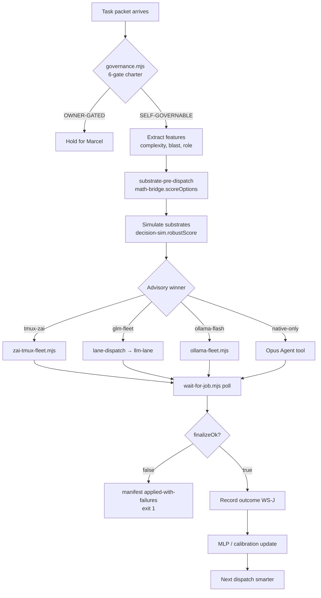

# GLM Substrate Options Bakeoff

**Date:** 2026-06-30  
**Owner:** Marcel  
**Authority:** Cursor plans/commits; GLM/Ollama execute later  
**Task files:**

- `02_RESOURCES/TASKS/glm-substrate-bakeoff-ws-l.json` (measurement + implementation)
- `02_RESOURCES/TASKS/glm-dispatch-rework-ws-l.json` (debug + adapter rework)

**Related:** `_SYSTEM/reports/MURE_ENFORCEMENT_MINIMUM_2026-06-30.md`, `_SYSTEM/reports/GLM_DISPATCH_VS_CLAUDE_ZAI_DEBUG_2026-06-30.md`

---

## A. Executive summary

**Marcel's `ai claude-zai` works; fleet `llm-lane` fails at orchestration scale — why:**

| Dimension | claude-zai (tmux) | glm-fleet → llm-lane (headless) |
|-----------|-------------------|----------------------------------|
| Runtime | Native Claude Code session | Node HTTP Anthropic adapter |
| Tools | Full CC tool loop | Guarded subset (read/grep/bash/write) |
| Transport | CC manages connection lifecycle | undici HTTP; AggregateError at concurrency |
| Output capture | Live pane + Marcel visibility | `--out` file; pipe/tee causes EPIPE |
| Session | Persistent warm context | Cold per dispatch |
| Fleet fit | Manual/semi-auto via tmux send-keys | Designed for parallel fan-out |

Single-shot smoke (`glm-5.2 "Reply OK" --no-tools`) passes on both paths **today** (exit 0). Failures appear under **fleet concurrency + tool loops + outer timeouts** — not bare API health.

**Recommended ranked options:**

1. **zai-tmux-fleet adapter** (new) — wrap `yuri-spawn-worker.sh`; best reliability + full CC tools for GLM Opus-tier work
2. **lane-dispatch → glm-fleet** — headless bulk/census/dry-run; use with retry wrapper, never pipe stdout
3. **ollama-fleet flash** — cross-family bulk scout; third substrate per MURE enforcement minimum

**Quantum pre-dispatch:** **Worth it** as an **advisory** gate (not execution replacement). Use `decision-sim.robustScore` + `math-bridge.scoreOptions` to rank substrates before dispatch; log outcomes to WS-J prediction-ledger for calibration. Skip quantum-hypothesis-tracker unless evidence order matters (substrate choice is not order-sensitive).

---

## B. Full options inventory

| Option | Entry | Best for | Armed by |
|--------|-------|----------|----------|
| **llm-lane headless** | `node _SYSTEM/Scripts/llm-lane.mjs <lane> "<prompt>"` | Single advisory ping, tool-light investigation | Always (keychain) |
| **lane-dispatch wrapper** | `node _SYSTEM/Scripts/lane-dispatch.mjs <lane> "<prompt>"` | Orchestration spine; retries fresh-process on AggregateError | Always |
| **glm-fleet** | `node _SYSTEM/Scripts/glm-fleet.mjs --tasks '<json>'` | Parallel GLM fan-out, RESULT_LABEL packets | `YURI_GLM_FLEET=1` |
| **ai claude-zai tmux** | `bash _SYSTEM/Scripts/voice/yuri-spawn-worker.sh <name> "<task>"` | Marcel-visible GLM-5.2 CC workers | Manual / voice |
| **ai llm glm-\*** | `_SYSTEM/Scripts/ai llm glm-5.2 "<prompt>"` | Shell convenience → llm-lane | Keychain |
| **ai claude-zai** | `_SYSTEM/Scripts/ai claude-zai` | Interactive Opus-tier GLM session | Keychain |
| **Ollama flash/minimax** | `node _SYSTEM/Scripts/ollama-fleet.mjs --tasks '<json>'` | Bulk scout/synthesist cross-family peers | `YURI_OLLAMA_FLEET=1` |
| **ClinePass** | `node _SYSTEM/Scripts/cline-fleet.mjs --tasks-file <path>` | Fourth substrate; flat-billing CLI sidecar | `YURI_CLINE_FLEET=1` |
| **Native Cursor/CC** | `native-spawn-loop.mjs` (stub) + Opus Agent tool | Owner cockpit, MCP/browser, native-only roles | `YURI_MURE_ARMED=1` |
| **fleet-router MLP** | `fleet-router-mlp.mjs` → `predictRoute()` | Advisory routing after labeled outcomes accumulate | Cold = fallback |
| **probabilistic-decision-core** | `_SYSTEM/mure/math-bridge.mjs`, `goal-engine.mjs` | EV discipline, governance gate, option scoring | Always (pure) |
| **quantum-hypothesis-simulation** | `quantum-hypothesis-tracker.mjs` | Order-sensitive evidence bakeoff (not substrate pick) | Always (pure) |
| **decision-sim** | `_SYSTEM/Scripts/decision-sim.mjs` | CVaR-robust ranking, minimax regret, flip rules | Always (pure) |
| **trade-decision-sim** | `alpha-factor-library/trade-decision-sim.mjs` | Trading decision lens (sibling pattern) | Ledger-dependent |
| **nano-dispatch** | `nano-dispatch.mjs` via `nano-spawn.mjs` | Recursive nano-swarm child lanes | DISARMED default |
| **runSwarm / runFleet** | `_SYSTEM/Scripts/runSwarm.mjs`, `runFleet.mjs` | End-to-end governed swarm | MURE armed |
| **company-dispatch** | `_SYSTEM/mure/company-dispatch.mjs` | MURE manifest apply | Owner-gated |
| **pulse-lane-dispatch** | `pulse-lane-dispatch.mjs` | Tier-gated dispatch + memory context | Pulse tier |
| **llm-compat.sh swarm** | `bash _SYSTEM/Scripts/llm-compat.sh --swarm` | Multi-lane advisory packet | Keychain |
| **yuri-slm-worker** | `yuri-slm-worker.mjs` | Local qwen SLM background | DISARMED |
| **codex-offload-runner** | `codex-offload-runner.mjs` | Codex platform worker surface | Owner-gated |

---

## C. Options matrix (scores 1–5)

Scoring: 5 = best. Based on architecture + smoke evidence + historical fleet audits. **L3 measured bakeoff pending.**

| Option | Reliability | Automation | Cost | Parallelism | Tool depth | Setup complexity |
|--------|-------------|------------|------|-------------|------------|------------------|
| **zai-tmux-fleet** (proposed) | 5 | 3 | 4 | 2 | 5 | 3 |
| **ai claude-zai manual** | 5 | 1 | 4 | 1 | 5 | 2 |
| **lane-dispatch → glm-fleet** | 3 | 5 | 4 | 4 | 3 | 2 |
| **llm-lane direct** | 3 | 4 | 4 | 3 | 3 | 1 |
| **ollama-fleet flash** | 4 | 5 | 5 | 3 | 3 | 2 |
| **cline-fleet** | 3 | 4 | 4 | 3 | 4 | 3 |
| **native-spawn-loop** | 4 | 2 | 2 | 2 | 5 | 4 |
| **fleet-router MLP** | 2 | 4 | 5 | — | — | 4 |

**Notes:**

- **Reliability:** tmux-zai wins because it uses the proven CC stack; headless loses points for AggregateError/EPIPE history.
- **Automation:** glm-fleet/ollama-fleet win; tmux requires macOS Terminal + tmux orchestration.
- **Cost:** ollama flash best $/token for bulk; glm-5.2 premium on Z.ai plan.
- **Parallelism:** glm-fleet semaphore (N concurrent); tmux is inherently serial per pane.
- **Tool depth:** native CC / tmux-zai = full tools; llm-lane = guarded subset.
- **Setup:** llm-lane lowest (one node command); MLP needs labeled outcomes.

---

## D. Why fleet llm-lane fails (root-cause ledger)

1. **Transport layer** — undici idle-socket reuse against Z.ai endpoint → bare `AggregateError`. Mitigated by `lane-dispatch` fresh-process retry (4× default).
2. **Pipe artifact** — stdout piped/tee'd → `transport:EPIPE`. Rule: `--out` file only (glm-fleet enforces).
3. **Timeout pressure** — glm-max multi-tool loops exceed flat 5min outer cap → SIGKILL before `--out` written. Fixed tier-aware: glm-max 30min, 2 retries.
4. **Headless tool loop** — `empty_output_stop` while files were written (glm-5.2 regression 2026-06-24).
5. **No session persistence** — each fleet leaf cold-starts; multi-turn tasks fail where CC session succeeds.
6. **Concurrency rate limits** — parallel fan-out → HTTP 429; backoff via `LANE_DISPATCH_RL_FACTOR`.

**Smoke today proves API + lane config healthy.** Failures are **scale + orchestration** problems.

---

## E. Recommended stack

```
┌─────────────────────────────────────────────────────────────┐
│  PRE-DISPATCH (advisory)                                     │
│  substrate-pre-dispatch.mjs                                  │
│    → math-bridge.scoreOptions([tmux-zai, glm-fleet, ollama]) │
│    → decision-sim.robustScore per substrate under uncertainty │
│    → fleet-router-mlp.predictRoute (when warm)               │
│    → governance.mjs hard gates ALWAYS win                    │
└──────────────────────────┬──────────────────────────────────┘
                           ▼
┌─────────────────────────────────────────────────────────────┐
│  EXECUTION (owner-armed)                                     │
│  Primary GLM:   zai-tmux-fleet.mjs → yuri-spawn-worker.sh  │
│  Bulk GLM:      glm-fleet → lane-dispatch → llm-lane         │
│  Bulk cross:    ollama-fleet (flash/minimax)                 │
│  Native-only:   Opus Agent tool (native-spawn-loop seam)     │
│  Optional:      cline-fleet sidecar                          │
└──────────────────────────┬──────────────────────────────────┘
                           ▼
┌─────────────────────────────────────────────────────────────┐
│  OUTCOME + LEARN (WS-J)                                      │
│  wait-for-job.mjs → manifest finalizeOk gate                 │
│  fleet-mlp-feedback outcome gate → prediction-ledger         │
│  MURE enforcement minimum honesty invariants                 │
└─────────────────────────────────────────────────────────────┘
```

### Ranked recommendation

| Rank | Option | When to use |
|------|--------|-------------|
| **1** | zai-tmux-fleet (implement WS-L L1) | GLM Opus-tier implementation, multi-tool builds, Marcel wants visibility |
| **2** | lane-dispatch → glm-fleet | Parallel census, DISARMED dry-run, simple `--no-tools` advisory |
| **3** | ollama-fleet flash | Cross-family bulk scout; MURE enforcement minimum bulk substrate |

---

## F. Quantum / probabilistic pre-dispatch layer

**Purpose:** Choose substrate **before** dispatch. Advisory only — never replaces execution or bypasses governance.

### F.1 When to use which instrument

| Instrument | Use for substrate selection? | Why |
|------------|------------------------------|-----|
| `decision-sim.robustScore` | **YES** | CVaR-robust ranking over uncertain latency/pass-rate draws |
| `math-bridge.scoreOptions` | **YES** | Wraps robustScore + minimaxRegret for option sets |
| `izanagi-bridge` | Optional | Corner-law guard on discrete substrate enum |
| `quantum-hypothesis-tracker` | **NO** (default) | Order-sensitive evidence; substrate traits are exchangeable |
| `probabilistic-decision-core` | **YES** | Output shape for logging base rates + signals |
| `fleet-router-mlp` | Later | After WS-J accumulates labeled (features, substrate, outcome) tuples |
| `trade-decision-sim` | Pattern only | Same orchestration pattern; trading-specific |

### F.2 Example pre-dispatch scoring

```javascript
import { scoreOptions } from '_SYSTEM/mure/math-bridge.mjs';

const substrates = [
  { id: 'tmux-zai',   mean: 0.92, sd: 0.05 },  // high pass, low variance (Marcel baseline)
  { id: 'glm-fleet',  mean: 0.65, sd: 0.25 },  // headless: good mean, fat tail
  { id: 'ollama-flash', mean: 0.78, sd: 0.12 },
  { id: 'cline',      mean: 0.70, sd: 0.18 },
];
const { ranked, best } = scoreOptions(substrates, { draws: 128, seed: 42 });
// best.id → advisory pick; governance + owner arming still required
```

**Uncertainty params** (`mean`, `sd`) come from L3 measured bakeoff or historical manifest pass rates — not hand-waved after L3 lands.

### F.3 Quantum tier — skip for substrate pick

`quantum-hypothesis-simulation` earns its keep when **evidence order matters** (G2/G3 falsification gate). Substrate features (reliability, tool depth, cost) are **order-independent** → classical `decision-sim` is correct and cheaper.

Reach for quantum only if Marcel introduces **sequential** evidence (e.g., "try headless → on failure escalate tmux" where order changes posterior).

### F.4 Is quantum pre-dispatch worth it?

| Verdict | Rationale |
|---------|-----------|
| **decision-sim + math-bridge: YES** | Cheap, deterministic, already wired in MURE math-bridge |
| **quantum-hypothesis: NOT YET** | Wrong instrument unless order-effects in substrate evidence |
| **MLP router: DEFER** | Cold weights; needs WS-J outcome gate + labeled history |

---

## G. Integration map

### G.1 zai-tmux-fleet adapter (WS-L)

Proposed `_SYSTEM/Scripts/zai-tmux-fleet.mjs`:

- ARM: `YURI_ZAI_TMUX_FLEET=1` / `_SYSTEM/state/zai-tmux-fleet.enabled`
- Spawn: `yuri-spawn-worker.sh <worker-N> "<prompt>"`
- Collect: poll tmux pane or `.claude/jobs/<runId>/results/<label>.json`
- Packet shape: same as `glm-fleet.mjs` (`extractResultLabel`, `validatePacket`)
- DISARMED: dry-run stub packets (zero tmux spawns)

### G.2 MURE enforcement minimum

| Invariant | How substrate bakeoff helps |
|-----------|----------------------------|
| B.1 fail-closed on `finalizeOk` | Pick reliable substrate → fewer `applied-with-failures` |
| B.2 MLP outcome gate | Pre-dispatch logs features; empty outcomes skipped |
| B.4 `wait-for-job.mjs` | tmux adapter polls job state instead of blind sleep |
| C.1 affinity matrix | Static substrate→role table before MLP override |

### G.3 WS-J learn loop

```
pre-dispatch score → chosen substrate → dispatch → manifest outcome
  → fleet-mlp-feedback.recordPrediction(features[12])
  → updateFromOutcome (when RESULT_LABEL substantive)
  → fleet-router-mlp warms over time
```

---

## H. Decision flow (Mermaid)



---

## I. L3 bakeoff protocol (pending execution)

Run by GLM/Ollama orchestrator per `glm-substrate-bakeoff-ws-l.json`:

1. **Prompt set:** 10 fixed prompts (3 no-tools, 4 read-only repo, 3 write-test in temp dir)
2. **Substrates:** tmux-zai (manual baseline), lane-dispatch glm-5.2, glm-fleet×3, ollama-flash×3
3. **Metrics:** latency p50/p95, exit code, RESULT_LABEL present, substantive output chars
4. **DISARMED:** glm-fleet/ollama dry-run for planning; armed only for measurement leaf
5. **Output:** appendix table in this doc + `02L5_BAKEOFF_MEASURED_X_PASS_COMMITTED`

---

## J. Smoke evidence (2026-06-30)

| Test | Exit | Output | Latency |
|------|------|--------|---------|
| `llm-lane.mjs glm-5.2 "Reply OK" --no-tools` | 0 | OK | ~6s |
| `lane-dispatch.mjs glm "Reply OK" --no-tools` | 0 | OK | ~6s |

Full L3 matrix not yet run.

---

## K. Residual risk

- zai-tmux-fleet unimplemented — highest-value L1 work
- tmux automation is macOS-specific (Terminal + osascript)
- Headless glm-max at fleet concurrency unmeasured post-timeout fix
- MLP advisory until outcome gate + held-out Brier green

**Checks run:** xref-query, smoke tests, skill reads (quantum, pdc, trade-decision-sim).  
**Codex second opinion:** skipped.
