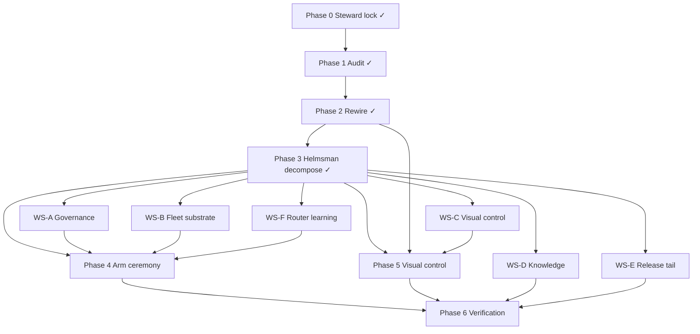

# MURE Company Build-Out — Phase 3 Helmsman Decomposition

**Date:** 2026-06-29  
**Authority:** `_SYSTEM/reports/MURE_COMPANY_BUILD_PLAN_2026-06-29.md` Phase 3  
**Prior:** Phase 1 `21c882d4` · Phase 2 `9d09640c`  
**RESULT_LABEL:** `03R1_MURE_DECOMPOSE_X_PASS_COMMITTED`  
**Posture:** ARMED (named build-out exception — `mure.enabled`, `glm-fleet.enabled`, `ollama-fleet.enabled` present)

---

## Executive summary

Phase 3 decomposes the company build-out into six governed workstream task packets (WS-A..F), validates 20-role coverage, publishes a held register, routes subtasks to native / GLM / Ollama substrates, and executes parallel advisory lanes. All WS dry-runs pass; MURE tests remain 127/127 green. Scout and evolver gaps are documented with mitigations.

| Deliverable | Status |
|-------------|--------|
| 20-role coverage matrix | ✅ 18/20 in packets; scout via GLM lane; evolver HELD |
| Held register | ✅ 3 held subtasks across WS-A + WS-E |
| Dependency graph | ✅ documented below |
| Substrate routing map | ✅ native / glm / ollama / inline |
| GLM parallel lanes | ✅ 3 live advisory slices |
| Ollama synthesis lane | ✅ 1 live armed run |
| helmsman-run.mjs | ✅ dry-run-all + ollama sidecar |
| runFleet sidecar fallback | ✅ `_SYSTEM/lane-output/ollama-sidecar/` when `.claude/jobs/` blocked |
| Visual-plan gate (WS-C) | ✅ documented |
| Verification | ✅ tests + dry-runs |

---

## 20-role coverage matrix (WS-A..F)

| Role | WS-A | WS-B | WS-C | WS-D | WS-E | WS-F | Substrate default | Phase 3 routing |
|------|:----:|:----:|:----:|:----:|:----:|:----:|-------------------|-----------------|
| helmsman | — | — | — | — | P8 ✓ | — | native/opus | **HELD** (finalize) |
| architect | — | ✓ | — | — | P3 ✓ | — | glm-max | glm |
| steward | ✓ | — | — | — | P4 ✓ | — | native | **HELD** (owner-gated) |
| ideator | — | — | — | ✓ | — | — | glm | glm |
| scout | — | — | — | — | — | — | native/sonnet | **GLM lane slice** (no JSON subtask) |
| synthesist | — | — | — | ✓ | P6 ✓ | — | glm-max | glm + **ollama live** |
| evolver | — | — | — | — | — | — | glm-max | **HELD** (oracle gate) |
| deliberator | — | ✓ | — | — | — | ✓ | glm-max | glm |
| engineer | ✓ | ✓ | — | — | P2 ✓ | — | glm | glm |
| mechanic | — | ✓ | ✓ | — | — | — | glm | glm |
| artificer | — | — | ✓✓ | — | — | — | haiku/glm-flash | glm + **ollama sidecar** (WS-C) |
| sentinel | ✓ | — | — | — | — | — | native/sonnet | native + **GLM arm audit slice** |
| kernelsmith | — | ✓ | — | — | P5 ✓ | ✓ | glm-max | glm |
| adjudicator | ✓ | ✓ | — | — | — | — | glm-max | glm + **GLM verify slice** |
| oracle | ✓ | — | — | — | P7 ✓ | — | native | native |
| calibrator | — | — | — | ✓ | — | ✓ | native | native |
| archivist | — | — | — | ✓ | — | — | native | native |
| chronicler | — | — | ✓ | ✓ | — | — | sonnet/glm | glm |
| quartermaster | — | — | — | — | — | ✓ | native | native |
| envoy | — | — | ✓ | — | — | — | native/sonnet | native |

**Coverage:** 18 roles cast in task JSON · scout covered via Phase 3 GLM advisory slice · evolver intentionally absent (owner-gated + oracle).

---

## Held register (owner-gated subtasks)

| Subtask | Workstream | Role | Reason | Owner action |
|---------|------------|------|--------|--------------|
| `WS-A-S1-steward-gate` | WS-A | steward | Role is owner-gated by posture | One-token confirm steward ruling |
| `P4-S1-steward-gate` | WS-E | steward | blastRadius HIGH — outward release | Explicit release authorize |
| `P8-H1-helmsman-finalize` | WS-E | helmsman | irreversible + HIGH blast — finalize | Owner-only commit/push/publish |
| *(implicit)* | all | evolver | Not in any packet | Oracle green + explicit evolver authorize |
| *(implicit)* | all | sentinel (arm) | Arm ceremony actions | Phase 4 ordered ceremony |

---

## Dependency graph



**Dispatch order (Phase 4+):** WS-A → WS-B → WS-C (after `/visual-plan`) → WS-D → WS-F → WS-E tail.

---

## Substrate routing summary

| Substrate | When | Mechanism | Phase 3 evidence |
|-----------|------|-----------|------------------|
| **native** | oracle, calibrator, quartermaster, envoy, sentinel audits | `nativeSpecs` → Opus Agent spawn | WS-A: 1 native; WS-C: 1 native |
| **glm** | engineer, mechanic, adjudicator, deliberator, ideator, synthesist, kernelsmith | `runSwarm` / `llm-compat @deepseek-flash` | WS-B: 6 glm leaves; 3 live GLM slices |
| **ollama** | scout/artificer bulk, synthesist research | `ollama-fleet.mjs` sidecar | WS-C: 2 artificer tasks; WS-D synthesist live |
| **inline** | chronicler doc-only, steward holds | planCompany inline | WS-A: 1 inline (oracle) |

### Dry-run cast totals (helmsman-run)

| Task file | Subtasks | GLM | Native | Held |
|-----------|----------|-----|--------|------|
| `mure-buildout-ws-a-governance.json` | 5 | 2 | 1 | 1 |
| `mure-buildout-ws-b-fleet.json` | 6 | 6 | 0 | 0 |
| `mure-buildout-ws-c-visual.json` | 5 | 4 | 1 | 0 |
| `mure-buildout-ws-d-knowledge.json` | 5 | 3 | 0 | 0 |
| `mure-buildout-ws-f-router.json` | 4 | 2 | 0 | 0 |
| `yuri-public-release-phase2-8.json` | 7 | 4 | 0 | 2 |

---

## GLM + Ollama lane execution (Phase 3)

All prompts bounded to file paths only; no secrets pasted.

### GLM lanes (live — `llm-compat @deepseek-flash` / `llm-lane.mjs deepseek`)

| Slice | Command | Outcome | RESULT_LABEL |
|-------|---------|---------|--------------|
| Scout audit | `bash _SYSTEM/Scripts/llm-compat.sh @deepseek-flash "…5 evidence gaps…"` | 5 gaps: stale WS-A packet, arm flags unverified, port mismatch, GitNexus hearsay, ollama overclaim | `03SCOUT_AUDIT_SLICE_X_PASS_COMMITTED` |
| Adjudicator verify | `bash _SYSTEM/Scripts/llm-compat.sh @deepseek-flash "…dryrun ws-a…"` | held=1, glm=2, native=1, inline=1 arithmetic OK | `03ADJUDICATOR_SLICE_X_PASS_COMMITTED` |
| Sentinel arm audit | `node _SYSTEM/Scripts/llm-lane.mjs deepseek "…arm flags…"` | mure/glm/ollama `.enabled` present; risk LOW | `03SENTINEL_ARM_SLICE_X_PASS_COMMITTED` |

Outputs: `_SYSTEM/lane-output/phase3/glm-*-live.txt` (gitignored).

**Note:** `@deepseek-flash` routed to `deepseek-v4-pro` via LOCAL_ROUTING; cost admission warnings observed (conservative cap).

### Ollama lane (live — armed via `ollama-fleet.enabled`)

| Slice | Command | Outcome | RESULT_LABEL |
|-------|---------|---------|--------------|
| Synthesist doctrine | `node _SYSTEM/Scripts/ollama-fleet.mjs --tasks '[…WS-D-S1…]'` | ok=true, 46.8s, 1163 chars — doctrine axes vs goal tree paragraph | `03D_SYNTHESIS_SLICE_X_PASS_COMMITTED` |

Output: `_SYSTEM/lane-output/phase3/ollama-synthesis-live.txt` + `.claude/jobs/olf-mqzctz1u-6a7ee5/results/`.

### Dry-run lanes (zero spend)

| Command | Result |
|---------|--------|
| `llm-compat.sh --dry-run @deepseek-flash …` | DRY_RUN marker only |
| `ollama-fleet.mjs --dry-run --tasks '[…]'` | armed=false, lane plan only |
| `helmsman-run.mjs --dry-run-all --ollama-sidecar` | 6/6 files, 0 errors |

---

## Visual-plan gate (WS-C)

WS-C task packet includes `"visualPlanUrl": "/visual-plan"`. Before armed multi-role UI dispatch:

1. Run `/visual-plan` with packet header:
   ```
   /visual-plan MURE WS-C Visual Control — dashboard drill-down, held queue stub, trends wiring
   Task file: 02_RESOURCES/TASKS/mure-buildout-ws-c-visual.json
   Endpoints: /api/run, /api/artifacts, /api/trends
   Posture: DISARMED read-only until Phase 4 arm ceremony
   ```
2. Owner approves wireframes / file map before mechanic+artificer armed runs.
3. After WS-C lands: `/visual-recap` per `02_RESOURCES/GUIDES/agent-native-company-visuals.md`.

**WS-C visual control items (chronicler checklist):**

| ID | Item | Status |
|----|------|--------|
| WS-C-R1 | Dashboard drill-down (`/api/run`, drawer) | ✅ Phase 2 |
| WS-C-R2 | Trends charts (`/api/trends`) | ✅ Phase 2 |
| WS-C-E1 | `visualPlanUrl` metadata convention | ✅ in task JSON |
| WS-C-H1 | Held queue stub | ⏳ Phase 5 |
| WS-C-C1 | Visual docs update | ⏳ this phase documents gate |

---

## Mechanism improvements (Phase 3)

### 1. `runFleet.mjs` — ollama sidecar write fallback

When `.claude/jobs/` is not writable (sandbox / protected), `--ollama-sidecar` falls back to `_SYSTEM/lane-output/ollama-sidecar/<runId>/ollama-tasks.json`.

### 2. `helmsman-run.mjs` — packet runner

```bash
# Dry-run all WS packets + capture outputs
node _SYSTEM/mure/helmsman-run.mjs --dry-run-all --ollama-sidecar --out _SYSTEM/lane-output/phase3

# Single packet
node _SYSTEM/mure/helmsman-run.mjs --task-file 02_RESOURCES/TASKS/mure-buildout-ws-b-fleet.json --ollama-sidecar
```

Parallel GLM pattern (manual, bounded prompts):

```bash
bash _SYSTEM/Scripts/llm-compat.sh @deepseek-flash "<bounded prompt with file paths>"
node _SYSTEM/Scripts/llm-lane.mjs deepseek "<bounded prompt>"
node _SYSTEM/Scripts/ollama-fleet.mjs --tasks-file _SYSTEM/lane-output/ollama-sidecar/<runId>/ollama-tasks.json
```

MURE dispatch (when armed):

```bash
node _SYSTEM/mure/company.mjs --task-file 02_RESOURCES/TASKS/mure-buildout-ws-a-governance.json --dry-run
node _SYSTEM/Scripts/runFleet.mjs --task-file 02_RESOURCES/TASKS/mure-buildout-ws-b-fleet.json --dry-run --ollama-sidecar
```

---

## Verification evidence

| Check | Command | Result |
|-------|---------|--------|
| MURE tests | `node --test _SYSTEM/mure/*.test.mjs` | 127 pass · 0 fail |
| Roster | `node _SYSTEM/mure/mure.mjs --validate` | 20 roles OK |
| Arm status | `node _SYSTEM/mure/mure.mjs --status` | ARMED (flag) |
| helmsman-run | `helmsman-run.mjs --dry-run-all --ollama-sidecar` | 6 files · 0 errors |
| WS-C ollama sidecar | runFleet on ws-c-visual | eligibleCount=2 (artificer) |
| Lane outputs | `_SYSTEM/lane-output/phase3/` | gitignored |

---

## Phase 4 readiness

| Prerequisite | Ready? |
|--------------|--------|
| Six WS task packets validated | ✅ |
| Held register published | ✅ |
| Governance tests green | ✅ |
| Ollama sidecar discoverable + fallback path | ✅ |
| GLM/Ollama smoke paths exercised | ✅ |
| helmsman-run dry-run harness | ✅ |
| Visual-plan gate documented for WS-C | ✅ |
| Owner arm ceremony runbook (plan § Phase 4) | ✅ (doc exists) |

**Next:** Phase 4 ordered arm ceremony (GLM → MURE → Ollama smokes) then dispatch WS-A first.

---

## Residual risks

| Risk | Severity | Mitigation |
|------|----------|------------|
| ARMED posture — accidental spend | HIGH | Phase 4 ceremony; dry-run default; document live calls |
| Scout not in task JSON | LOW | Add `WS-D-R0-scout-census` in Phase 4 or keep GLM lane |
| WS-A packet stale vs Phase 2 completion | MEDIUM | Sync subtask status before armed WS-A dispatch |
| Ollama still manual spawn (not auto-dispatched) | MEDIUM | Phase 4 `--apply` integration |
| `@deepseek-flash` routes to v4-pro (cost) | LOW | Use explicit flash tier when cost admission allows |
| Held queue UI not wired | LOW | WS-C-H1 Phase 5 |
| Native substrate requires Opus session | MEDIUM | Documented seam; nativeSpecs for Cursor spawn |

---

## Files changed (Phase 3)

| Path | Change |
|------|--------|
| `_SYSTEM/reports/MURE_COMPANY_BUILD_03_HELMSMAN.md` | This report |
| `_SYSTEM/mure/helmsman-run.mjs` | Packet runner |
| `_SYSTEM/Scripts/runFleet.mjs` | Ollama sidecar write fallback |
| `.gitignore` | `_SYSTEM/lane-output/` |

---

*Produced under ARMED build-out exception. Live GLM (3) + Ollama (1) calls documented. Lane outputs gitignored.*
