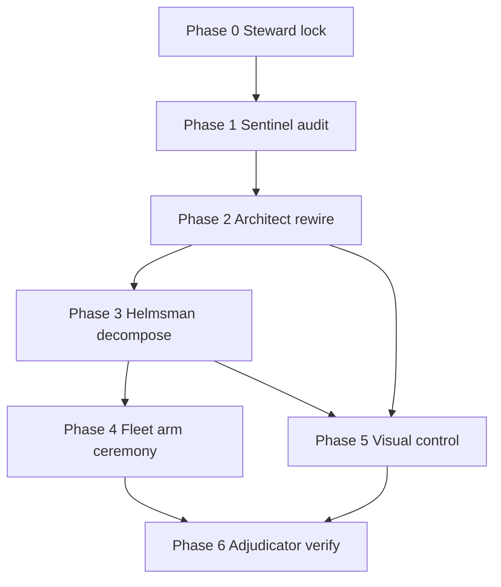

# MURE Company Build-Out — Execution Plan

**Date:** 2026-06-29  
**Authority:** Owner Marcel + MURE 20-role model  
**Label:** `MURE_BUILD_PLAN_00_SCOPE_LOCKED_X_PASS_COMMITTED`  
**Baseline commits:** `7c2540ab` (release prep) · `86e381fb` (agent-native) · `64d3b306` (bootstrap fix)

---

## Executive summary

MURE is **built but not fully operational**: the 20-role roster validates, `company.mjs` plans and dispatches (when armed), the work dashboard serves on `:4270`, and Agent-Native visual-plan is wired. Gaps block safe company-scale execution:

| Area | State | Gap |
|------|-------|-----|
| **Arm posture** | All three fleet flags **present** (`mure.enabled`, `glm-fleet.enabled`, `ollama-fleet.enabled`) | Build-out should start **DISARMED**; flags left over from prior sessions |
| **Tests** | 8 failing in `_SYSTEM/mure/*.test.mjs` | Governance regressions (self-arm, finalize hold, substrate invariants) |
| **Task packets** | Only `phase1-census.json` exists | Phases 2–8 referenced in release scope doc are **missing** |
| **Ollama substrate** | `ollama-fleet.mjs` live | **Not auto-wired** in `company.mjs` / `runFleet.mjs` (manual sidecar only) |
| **Native substrate** | `native-spawn-loop.mjs` seam defined | GLM-side runs produce **stub packets**; real native execution requires Opus/Cursor Agent spawn |
| **Dashboard UI** | API has `/api/run`, `/api/artifacts`, `/api/trends` | `dashboard.html` does **not consume** drill-down endpoints; no approval queue UI |
| **MLP router** | Weights file present, advisory integration in `planCompany` | Cold weights; no ledger feedback loop wired to `updateFromOutcome` |
| **GitNexus index** | 3 commits behind | Structural hits downranked; re-index before large refactors |

**Recommended posture for this build-out:** Armed exception for active build-out (owner 2026-06-29); role charter + owner-gated roles still hold. See Phase 0 lock below.

---

## Owner lock (2026-06-29)

| Decision | Owner choice |
|----------|--------------|
| **Scope (B03)** | **Both — company ops first, then public-release tail** (phases 2–8) |
| **Arm posture (B01)** | **Keep armed** — named exception: active company build-out session; live dispatch still subject to 6-gate + owner-gated roles |
| **Plan artifact** | This file is the steward lock for build-out execution |

---

## MURE roster reference (20 roles)

| Group | Roles | Owner-gated |
|-------|-------|-------------|
| Orchestration | helmsman, architect, steward | helmsman, steward |
| Research | ideator, scout, synthesist, evolver, deliberator | evolver |
| Engineering | engineer, mechanic, artificer, sentinel, kernelsmith | sentinel (arm actions) |
| Verification | adjudicator, oracle, calibrator | — |
| Knowledge | archivist, chronicler | — |
| Operations | quartermaster, envoy | — |

Substrates: **native** (Opus/Sonnet/Haiku Agent tool) · **glm** (z.ai via runSwarm) · **ollama** (parallel sidecar, not yet in company.mjs).

---

## Phase 0 — Steward lock (scope + arm posture)

**Purpose:** Lock what "company build-out" means, enforce DISARMED-first, and prevent accidental spend during planning.

### Roles involved

| Role | Responsibility |
|------|----------------|
| **steward** | Scope lock, arm posture ruling, 6-gate charter on every subsequent phase |
| **envoy** | Decode owner intent → goal tree + acceptance criteria |
| **helmsman** | Approve phase ordering and dependency graph (owner-gated plan sign-off) |
| **chronicler** | Publish this plan + scope lock artifact |

### Deliverables

1. **Scope lock doc** (this file) — **RATIFIED** owner 2026-06-29
2. **Arm posture — named exception (armed build-out):**
   - Flags remain: `mure.enabled`, `glm-fleet.enabled`, `ollama-fleet.enabled`
   - Chronicle: `_SYSTEM/reports/MURE_COMPANY_BUILD_PLAN_2026-06-29.md` § Owner lock
   - **Still required:** 6-gate charter, owner-gated roles (helmsman/steward/evolver/sentinel arm), no finalize without adjudicator pass
   ```bash
   node _SYSTEM/mure/mure.mjs --status   # expect ARMED under exception
   ```
3. **Build-out goal tree** (locked — company ops first, then release tail):
   ```
   MURE Company Operational
   ├── P0 Steward lock + armed exception documented ✓
   ├── P1 Sentinel/Scout audit (broken/stale inventory)
   ├── P2 Architect/Engineer rewire (mechanism fixes)
   ├── P3 Helmsman decomposition (20-role task packets per workstream)
   ├── P4 Fleet arm ceremony (ordered arming with keys)
   ├── P5 Visual company control (dashboard + dispatch + visual-plan gates)
   └── P6 Adjudicator verification + residual risk
   ```
4. **Out-of-scope boundary:** no public repo push, no invite-repo creation, no evolver self-modification, no governance.mjs edits without oracle gate

### DISARMED vs ARMED

| Action | Posture |
|--------|---------|
| Read files, run xref, planCompany, mure --demo, work-dashboard --serve | **DISARMED** (safe) |
| runCompany with GLM spend, ollama-fleet fan-out, native Agent spawn | **ARMED** (blocked until Phase 4) |
| Commit/push/finalize | **Owner-only** (never autonomous) |

### Dependencies

- None (entry phase)
- **Owner decision required:** confirm build-out scope (private monorepo company ops vs public-release follow-on vs both)

### Execution order

1. Owner confirms scope (see blockers below)
2. Steward publishes arm reset checklist
3. Owner executes arm reset (or explicitly keeps armed for a named live run — document exception)
4. Chronicler links plan from `_SYSTEM/INDEX.md` or context registry if desired

---

## Phase 1 — Sentinel/Scout audit (what's broken, stale, unarmed)

**Purpose:** Evidence-first inventory before any rewire. Read-only; no arm required.

### Roles involved

| Role | Subtask focus |
|------|---------------|
| **sentinel** | Protected-path audit, arm-flag inventory, secrets surface scan (tracked files only) |
| **scout** | Stale index census (GitNexus, xref), missing task files, dashboard API/UI gap map |
| **adjudicator** | Independent refute-by-default on "MURE is ready" claim |
| **oracle** | Red/grey/green on test suite + demo dry-run |
| **artificer** | Bulk file census (task JSON gaps, test failure enumeration) |
| **quartermaster** | Token/cost lane health (llm-compat admission, quota pressure signals) |

### Deliverables

1. **Fleet/lane health report** (`_SYSTEM/reports/MURE_AUDIT_FLEET_HEALTH_2026-06-29.md`)
   - MURE roster: `node _SYSTEM/mure/mure.mjs --validate` → **20 roles OK**
   - MURE tests: **8 failures** in `company.test.mjs` (governance regressions)
   - Arm flags: all three present (document owner intent)
   - llm-compat: routes to DeepSeek; cost admission warnings observed
   - ollama-fleet: DISARMED logic OK; not wired to company.mjs
   - work-ledger: populated (release + mure + blender jobs visible)
   - job-pool: operational (rankJobs, jobStats wired to dashboard)
   - GitNexus: **STALE** (re-index before Phase 2 refactors)
2. **Task packet gap list:** phases 2–8 JSON files missing (only `yuri-public-release-phase1-census.json` exists)
3. **Dashboard gap matrix:**

   | API endpoint | Backend | UI wired |
   |--------------|---------|----------|
   | `/api/overview` | ✅ | ✅ (poll) |
   | `/api/run?id=` | ✅ | ❌ |
   | `/api/artifacts?role=&run=` | ✅ | ❌ |
   | `/api/trends?type=` | ✅ | ❌ |
   | Approval queue (held subtasks) | ❌ | ❌ |

4. **Native substrate seam audit:** confirm Opus/Cursor is the only live native executor
5. **RESULT_LABEL:** `01R1_MURE_AUDIT_X_PASS_COMMITTED`

### DISARMED vs ARMED

| Action | Posture |
|--------|---------|
| All audit subtasks | **DISARMED** |
| Optional ollama smoke | **ARMED** (owner-gated; defer to Phase 4) |

### Dependencies

- Phase 0 scope lock
- Arm reset recommended (prevents accidental spend during parallel sessions)

### Execution order

1. Scout: file/index census
2. Sentinel: arm flags + protected-path boundary check
3. Oracle: run `node --test _SYSTEM/mure/*.test.mjs` + `mure.mjs --demo`
4. Adjudicator: attack audit completeness
5. Quartermaster: llm-compat + token-ledger snapshot
6. Chronicler: consolidate audit report

**Suggested ollama sidecar (read-only plan):**
```bash
node _SYSTEM/Scripts/runFleet.mjs --task-file <audit-task.json> --dry-run
# ollama parallel: node _SYSTEM/Scripts/ollama-fleet.mjs --dry-run --tasks '[...]'
```

---

## Phase 2 — Architect/Engineer rewire (mechanisms to fix)

**Purpose:** Fix broken governance tests, wire missing substrate seams, scaffold missing task infrastructure.

### Roles involved

| Role | Subtask focus |
|------|---------------|
| **architect** | Substrate integration design (ollama sidecar contract, native Opus seam, MLP feedback loop) |
| **engineer** | Fix `company.test.mjs` failures; restore governance invariants |
| **mechanic** | Wire ollama sidecar hook in `runFleet.mjs`; dashboard drill-down UI |
| **kernelsmith** | MLP router → work-ledger outcome feedback; performance of planCompany |
| **sentinel** | Review rewire diff for protected-path touches, arm-gate integrity |
| **steward** | Gate every mechanism change (blast ≤ MEDIUM, reversible) |

### Deliverables

1. **Governance test green** — fix 8 failures in `_SYSTEM/mure/company.test.mjs`:
   - Self-arm regression (`runCompany({armed:true})` must not bypass owner flag)
   - Finalize subtask hold
   - Substrate invariant (glm lane ↔ glm leaf; native model ↔ native spec)
   - Conservation: held + glm + native + inline == cast count
   - Deterministic planCompany
2. **Ollama sidecar contract** in `runFleet.mjs`:
   - Auto-generate `ollama-tasks.json` from plan casts where role/lane suggests bulk (scout, artificer)
   - Document parallel invocation; optional `--ollama-sidecar` flag (DISARMED = plan only)
3. **MLP feedback seam:**
   - After swarm run: call `updateFromOutcome(features, decision, outcome)` from runSwarm finalize path
   - Log to work-ledger / fleet-router-ledger
4. **Task packet scaffold:** create `02_RESOURCES/TASKS/mure-buildout-*.json` for phases 1–6 (see Phase 3)
5. **GitNexus re-index:** `npx gitnexus analyze --skip-agents-md`
6. **RESULT_LABEL:** `02R1_MURE_REWIRE_X_PASS_COMMITTED`

### DISARMED vs ARMED

| Change | Posture |
|--------|---------|
| Test fixes, UI wiring, task JSON, MLP logging | **Self-governable** (DISARMED) |
| Live ollama/GLM integration test | **ARMED** (Phase 4) |
| governance.mjs edits | **Owner-gated** (steward hold) |

### Dependencies

- Phase 1 audit report (prioritized fix list)
- No arm flags during test development (hermetic tests assume DISARMED)

### Execution order

1. Architect: integration spec (1-page, in report or `_SYSTEM/mure/BUILD-DOCTRINE.md` appendix)
2. Engineer: test fixes (TDD — red first from audit)
3. Mechanic: runFleet ollama hook + dashboard UI drill-down
4. Kernelsmith: MLP outcome loop
5. Sentinel: security review of diffs
6. Adjudicator: re-run full test suite

---

## Phase 3 — Helmsman decomposition (20-role task packets per workstream)

**Purpose:** Break the company build-out into governed, role-cast task packets the orchestrator can plan and (when armed) dispatch.

### Roles involved

| Role | Responsibility |
|------|----------------|
| **helmsman** | Decompose goal tree → subtasks; assign roles via capability match |
| **envoy** | Normalize owner packets into JSON task shape |
| **architect** | Workstream boundaries and dependency ordering |
| **steward** | Gate each subtask (blast, outward, contended, finalize) |

### Workstreams and task packets

Each workstream gets a JSON task file under `02_RESOURCES/TASKS/`:

| Workstream | Task file | Primary roles | Subtask count (target) |
|------------|-----------|---------------|------------------------|
| **WS-A: Governance hardening** | `mure-buildout-ws-a-governance.json` | steward, sentinel, adjudicator, oracle | 4–6 |
| **WS-B: Fleet substrate rewire** | `mure-buildout-ws-b-fleet.json` | architect, engineer, mechanic, kernelsmith | 5–8 |
| **WS-C: Visual control** | `mure-buildout-ws-c-visual.json` | mechanic, artificer, chronicler, envoy | 4–6 |
| **WS-D: Knowledge & doctrine** | `mure-buildout-ws-d-knowledge.json` | archivist, synthesist, chronicler, calibrator | 3–5 |
| **WS-E: Public-release tail** | `yuri-public-release-phase2-8.json` (phases 2–8) | per release scope doc | 8 phases × 3–5 subtasks |
| **WS-F: Router learning** | `mure-buildout-ws-f-router.json` | calibrator, quartermaster, kernelsmith | 3–4 |

### Example subtask shape (from phase1 pattern)

```json
{
  "id": "WS-B-R1-ollama-sidecar",
  "role": "mechanic",
  "need": ["integration", "refactor"],
  "prompt": "Wire ollama-fleet sidecar generation into runFleet.mjs when plan casts bulk roles. DISARMED default. Document in README. Return 02B1_OLLAMA_SIDEcar_X_PASS_COMMITTED.",
  "blastRadius": "LOW",
  "reversible": true
}
```

### Role coverage matrix (ensure all 20 roles get ≥1 subtask across packets)

| Role | WS-A | WS-B | WS-C | WS-D | WS-E | WS-F |
|------|------|------|------|------|------|------|
| helmsman | plan | — | — | — | phase8 | — |
| architect | — | ✓ | ✓ | — | phase3-4 | — |
| steward | ✓ | gate | — | — | phase4,8 | — |
| ideator | — | — | — | ✓ | — | — |
| scout | audit | — | — | ✓ | phase1,6 | — |
| synthesist | — | — | — | ✓ | phase6 | — |
| evolver | — | — | — | — | **HELD** | — |
| deliberator | — | ✓ | — | — | — | ✓ |
| engineer | — | ✓ | — | — | phase2-3 | — |
| mechanic | — | ✓ | ✓ | — | phase2 | — |
| artificer | census | — | ✓ | — | phase1,3 | — |
| sentinel | ✓ | review | — | — | phase1-2,7 | — |
| kernelsmith | — | ✓ | — | — | phase5 | ✓ |
| adjudicator | ✓ | verify | — | — | phase7 | — |
| oracle | ✓ | — | — | — | phase7 | — |
| calibrator | — | — | — | ✓ | phase7 | ✓ |
| archivist | — | — | — | ✓ | phase6 | — |
| chronicler | doc | — | ✓ | ✓ | phase3-4,8 | — |
| quartermaster | cost | — | — | — | phase7 | ✓ |
| envoy | intake | — | ✓ | — | phase4 | — |

### Deliverables

1. Six task JSON files (minimum) with validated role casts
2. Dry-run plans for each:
   ```bash
   node _SYSTEM/mure/company.mjs --task-file 02_RESOURCES/TASKS/mure-buildout-ws-a-governance.json --dry-run
   node _SYSTEM/Scripts/runFleet.mjs --task-file 02_RESOURCES/TASKS/mure-buildout-ws-b-fleet.json --dry-run
   ```
3. Held-subtask register (owner-gated items: evolver, finalize, arm actions, outward release)
4. **Visual-plan gate:** `/visual-plan` on WS-C before UI implementation (Agent-Native approval)
5. **RESULT_LABEL:** `03R1_MURE_DECOMPOSE_X_PASS_COMMITTED`

### DISARMED vs ARMED

| Action | Posture |
|--------|---------|
| Task JSON authoring, planCompany dry-run | **DISARMED** |
| Any subtask with `arming: true` or `finalize: true` | **HELD** (owner-gated) |

### Dependencies

- Phase 2 rewire complete (tests green, ollama contract defined)
- Phase 0 scope choice (which workstreams in vs out)

### Execution order

1. Envoy: normalize workstream specs
2. Helmsman: decompose + capability-match (owner reviews plan)
3. Steward: gate each subtask
4. Chronicler: publish task file index
5. Owner: approve held register

---

## Phase 4 — Fleet arm ceremony (what to arm, in what order, with what keys)

**Purpose:** Controlled, documented arming for live multi-substrate dispatch. **Never auto-arm.**

### Roles involved

| Role | Responsibility |
|------|----------------|
| **steward** | Arm ceremony script + rollback procedure |
| **sentinel** | Pre-arm security checklist (no secrets in prompts, no protected paths) |
| **helmsman** | Ordered dispatch sequence |
| **quartermaster** | Cost ceiling + quota check before each arm step |
| **oracle** | Smoke verdict before scaling to full workstream |

### Arm ceremony sequence (strict order)

| Step | Gate | Env / flag | Keys required | Rollback |
|------|------|------------|---------------|----------|
| **0. Pre-flight** | DISARMED dry-run all WS task files | — | — | — |
| **1. GLM fleet** | Owner token: "arm glm" | `touch _SYSTEM/state/glm-fleet.enabled` or `YURI_GLM_FLEET=1` | z.ai API key (keychain) | `rm _SYSTEM/state/glm-fleet.enabled` |
| **2. Swarm convergence** | After GLM smoke pass | `YURI_SWARM_CONVERGENCE=1` | (bundled with GLM) | unset env |
| **3. MURE orchestrator** | After steps 1–2 green | `touch _SYSTEM/state/mure.enabled` or `YURI_MURE_ARMED=1` | (uses GLM from step 1) | `rm _SYSTEM/state/mure.enabled` |
| **4. Ollama sidecar** | Parallel bulk only | `touch _SYSTEM/state/ollama-fleet.enabled` or `YURI_OLLAMA_FLEET=1` | Ollama Pro key (keychain) | `rm _SYSTEM/state/ollama-fleet.enabled` |
| **5. Native substrate** | Opus/Cursor session only | (same as MURE) | Anthropic weekly pool | disarm MURE |
| **6. Evolver** | **Separate owner gate** | oracle green + explicit evolver authorize | — | never auto |

### Smoke commands (per step)

```bash
# Step 1 — GLM only
YURI_GLM_FLEET=1 node _SYSTEM/Scripts/glm-fleet.mjs --smoke

# Step 3 — MURE armed single-leaf
YURI_MURE_ARMED=1 node _SYSTEM/mure/mure.mjs --demo   # then small real task

# Step 4 — Ollama 3-model smoke
YURI_OLLAMA_FLEET=1 node _SYSTEM/Scripts/ollama-fleet.mjs --smoke

# Full tri-substrate (after all smokes green)
node _SYSTEM/Scripts/runFleet.mjs --task-file 02_RESOURCES/TASKS/mure-buildout-ws-b-fleet.json --apply
# parallel: node _SYSTEM/Scripts/ollama-fleet.mjs --tasks-file <generated-sidecar.json>
```

### Deliverables

1. **Arm ceremony runbook** (section in this doc + `_SYSTEM/mure/README.md` cross-link)
2. **Smoke RESULT_LABELs** per substrate
3. **Disarm script:**
   ```bash
   rm -f _SYSTEM/state/{mure,glm-fleet,ollama-fleet}.enabled
   ```
4. **Held dispatch log** — every owner-gated subtask with ruling + owner confirm token

### DISARMED vs ARMED

| Step | Posture |
|------|---------|
| Steps 0, documentation | DISARMED |
| Steps 1–5 | ARMED (owner ceremony each) |
| Step 6 evolver | **Owner-gated + oracle** |

### Dependencies

- Phase 3 task packets approved
- Phase 2 tests green
- Owner keys verified in keychain (never read `.env`)

### Execution order

1. Quartermaster: cost budget for smoke + first workstream
2. Sentinel: pre-arm checklist
3. Owner: execute steps 0→5 in order
4. Oracle: smoke verdicts
5. Helmsman: dispatch WS-A (governance) first, then WS-B, etc.

---

## Phase 5 — Visual company control (dashboard, dispatch, visual-plan gates)

**Purpose:** Operator-facing control surface — see runs, approve held items, link visual plans, eventual Dispatch fork.

### Roles involved

| Role | Responsibility |
|------|----------------|
| **mechanic** | Dashboard drill-down UI (`/api/run`, `/api/artifacts`, `/api/trends`) |
| **artificer** | Approval queue stub (held subtasks from planCompany) |
| **envoy** | Visual-plan ↔ task packet linking convention |
| **architect** | Dispatch template fork scope (headless-first) |
| **chronicler** | Update `02_RESOURCES/GUIDES/agent-native-company-visuals.md` |

### Deliverables (prioritized)

#### P5-A — Dashboard drill-down (1–2 sessions, DISARMED)

- [ ] Run detail panel: fetch `/api/run?id=<runId>` on constellation node click
- [ ] Artifact browser: `/api/artifacts?role=&run=`
- [ ] Trends charts: wire `/api/trends?type=throughput|convergence|productivity`
- [ ] Held queue read-only stub: ingest latest `planCompany` held array from work-ledger or run metadata

```bash
node _SYSTEM/Scripts/work-dashboard.mjs --serve   # :4270
```

#### P5-B — Visual-plan integration gates (DISARMED)

- [ ] Helmsman workflow: `/visual-plan` before WS-C and any multi-role dispatch
- [ ] Plan slug field in task JSON (`visualPlanUrl` optional metadata)
- [ ] `/visual-recap` after each workstream lands
- [ ] Owner auth (optional): `node _SYSTEM/Scripts/agent-native-bootstrap.mjs connect`

#### P5-C — Company Console fork (multi-session, bounded)

Scaffold from `integrations/agent-native/templates/dispatch/` (local clone, gitignored):

| Dispatch route | YURI action |
|----------------|-------------|
| overview | work-ledger overview + MURE status |
| agents | role constellation + last run per role |
| approvals | held subtasks (owner-gated roles) |
| audit | blackboard JSON + RESULT_LABELs |
| metrics | trends API + MLP confidence |
| chat | (defer — use Cursor/Opus session) |

Wire read paths only until Phase 4 arm ceremony complete. Live dispatch buttons → owner-gated.

#### P5-D — Analytics layer (med priority)

- Port Analytics template patterns for fleet-router-ledger + token-ledger
- Charts: throughput, convergence rate, lane cost, router confidence

### DISARMED vs ARMED

| Surface | Posture |
|---------|---------|
| Dashboard serve, drill-down, trends | DISARMED (read-only) |
| Dispatch live actions | ARMED + owner confirm per action |
| Hosted visual plans | DISARMED (no secrets in plans) |

### Dependencies

- Phase 2 dashboard API (already exists — UI wiring only)
- Agent-Native bootstrap complete (`64d3b306`)
- Phase 3 WS-C task packet + visual-plan approval

### Execution order

1. P5-A dashboard drill-down (quick win)
2. P5-B visual-plan gates in helmsman workflow
3. P5-C Dispatch fork (scoped)
4. P5-D analytics (when ledger feedback loop exists from Phase 2)

---

## Phase 6 — Adjudicator verification + residual risk

**Purpose:** Adversarial pass before claiming "MURE company operational."

### Roles involved

| Role | Responsibility |
|------|----------------|
| **adjudicator** | Refute-by-default on all phase deliverables |
| **oracle** | Red/grey/green acceptance tests |
| **calibrator** | Brier/honesty check on prediction ledger |
| **sentinel** | Final protected-path + arm-posture audit |
| **quartermaster** | Cost post-mortem |
| **chronicler** | Final report + owner summary |

### Verification checklist

| Check | Command / evidence | Pass criteria |
|-------|------------------|---------------|
| Roster valid | `node _SYSTEM/mure/mure.mjs --validate` | 20 roles, 0 errors |
| Tests green | `node --test _SYSTEM/mure/*.test.mjs` | 0 failures |
| DISARMED default | `node _SYSTEM/mure/mure.mjs --status` | DISARMED after ceremony disarm |
| Plan-only safe | `node _SYSTEM/mure/mure.mjs --demo` | zero spend, held evolver |
| Tri-substrate plan | `runFleet.mjs --dry-run` each WS | casts + router suggestions |
| Dashboard live | `work-dashboard.mjs --serve` + manual click-through | drill-down works |
| Arm ceremony | documented smoke RESULT_LABELs | all substrates verified |
| No secrets in export | sentinel census | zero blockers |
| GitNexus fresh | `gitnexus analyze` | index current |

### Deliverables

1. **Verification report:** `_SYSTEM/reports/MURE_BUILDOUT_VERIFICATION_2026-06-29.md`
2. **Residual risk register** (see below)
3. **Owner summary** with RESULT_LABEL: `06V1_MURE_BUILDOUT_X_PASS_COMMITTED`

### Residual risks (initial)

| Risk | Severity | Mitigation |
|------|----------|------------|
| Native substrate requires Opus/Cursor — GLM-side runs get stubs | MEDIUM | Document seam; Opus session spawns nativeSpecs |
| Ollama not in company.mjs — manual sidecar | MEDIUM | Phase 2 rewire + runFleet hook |
| MLP cold weights — advisory only | LOW | Phase 2 feedback loop; don't auto-override governance |
| All arm flags currently set — accidental spend | HIGH | Phase 0 disarm reset (owner action) |
| 8 failing governance tests | HIGH | Phase 2 before any arm ceremony |
| Dispatch fork scope creep | MEDIUM | Headless-first; bounded to YURI actions |
| GitNexus stale | LOW | Re-index Phase 2 |

### DISARMED vs ARMED

| Action | Posture |
|--------|---------|
| Verification reads, dry-runs | DISARMED |
| Live end-to-end company run | ARMED (final demo only, owner present) |

### Dependencies

- Phases 0–5 complete
- Owner sign-off on held register cleared or explicitly deferred

---

## Prioritized backlog

| ID | Priority | Item | Tag | Phase | Owner action? |
|----|----------|------|-----|-------|---------------|
| B01 | **P0** | DISARM reset — remove `mure.enabled`, `glm-fleet.enabled`, `ollama-fleet.enabled` | owner-gated | 0 | **Yes** — execute checklist |
| B02 | **P0** | Fix 8 failing `company.test.mjs` governance regressions | self-governable | 2 | No |
| B03 | **P0** | Confirm build-out scope (company ops vs release tail vs both) | owner-gated | 0 | **Yes** — scope decision |
| B04 | **P0** | Create missing task packets (WS-A through WS-F + release phases 2–8) | self-governable | 3 | No |
| B05 | **P0** | GitNexus re-index before refactors | self-governable | 2 | No |
| B06 | P1 | Wire ollama sidecar into `runFleet.mjs` | self-governable | 2 | No |
| B07 | P1 | Dashboard drill-down UI (run/artifacts/trends) | self-governable | 5 | No |
| B08 | P1 | MLP outcome feedback loop (`updateFromOutcome`) | self-governable | 2 | No |
| B09 | P1 | Arm ceremony runbook + smoke scripts | self-governable | 4 | Arm steps: **Yes** |
| B10 | P1 | Visual-plan gate in helmsman workflow | self-governable | 5 | Optional auth: **Yes** |
| B11 | P2 | Dispatch template fork (Company Console) | self-governable | 5 | Live dispatch: **Yes** |
| B12 | P2 | Analytics dashboard (fleet/token ledger) | self-governable | 5 | No |
| B13 | P2 | Public release phases 2–8 execution | mixed | 3/E | Finalize/push: **Yes** |
| B14 | P2 | Plan MCP owner auth for shareable links | owner-gated | 5 | **Yes** (optional) |
| B15 | P2 | Evolver path (self-modification) | owner-gated | — | **Yes** + oracle |

---

## Cross-phase dependency graph



**Parallel tracks after Phase 2:**
- Track A: Phase 3 → 4 (fleet dispatch)
- Track B: Phase 5 (visual control — can start after Phase 2 dashboard API confirmed)

---

## Suggested execution order (master sequence)

1. **Owner:** Scope decision (B03) + disarm reset (B01)
2. **Sentinel/Scout audit** (Phase 1) — 1 session, DISARMED
3. **Engineer rewire** (Phase 2) — tests green, ollama hook, GitNexus — 1–2 sessions
4. **Helmsman task packets** (Phase 3) — 1 session
5. **Dashboard drill-down** (Phase 5-A) — parallel with step 4
6. **Visual-plan on WS-C** — owner approval gate
7. **Arm ceremony** (Phase 4) — owner present, ordered smokes
8. **Dispatch workstreams** WS-A → WS-B → WS-C (armed)
9. **Verification** (Phase 6)
10. **Optional:** Public release phases 2–8, Dispatch fork, analytics

---

## Governance reminders

- **No secrets** in task prompts, visual plans, or blackboard exports
- **No protected paths** (`backend/data/`, `.claude/state/`, `.env`, etc.)
- **No live arm** without documented ceremony and owner token
- **Finalize** (commit/push/publish) = owner/Opus only — subtasks with `finalize: true` are HELD
- **Evolver** requires oracle green + explicit owner authorization
- **MLP router** is advisory — governance.mjs always wins

---

## References

- `_SYSTEM/mure/README.md` — operator manual
- `_SYSTEM/mure/company.mjs` — orchestrator
- `_SYSTEM/config/fleet-roles.json` — canonical roster
- `_SYSTEM/Scripts/runFleet.mjs` — tri-substrate conductor
- `_SYSTEM/Scripts/fleet-router-mlp.mjs` — advisory MLP router
- `_SYSTEM/Scripts/work-dashboard.mjs` — dashboard `:4270`
- `_SYSTEM/reports/AGENT_NATIVE_INTEGRATION_2026-06-29.md`
- `_SYSTEM/reports/YURI_PUBLIC_RELEASE_00_SCOPE_LOCKED.md`
- `02_RESOURCES/GUIDES/agent-native-company-visuals.md`
- `02_RESOURCES/RESEARCH/sakana-blueprint-2026-06-22/00-MURE-BLUEPRINT.md`

---

*Plan produced DISARMED. No arm flags were modified during authoring.*
