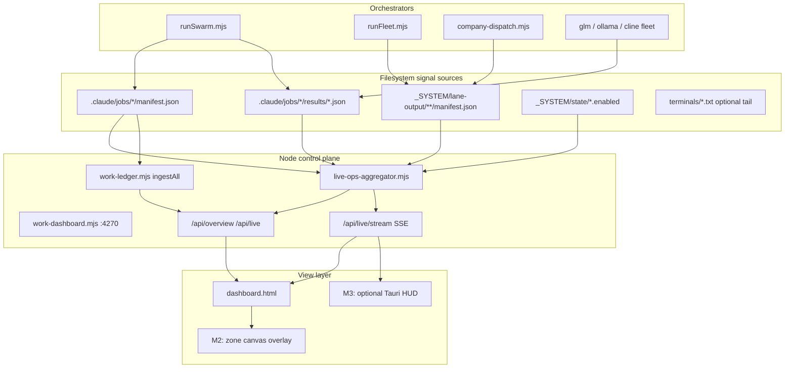

# MURE Live Ops Dashboard — Research & Handoff

**Date:** 2026-06-30  
**Owner:** Marcel  
**Scope:** Research + spec only (Cursor plan/review; GLM/Ollama/Cline build)  
**Related:** `proj-agentic-digital-company-2026-06-22`, `MURE_COMPANY_HEALTH_2026-06-30`, WS-C dashboard shipped 2026-06-23

---

## Executive summary

MURE already has a **strong static→semi-live company overview** (`work-dashboard.mjs` + `dashboard.html` on `:4270`) that polls `/api/overview` every 3s and ingests completed work into `work-ledger.db`. What Marcel wants next is a **live ops realm**: every active worker/agent/lane, what it is doing *right now*, game-metaphor spatial feel, and orchestration visibility — not another KPI board.

**Recommendation:** **Hybrid Node-first, defer Rust desktop.** Extend the existing `work-dashboard.mjs` stack with an SSE live feed (copy the proven `observatory-server.mjs` pattern), add a thin `live-ops-aggregator.mjs` that watches filesystem signals (manifests, result packets, roundLog, lane-output), and layer game metaphor in M2 as a canvas overlay on top of the same event bus. Python `server.py` stays demo-only; FastAPI is optional M1.5 if Python-side hooks are needed. Tauri/egui is M3+ polish, not the MVP path.

**M0 first build (GLM lane):** Ship `live-ops-aggregator.mjs` + `GET /api/live/stream` (SSE) on `work-dashboard.mjs` + a minimal “Lane strip” panel in `dashboard.html` showing `{runId, leaf, lane, substrate, status, lastAction, age}` — read-only, no new DB tables.

---

## Current YURI surfaces (inventory)

| Surface | Role today | Live gap |
|---------|------------|----------|
| `_SYSTEM/Scripts/work-dashboard.mjs` | Canonical server `:4270`; throttled `ingestAll` + `/api/overview` | Poll-only; no per-lane “now”; no SSE |
| `_SYSTEM/mure/dashboard.html` | GLM-designed NEXUS LINK UI: constellation, runs stream, jobs, doctrine, drawers | Role `active` = run with `status='running'` in ledger — coarse; no leaf-level action |
| `_SYSTEM/mure/server.py` | Demo backend `:8433` with fake data | **Not production** — replace per DRILLDOWN_WIRING “Next Steps” |
| `_SYSTEM/Scripts/work-ledger.mjs` | SQLite funnel: runs, artifacts, role_outputs, activity | Historical + ingest; `running` only if `finishedAt` absent on manifest |
| `_SYSTEM/Scripts/runSwarm.mjs` | Writes `.claude/jobs/<runId>/manifest.json` with `roundLog[]`, `startedAt`, `finishedAt` | **Rich mid-flight signal** not surfaced to UI |
| `glm-fleet.mjs` / `ollama-fleet.mjs` / `cline-fleet.mjs` | Per-leaf `results/<label>.json` packets in `.claude/jobs/<runId>/results/` | Packet lands at end of lane call — partial progress only via stderr/log tail |
| `_SYSTEM/lane-output/` | Dispatch manifests (`dispatch-*/manifest.json`), helmsman summaries | Parallel to jobs dir; not unified in dashboard |
| `observatory-server.mjs` | Trading observatory: REST + **SSE** (`/api/observatory/stream`), tick loop | **Reference architecture** for MURE live feed |
| `company-dispatch.mjs` | Multi-stream apply manifests under lane-output | Planned vs executed status — not on dashboard |

### Manifest shapes (completion signaling sources)

**runSwarm manifest** (`.claude/jobs/swarm-*/manifest.json`):

```json
{
  "runId": "swarm-…",
  "traceId": "tr-…",
  "startedAt": "…",
  "finishedAt": null,
  "rounds": 2,
  "leaves": ["WS-B-R1", "WS-B-R2"],
  "converged": false,
  "roundLog": [
    {
      "round": 0,
      "dispatched": ["WS-B-R1", "WS-B-R2"],
      "fleet": [{ "label": "WS-B-R1", "ok": true }],
      "converged": false,
      "reason": "obligation-floor",
      "blocking": 1
    }
  ],
  "runDir": ".claude/jobs/swarm-…/results"
}
```

**Per-lane result packet** (`results/<label>.json`):

```json
{
  "role": "mechanic",
  "label": "WS-B-R1",
  "status": "ok",
  "resultLabel": "02B1_OLLAMA_SIDECAR_X_PASS_COMMITTED",
  "text": "…",
  "lane": "glm-flash",
  "ok": true
}
```

**Dispatch manifest** (`_SYSTEM/lane-output/.../manifest.json`): multi-stream plan with `status: "planned" | "applied"`, per-stream `glm`/`native` counts — orchestration-level, not leaf-level.

### Dashboard tick loop (today)

`dashboard.html` line ~793: `setInterval(tick, 3000)` → `fetch('/api/overview')` → reconcile KPIs, constellation, runs, jobs. Seamless in-place updates already solved (keyed `reconcile()`). **Extend tick or add parallel SSE subscriber** — do not rebuild UI from scratch.

---

## Gap analysis vs Marcel requirements

| Requirement | Current | Needed |
|-------------|---------|--------|
| Every active worker/agent/lane | Role-level `active` from DB | Leaf-level cards: substrate + lane + prompt excerpt + tool phase |
| Current action | None live | Derive from: latest `roundLog`, newest result packet mtime, optional log tail |
| Live feed feel | 3s poll | SSE push on manifest/result/fs change; sub-1s target |
| Video game workspace | Constellation (abstract) | M2: zone metaphor (library/forge/arena à la Agent Quest) mapped to capability groups |
| Program not static HTML | `work-dashboard.mjs` exists | Add aggregator module + WS/SSE; keep HTML as view layer |
| Orchestration visibility | Job pool + runs list | Fleet round state, cline/ollama sidecar status, native stub flag |

---

## External reference landscape (buildable patterns)

| Project | Pattern | YURI fit |
|---------|---------|----------|
| [Agent Quest](https://github.com/lbb-idr/Agent-Quest) | Tool→building mapping, WebSocket, session log tail | **Tone reference** — map MURE role groups to zones |
| [Agent Mission Control](https://github.com/glglak/agent-mission-control) | Fastify bridge + SQLite + WS + pixel office | Closest full-stack analog; YURI already has bridge + DB |
| [AgentHUD](https://github.com/IAMMARBIT/AgentHUD) | Desktop overlay cards, localhost WS | Future Tauri layer; not M0 |
| [PixelOps](https://github.com/michaelpentz/PixelOps) | Tauri + JSONL tail + isometric office | M3 desktop option |
| Grafana realtime | SSE/Live panels, datasource plugins | Enterprise ops — overkill for local MURE |
| Sakana/Fugu tone | Collective intelligence, school-of-fish | **Metaphor only** — MURE 群れ constellation already on-brand |

**Buildable in YURI without new deps:** Node `fs.watch` / mtime polling on `.claude/jobs`, SSE from `work-dashboard.mjs`, canvas/SVG zone overlay in existing `dashboard.html`.

---

## Architecture options

### Option A — **Node extend (RECOMMENDED MVP)**

Extend `work-dashboard.mjs`:

- New module `_SYSTEM/Scripts/live-ops-aggregator.mjs` — scans jobs dir, builds `LiveSnapshot`
- `GET /api/live` — JSON snapshot (for poll fallback)
- `GET /api/live/stream` — SSE (copy `_sseClients` from `observatory-server.mjs`)
- Optional: `fs.watch` on `.claude/jobs` with debounce 200ms

**Pros:** Zero new runtime; reuses ledger, dashboard, launch.json `:4270`; GLM lanes already know this stack.  
**Cons:** Single-process; no cross-machine agents.

### Option B — Python FastAPI + WebSocket

Replace `server.py` demo with FastAPI, watch jobs dir, push WS.

**Pros:** Marcel may prefer Python for future ML panels; easy BackgroundTasks.  
**Cons:** **Second server** duplicates `work-dashboard.mjs`; splits source of truth; `better-sqlite3` ledger stays Node.

**Verdict:** M1.5 only if a Python-only hook surface is required (e.g. Blender subprocess status). Default: skip.

### Option C — Rust Tauri + egui

Desktop app watching JSONL / jobs dir, native overlay.

**Pros:** AgentHUD/PixelOps polish; multi-monitor HUD.  
**Cons:** New toolchain, duplicate UI, slower iteration; **not minimal path**.

**Verdict:** M3+ optional skin; spec interface (`LiveSnapshot` JSON schema) so Tauri can consume same `/api/live`.

### Option D — Hybrid (RECOMMENDED long-term)

```
Node: work-dashboard + live-ops-aggregator + SSE  (M0–M2)
  ↓ LiveSnapshot JSON (stable schema)
HTML/SVG: dashboard.html game layer                 (M2)
Optional: Tauri HUD reader                          (M3)
```

---

## Wire diagram



---

## LiveSnapshot schema (proposed contract)

```typescript
// Stable handoff contract — UI + future Tauri consume this
type LiveSnapshot = {
  generatedAt: string;
  armed: { mure: boolean; glm: boolean; ollama: boolean; cline: boolean };
  lanes: Array<{
    id: string;           // "swarm-abc/WS-B-R1"
    runId: string;
    leafId: string;
    substrate: 'glm' | 'native' | 'ollama' | 'cline' | 'cursor' | 'unknown';
    lane: string;         // glm-max, glm-flash, sonnet, …
    role: string;
    status: 'queued' | 'running' | 'ok' | 'fail' | 'held';
    phase: string;        // "round 1 dispatch" | "adversarial" | "converge" | "idle"
    lastAction: string;   // human-readable one-liner
    startedAt: string | null;
    updatedAt: string;
    resultLabel: string | null;
  }>;
  runs: Array<{
    runId: string;
    status: 'running' | 'converged' | 'failed' | 'forced';
    round: number;
    pendingLeaves: string[];
    roundLogTail: object | null;
  }>;
  events: Array<{ ts: string; type: string; detail: string }>;  // last 50, activity-feed style
};
```

---

## Tech stack recommendation

| Layer | Choice | Why |
|-------|--------|-----|
| Aggregator | **Node** (`live-ops-aggregator.mjs`) | Same repo as runSwarm, glm-fleet, work-ledger; no import boundary |
| Server | **Extend `work-dashboard.mjs`** | Already serves HTML + overview; localhost-bound |
| Realtime transport | **SSE first** (WS later if needed) | Proven in `observatory-server.mjs`; simpler than WS for one-way push |
| Storage | **Existing `work-ledger.db`** + ephemeral snapshot | No new DB for M0; ledger remains historical truth |
| UI | **Extend `dashboard.html`** | GLM-designed, reconcile pattern, NEXUS tokens — don't fork |
| Python | **`server.py` deprecated** | Demo only; do not invest |
| Rust/Tauri | **Defer to M3** | Consume `/api/live` JSON |

### Minimal viable path (M0 → M2)

| Milestone | Deliverable | Owner lane |
|-----------|-------------|------------|
| **M0** | Aggregator + `/api/live` + lane strip panel | GLM mechanic/engineer |
| **M1** | Lane cards with substrate color, roundLog phase, click→drawer | GLM artificer |
| **M2** | Zone map: role group → building, tool/phase → avatar position | GLM artificer + visual-plan gate |

---

## M2 game metaphor mapping (draft)

| MURE group | Zone | Active when |
|------------|------|-------------|
| orchestration | Command tower | planning, converge, dispatch |
| research | Library | read, xref, research prompts |
| engineering | Forge | edit, implement, glm-flash build |
| verification | Arena | test, adjudicator, adversarial |
| knowledge | Archive | doc, chronicler, ingest |
| operations | Quartermaster | job pool, nexus-company cycle |

Animate **energized links** (already in constellation) + **agent tokens** walking on SVG paths between hub and zone — reuse `updateStar()` in-place update pattern.

---

## Completion signaling for orchestrator

**Problem:** Blind `sleep 5min` / `Wait 20min` wastes wall-clock and misses early completion or late failure.

### Pattern catalog (YURI-native)

| Pattern | When | Mechanism |
|---------|------|-----------|
| **Cursor `notify_on_output`** | Shell command with known completion regex | `block_until_ms` high + `pattern` on stdout; wakes on match |
| **Cursor `Await` tool** | Background shell already running | Poll terminal file for regex or exit footer; `block_until_ms: 0` for status checks |
| **Background subagent notification** | Task tool `run_in_background: true` | Parent turn ends; system notifies on completion — **already used** |
| **Manifest `finishedAt`** | runSwarm / fleet run | `node -e` loop or `wait-for-job.mjs` polling `.claude/jobs/<id>/manifest.json` |
| **Result packet appearance** | Per-leaf glm/cline/ollama | Watch `results/<label>.json` mtime or `status` field |
| **`nano-barrier.canFinalize`** | Nano swarm trees | Programmatic — descendants-in-flight blocks finalize; use instead of sleep between rounds |
| **`ollama-kv-config.mjs` `waitForServer`** | Infrastructure ready | HTTP probe with timeout — template for generic `wait-for-port` |

### Recommended YURI-native approach

**Ship `_SYSTEM/Scripts/wait-for-job.mjs`** (small, zero-dep):

```bash
# Wait for swarm run to finish (success or failure)
node _SYSTEM/Scripts/wait-for-job.mjs --run-id swarm-abc123 \
  --timeout 1800000 --poll-ms 2000 --expect finishedAt

# Wait for a specific leaf result
node _SYSTEM/Scripts/wait-for-job.mjs --run-id swarm-abc123 \
  --leaf WS-B-R1 --expect resultLabel

# Exit codes: 0=condition met, 1=timeout, 2=run failed (finishedAt + !finalizeOk)
```

Implementation sketch:

1. Poll `manifest.json` for `finishedAt`, `converged`, `finalizeOk`, latest `roundLog` entry.
2. Optionally poll `results/<leaf>.json` for `status` / `resultLabel`.
3. Print JSON status line on each change (orchestrator can parse).
4. **Optional hook:** write `_SYSTEM/state/job-watch/<runId>.done` on completion for `fs.watch` consumers.

**Orchestrator priority:**

1. **Subagent / background task** when parallel work fits Task tool.
2. **`wait-for-job.mjs`** when shell-spawned runSwarm/glm-fleet from Cursor terminal.
3. **`Await` + regex** on terminal output for streaming progress (e.g. `[runSwarm …] round 2:`).
4. **`notify_on_output`** when a single known line marks done.
5. **Sleep** only with documented reason (e.g. rate-limit cooldown with known window).

**Anti-patterns:**

- `sleep 20min` before checking manifest
- Polling faster than 500ms on jobs dir (use 1–2s default)
- Trusting exit code when `tee` masks node failures (see nexus-company picked bug)

---

## Risks & residual

| Risk | Mitigation |
|------|------------|
| `finishedAt` null but process dead | Timeout + stale detection (mtime on results dir) |
| Native/Cline lanes invisible | Explicit `substrate` in snapshot; stub status for native-spawn-loop |
| Dual servers (4270 vs 8433) | Document 4270 canonical; deprecate server.py in chronicler task |
| SSE client leak | Copy observatory `addSseClient` + close handlers |
| Game UI scope creep | M2 behind visual-plan gate; M0 read-only strip first |

---

## Handoff artifacts

| Path | Purpose |
|------|---------|
| `_SYSTEM/reports/MURE_LIVE_OPS_DASHBOARD_RESEARCH_2026-06-30.md` | This document |
| `02_RESOURCES/TASKS/mure-live-ops-dashboard-ws-h-visual.json` | Phased GLM/Ollama task file |

**M0 first build step for GLM lane:** Implement `live-ops-aggregator.mjs` + wire `GET /api/live` and `GET /api/live/stream` into `work-dashboard.mjs` + add “Live lanes” strip to `dashboard.html` (read-only). Verify with a dry-run `runSwarm` while dashboard open — lane card appears on dispatch, updates on result packet write, clears on `finishedAt`.

---

## Checks run (research session)

- `node _SYSTEM/Scripts/xref-query.mjs "company dashboard visual monitor swarm jobs"`
- Read: `work-dashboard.mjs`, `work-ledger.mjs`, `runSwarm.mjs`, `dashboard.html`, `server.py`, `DRILLDOWN_WIRING.md`, `observatory-server.mjs` (SSE), manifest samples
- External: Agent Quest, Agent Mission Control, AgentHUD, PixelOps (web)

**Codex second opinion:** Intentionally skipped — research/handoff only.
