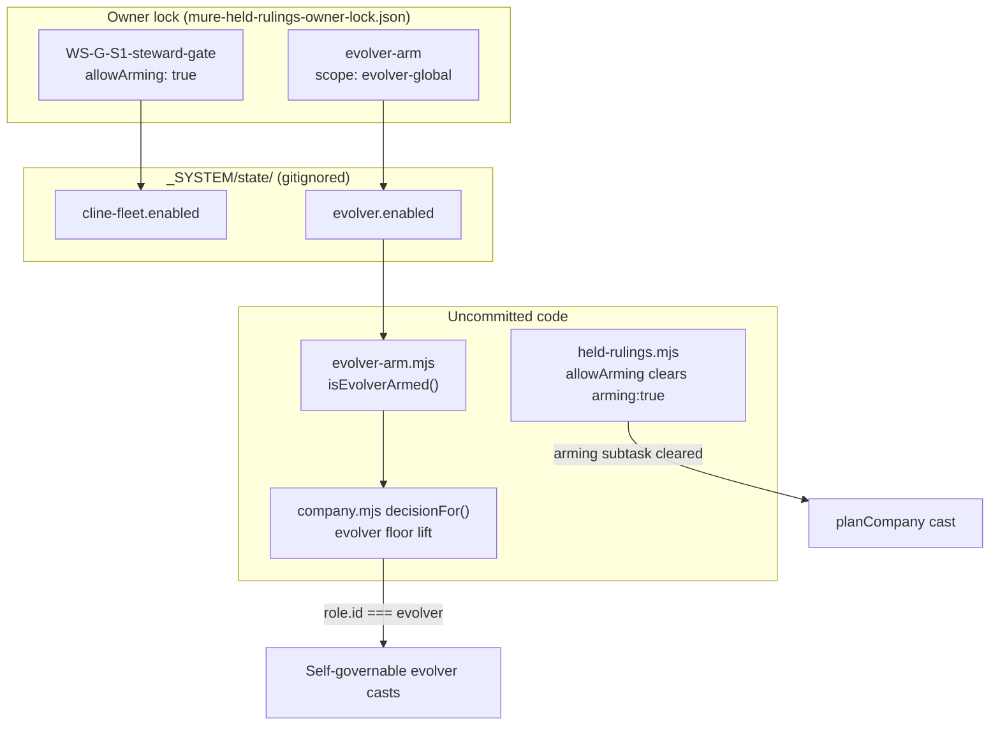
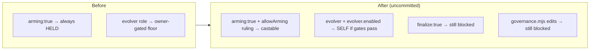

# MURE Uncommitted Arm Work — Visual Recap

**Generated:** 2026-06-30  
**Scope:** Uncommitted evolver / held-rulings / company orchestration lift (not yet committed)

## Git diff stats

| Path | Status | Δ |
|------|--------|---|
| `_SYSTEM/mure/evolver-arm.mjs` | **untracked (new)** | +19 lines |
| `_SYSTEM/mure/company.mjs` | modified | +20 / −0 (20 insertions) |
| `_SYSTEM/mure/held-rulings.mjs` | modified | +7 / −3 (net +4) |
| `02_RESOURCES/TASKS/mure-held-rulings-owner-lock.json` | modified | +15 / −2 (net +13) |

**Combined tracked diff:** 3 files, **42 insertions, 5 deletions**

---

## Architecture — arm lift flow

---

## Component map

---

## File summaries

### `evolver-arm.mjs` (new, untracked)

Owner-gated arm surface mirroring glm-fleet / cline-fleet idiom:

- `EVOLVER_ARM_ENV` = `YURI_EVOLVER_ARMED`
- `EVOLVER_ARM_FLAG` = `_SYSTEM/state/evolver.enabled`
- `isEvolverArmed()` — env OR flag file

### `company.mjs` — `decisionFor()` lift

When `role.id === 'evolver'` **and** `isEvolverArmed()`, the role floor no longer downgrades self-governable rulings to OWNER-GATED.

Also adds **sidecar metadata** blocks on `ollamaSidecar` and `clineSidecar` in `planCompany()` (bulkRoles, armEnv/armFlag, tasksFileHint, fullImplementation) for consistent runFleet sidecar generation.

### `held-rulings.mjs` — `allowArming`

| Subtask flag | Cleared when |
|--------------|--------------|
| `finalize: true` | **Never** |
| `arming: true` | Ruling `approved` **and** `allowArming: true` |
| Other owner-gated | Ruling `approved: true` (unchanged) |

### `mure-held-rulings-owner-lock.json`

Owner ratified 2026-06-30:

- **WS-G-S1-steward-gate** — `allowArming: true` → Cline Pass fleet may arm
- **evolver-arm** — global evolver role floor lift (separate from per-subtask arming)
- Release-tail rulings unchanged; finalize ceremony still advisory-only

---

## Live apply context (BUILD_07)

From `_SYSTEM/reports/MURE_COMPANY_BUILD_07_LIVE_APPLY.md`:

| Workstream | Swarm | Owner lock used |
|------------|-------|-----------------|
| WS-A | `swarm-mqzx904v-e93aca` | clearedHeld=1 (steward gate) |
| WS-G | `swarm-mr065t4p-3f200c` | clearedHeld=1 (steward gate + allowArming) |

All six streams marked **applied** in dispatch manifest despite swarm-level obligation-floor residuals (pre-fix).

---

## Residual risks (uncommitted arm work)

1. **Evolver lift is broad** — any self-governable evolver subtask casts when armed; doctrine/oracle gates still apply but blast should be monitored.
2. **allowArming is per-subtask** — only WS-G steward gate has it today; other arming subtasks remain blocked without explicit rulings.
3. **Flag files are live** — `evolver.enabled`, `cline-fleet.enabled` are ARMED on disk; sidecars still require manual spawn (DISARMED spawn default in runFleet JSON).
4. **Not committed** — arm lift is local-only until owner pathspec commit.

---

## Related report

- Live apply detail: `_SYSTEM/reports/MURE_COMPANY_BUILD_07_LIVE_APPLY.md`
- Company health (post-fix): `_SYSTEM/reports/MURE_COMPANY_HEALTH_2026-06-30.md`
