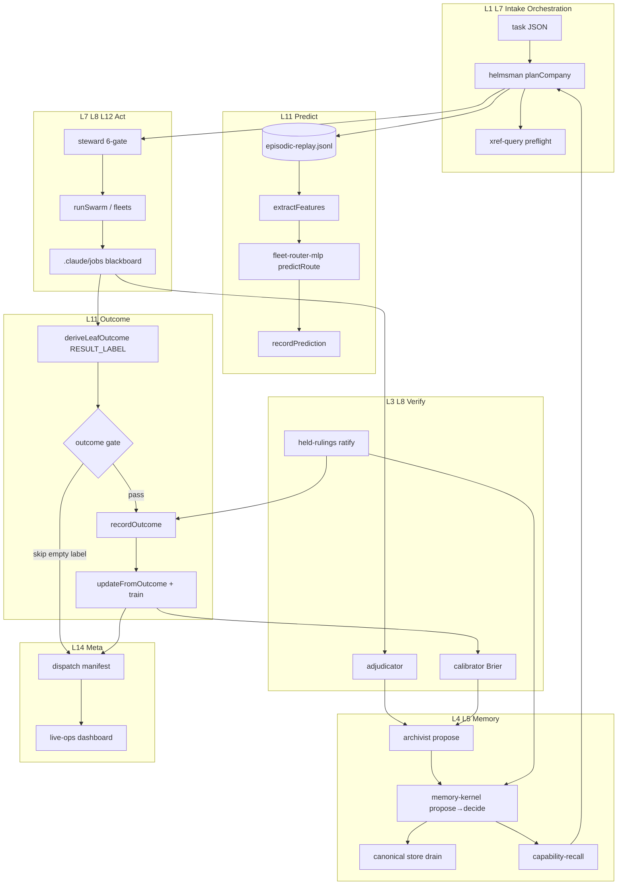

# YURI Active Learning + Memory Upgrade — Research & Roadmap

**Date:** 2026-06-30  
**Owner:** Marcel  
**Scope:** Research + planning only (Cursor plans; GLM/Ollama implement via WS-J)  
**Related:** `YURI_DIGITAL_COMPANY_SKELETON_2026-06-30`, `MURE_COMPANY_HEALTH_2026-06-30`, `02_RESOURCES/TASKS/yuri-active-learning-ws-j-memory.json`, `02_RESOURCES/TASKS/yuri-skeleton-adoption-ws-i-foundation.json`

---

## Executive summary

YURI already has the **spine** of a learning company: `prediction-ledger.mjs` (Brier), `fleet-router-mlp.mjs` (advisory substrate routing), `fleet-mlp-feedback.mjs` (predict → act → outcome → update), Track A `memory-kernel.mjs` (propose → decide → promote), and MURE's `goal-engine.mjs` (PROPOSE → SCORE → GATE). What is missing is **closed-loop wiring**: outcomes rarely become durable memory, the MLP trains on thin/noisy labels without held-out eval, episodic replay is absent, and MURE roles `archivist` / `calibrator` / `chronicler` are roster-only.

**Why this unlocks speed:** Every MURE dispatch today re-discovers routing, failure modes, and operator preferences. Sakana's product layer (Fugu Ultra) and the agent-memory literature converge on the same pattern: **retain structured outcomes, replay them at decision time, and update lightweight routers from bandit feedback** — not fine-tune foundation weights. YURI's advantage is an **explicit control plane** (governance, Track A/B separation, RESULT_LABEL contract). The upgrade is wiring, not a new paradigm.

**Honest Sakana boundary:** Public sources document Fugu's learned Conductor, inter-workflow shared memory with intra-workflow isolation, AI Scientist's experimental journal + review archive, and evolutionary model merge for **parametric** composition. YURI should adopt the **orchestration + memory-tier** patterns, not replicate opaque product routing or weight merging in P0–P1.

**Prerequisite:** WS-I skeleton bind (`mure-skeleton-bind.json`) anchors L11 Learning on the die graph. WS-J can start P0 mechanisms in parallel but **P1 replay requires L4/L11 bind metadata**.

---

## Sakana / industry patterns vs YURI today

| Pattern | Sakana / industry (public) | YURI today | Gap | YURI adoption |
|---------|---------------------------|------------|-----|---------------|
| **Learned orchestrator** | Fugu Conductor (ICLR 2026 TRINITY + Conductor); RL-trained workflow author | `fleet-router-mlp.mjs` — 12-feature tiny MLP, cold-start Xavier weights | No held-out eval; suggestions advisory-only; feature reconstruction when ledger rows lack `features` | Keep MLP **advisory**; add outcome-gated persist + Brier gate before surfacing suggestions |
| **Shared memory tiers** | Fugu-Ultra: inter-workflow tool-call memory + intra-workflow isolation via access list | Track A kernel + canonical store + job blackboard (`.claude/jobs/`) | Blackboard is ephemeral; no archivist → kernel pipeline | P0: job-finished → `proposeMemoryWrite`; P2: MemGPT-style recall paging into packets |
| **Skill library** | Voyager: executable skills indexed by embedding of description | `skills/` + capability registry + `@capability` tags | No outcome-linked skill retrieval at dispatch; no "top-k past successes for role" | P1: episodic replay table keyed `(role, taskClass, substrate)` |
| **Verbal RL / reflection** | Reflexion: episodic text buffer from failure reflection | `adjudicator` off-loop; no structured reflection → ledger | Failures not distilled into replay text | P1: `calibrator` emits reflection snippets on `finalizeOk:false` |
| **Experience pool** | ExpeL: train-phase trajectories + extracted insights → inference recall | `prediction-ledger` JSONL only | No insight extraction; no cross-task transfer | P1: `synthesist` distills ledger windows → Track A proposals |
| **Scientific journal** | AI Scientist: experimental journal, review feedback archive, tree search | `goal-engine.mjs` built; `evolver` DISARMED + unwired | No post-run goal cycle; no review → ideation loop | P2: wire `runGoalCycle` post-dispatch (plan-only default) |
| **Evolutionary merge** | Evolutionary Model Merge (Nature MI 2025): CMA-ES over merge recipes | N/A (different substrate) | Not applicable to lane routing | **Defer** — evolver may *propose* merge experiments; never auto-merge weights |
| **Bandit routing** | BaRP (2025): train under partial feedback like deployment | `recordMlpOutcomesFromRun` logs only chosen substrate | Treats deployment as full-information batch train | P0: document bandit semantics; P2: explore uncertainty sampling for oracle leaves |
| **Gold vs preference labels** | Meta-Router (2025): causal correction of cheap judge bias | `RESULT_LABEL` + `extractResultLabel` | Empty `.out` → false negatives; BUILD_07 quality drift | P0: **outcome gate** — skip MLP update when label missing/empty |
| **Hierarchical memory** | MemGPT/Letta: core / recall / archival tiers + self-edit tools | Track A/B + canonical convergence | No agent-controlled paging; Marcel manual promotion | P2: archivist tools wrapping `recallMemory` + `proposeMemoryWrite` |

**Fugu Ultra memory loop (public, inferred actionable):** Conductor writes natural-language workflows; agents see **prior workflow tool traces** across turns but are **isolated within the current workflow** except via an explicit access list. YURI analog: **inter-dispatch episodic store** (L11) + **intra-swarm blackboard isolation** (already STAR topology) + `helmsman` publishes access list of which prior run artifacts each leaf may read.

---

## arXiv / literature digest (15 papers)

| # | Title | Year | Takeaway (2 lines) | YURI score |
|---|-------|------|-------------------|------------|
| 1 | **Reflexion: Language Agents with Verbal Reinforcement Learning** (Shinn et al.) | 2023 | Agents store self-reflection text in episodic buffer; no weight updates. Strong on coding retries. | **5** — maps to `adjudicator`/`calibrator` reflection → replay injection in `buildRolePrompt` |
| 2 | **ExpeL: LLM Agents Are Experiential Learners** (Zhao et al., AAAI) | 2024 | Gather trajectories in training tasks; extract NL insights; recall at inference. API-model compatible. | **5** — `synthesist` distills dispatch ledger → insight files; `archivist` promotes |
| 3 | **Voyager** (Wang et al.) | 2023 | Skill library of executable code; retrieve top-k by embedding of task description; compositional growth. | **4** — YURI skills are files not code-at-runtime; adapt as capability-hit replay |
| 4 | **MemGPT: Towards LLMs as Operating Systems** (Packer et al.) | 2023 | Virtual context via paging between main context and archival/recall stores; self-edit memory tools. | **4** — aligns with Track A + canonical store; implement as scripts not LLM-managed paging in P2 |
| 5 | **The AI Scientist** (Lu et al., Nature 2026) | 2024–26 | End-to-end ideation→experiment→paper→review; experimental journal + feedback archive informs next cycle. | **3** — pattern for `evolver`+`chronicler`; overkill for daily ops; borrow journal shape |
| 6 | **Evolutionary Optimization of Model Merging Recipes** (Akiba et al., Sakana) | 2024 | CMA-ES discovers merge recipes in parameter + data-flow space. | **2** — evolver proposal class only; not P0–P1 routing |
| 7 | **Sakana Fugu Technical Report** (Conductor / Fugu-Ultra) | 2026 | Learned orchestrator; shared inter-workflow memory with intra-workflow isolation. | **5** — direct analog for MURE dispatch memory policy |
| 8 | **Learning to Route LLMs from Bandit Feedback (BaRP)** | 2025 | Train router under partial feedback (only chosen model outcome observed). | **5** — correct framing for `fleet-mlp-feedback`; YURI deployment matches bandit not supervised |
| 9 | **Meta-Router: Gold-standard vs Preference-based Evaluations** | 2025 | Causal correction when cheap labels bias routing; active learning for expensive eval budget. | **4** — `oracle`/`adjudicator` as gold; `RESULT_LABEL` as cheap; sample oracle on boundary |
| 10 | **Causal LLM Routing: Regret Minimization from Observational Data** | 2025 | Learn routing from logs where only deployed model outcome is seen. | **4** — validates observational training from `work-ledger` |
| 11 | **From Selection to Generation: Survey of LLM-based Active Learning** | 2025 | AL for annotation routing; hybrid human/LLM label acquisition. | **3** — informs when to spawn `oracle` leaf vs trust glm pass label |
| 12 | **Generative Agents** (Park et al.) | 2023 | Memory stream: observe→reflect→retrieve for believable agents. | **3** — reflection cadence for `chronicler`; YURI is ops not simulation |
| 13 | **SWE-agent / Agentless lineage** (coding agents) | 2024 | Trajectory logging + retry from failure logs. | **4** — `.claude/jobs/*/results` already exists; needs promotion hook |
| 14 | **RouterBench** (Hu et al.) | 2024 | Benchmark for LLM routing; cost-quality Pareto. | **3** — future eval harness for MLP; borrow metrics not dataset |
| 15 | **TRINITY + Conductor** (Sakana, ICLR 2026) | 2025–26 | Learn to assemble/route expert models per task. | **4** — conceptual north star for `helmsman`+MLP; YURI keeps governance hard override |

**Marcel read-first (3):** (1) **Fugu Technical Report** §shared memory — closest product pattern; (2) **BaRP** — correct training framing for existing MLP; (3) **ExpeL** — insight extraction without fine-tuning.

---

## YURI memory stack audit

### Track A — `memory-kernel.mjs`

| Surface | Status | Evidence |
|---------|--------|----------|
| `proposeMemoryWrite` / `promoteMemoryProposal` | **LIVE** | Governed pipeline; operator approval |
| `recallMemory` / `recallEntries` | **LIVE** | xref + lanes can query |
| Canonical bridge | **LIVE** | `memory-canonical-store.mjs` peer read |
| MURE dispatch hook | **MISSING** | `company-dispatch` does not call archivist |
| Episodic (pre-promotion) store | **PARTIAL** | Proposals exist; no high-volume dispatch ingest |

### Track B — Claude auto-memory

| Surface | Status | Notes |
|---------|--------|-------|
| `~/.claude/projects/*/memory/` | **LIVE** | Operator/session prefs only |
| Cross-lane leakage risk | **GUARDED** | yuri-origin routing rules |
| Duplicate of Track A | **ANTI-PATTERN** | Fleet outcomes must not mirror into Track B |

### MLP ledger — `prediction-ledger` + `fleet-router-mlp`

| Surface | Status | Evidence |
|---------|--------|----------|
| `recordMlpPredictions` / `recordMlpOutcomesFromRun` | **LIVE** (armed) | `mlp-learn.enabled` + `--mlp-learn` |
| `trainFleetRouterFromLedger` | **LIVE** | 50-example pass per health report |
| Held-out validation | **MISSING** | Trains on all matched rows |
| Router gating dispatch | **MISSING** | Advisory only (correct for safety) |
| Feature persistence | **PARTIAL** | `reconstructFeatures()` heuristic fallback |
| Cline 4th substrate bit | **DESIGNED NOT LIVE** | health report gap |
| Empty label outcomes | **RISK** | `deriveLeafOutcome` may train on false negatives |

### Episodic / blackboard

| Surface | Status | Notes |
|---------|--------|-------|
| `.claude/jobs/<run>/results/*.json` | **LIVE** | Per-run only |
| Cross-run retrieval | **MISSING** | No embedding index of past leaves |
| Replay at plan time | **MISSING** | `planCompany` does not query history |

### Capability registry

| Surface | Status | Notes |
|---------|--------|-------|
| `@capability` tags + `capability-recall.mjs` | **LIVE** | Pre-build recall |
| Outcome-weighted capability ranking | **MISSING** | No success rate per capability |
| Voyager-style skill composition | **MISSING** | Skills static until human edits |

### Held rulings feedback

| Surface | Status | Notes |
|---------|--------|-------|
| `held-rulings.mjs` | **LIVE** | Owner ratification gate |
| Ruling → router feature | **MISSING** | Ratified rulings don't update `historicalSuccess` |
| Ruling → memory proposal | **MISSING** | Steward decisions not auto-proposed to Track A |

### MURE goal-engine / evolver

| Surface | Status | Notes |
|---------|--------|-------|
| `goal-engine.mjs` | **BUILT** | Not in dispatch loop |
| `evolver-arm.mjs` | **ARMED** | Proposals not auto-ingested |

### Layer binding (WS-I)

| Surface | Status | Notes |
|---------|--------|-------|
| L4 Memory + L11 Learning on die graph | **STUB** | MURE not registered; see skeleton report |
| `learningHook` on digitized roles | **SPEC ONLY** | In skeleton report §metadata |

---

## Active learning loop design for YURI

### Core loop (predict → act → outcome → update)

```text
planCompany(task)
  ├─ PREDICT: extractFeatures(leaf) → predictRoute → recordPrediction (if armed)
  ├─ ACT: runSwarm / sidecars under governance (steward 6-gate)
  ├─ OUTCOME: deriveLeafOutcome from RESULT_LABEL + status + convergence
  ├─ GATE: skip update if label missing OR dry-run OR !shouldPersistMlpLearn
  ├─ UPDATE: recordOutcome → updateFromOutcome → trainFleetRouterFromLedger (epochs)
  ├─ CALIBRATE: calibrationReport → Brier buckets (calibrator role)
  ├─ EPISODIC: archivist proposeMemoryWrite (dispatch summary, failures, reflections)
  └─ HELD: steward rulings → feature bump + optional Track A proposal
```

### Outcome gating rules (P0 — non-negotiable)

1. **No label, no train:** If `extractResultLabel` empty AND `status !== ok` with substantive text → `outcome.skipped: true`, do not call `updateFromOutcome`.
2. **Convergence honesty:** Forced-stop (`converged:false`) downweights `quality` to ≤0.3 even if label parses.
3. **Feature fidelity:** Persist `features` array on every `recordPrediction`; reject training rows where `features` was reconstructed (log warning).
4. **Held-out split:** Reserve last 20% of prediction IDs (time-ordered) for eval; train only on train split; surface `evalMeanBrier` in manifest.
5. **Advisory forever by default:** Router suggestions annotate manifest; `YURI_MLP_ROUTE_GATE=1` + owner ruling required to override `role-registry` default substrate.

### Episodic replay (P1)

**Store:** `_SYSTEM/state/episodic-replay.jsonl` (gitignored) append-only:

```json
{
  "ts": "ISO",
  "leafId": "WS-B-R1",
  "role": "oracle",
  "taskClass": "adversarial-verify",
  "substrate": "glm-max",
  "resultLabel": "02B1_..._X_PASS_...",
  "success": 1,
  "quality": 0.9,
  "reflection": "optional calibrator snippet",
  "artifactPaths": ["_SYSTEM/lane-output/.../results/WS-B-R1.json"]
}
```

**Retrieve at plan time:** `helmsman` / `fleet-router-mlp.extractFeatures` adds `historicalSuccess` from rolling window of replay rows matching `(role, taskClass)`; inject top-3 reflection snippets into leaf prompt footer (cap 400 tokens).

### Cross-role memory kernel (P2)

- **Role-scoped recall namespaces** in Track A: `surface: mure-role/<roleId>` for durable patterns (e.g. `oracle:glm-max-timeout-class`).
- **Synthesist insight pass:** weekly or post-build digest of replay JSONL → `proposeMemoryWrite` batch with `confidence` from Brier stability.
- **MemGPT paging (lightweight):** `archivist` tool pair: `recallEpisodic(query)` + `proposePromotion(entry)` — no LLM-managed deletion; eviction via `memory-kernel evict` only.

### Held rulings feedback

When owner ratifies a held ruling:

1. Append `prediction-ledger` outcome with `source: held-ruling` linking `subtaskId`.
2. Bump `historicalSuccess` prior for affected `(role, substrate)` in replay aggregator.
3. `chronicler` drafts one-paragraph Track A proposal if ruling changes doctrine (owner promotes).

### Mermaid: learning loop integrated with MURE dispatch



---

## Upgrade roadmap

### P0 — Outcome-gated MLP persist (1–2 GLM sessions)

| ID | Mechanism | Owner | Acceptance |
|----|-----------|-------|------------|
| P0.1 | `deriveLeafOutcome` → `skipped` flag when label empty / text &lt; threshold | kernelsmith | Unit test: empty `.out` → no `updateFromOutcome` |
| P0.2 | Always persist `features` on `recordPrediction` | kernelsmith | Ledger rows have 12-length `features` |
| P0.3 | `trainFleetRouterFromLedger` held-out 20% time split + `evalMeanBrier` in return | calibrator | Manifest logs eval metric |
| P0.4 | `company-dispatch` manifest field `mlpFeedback.evalMeanBrier` | kernelsmith | Dry-run + apply path |
| P0.5 | Document bandit semantics in `_SYSTEM/mure/DRILLDOWN_WIRING.md` | chronicler | BaRP framing explicit |

**Exit:** MLP never trains on empty labels; eval Brier visible in manifest; WS-F calibrator leaf has real metric.

### P1 — Episodic replay for routing (2–3 sessions)

| ID | Mechanism | Owner | Acceptance |
|----|-----------|-------|------------|
| P1.1 | `episodic-replay.mjs` append + rolling `historicalSuccess` | archivist | Replay file grows on armed apply |
| P1.2 | `planCompany` injects top-k reflections into leaf prompts | kernelsmith | Prompt footer capped; logged in plan |
| P1.3 | `calibrator` reflection snippet on `finalizeOk:false` | calibrator | JSON field `reflection` in replay |
| P1.4 | `synthesist` post-build insight digest → memory proposals | synthesist | ≥1 proposal per BUILD with armed replay |
| P1.5 | Active oracle sampling: spawn extra oracle when MLP confidence ∈ [0.45,0.55] | helmsman spec | Documented in dispatch; DISARMED default |

**Exit:** Second dispatch on same workstream class shows non-zero `historicalSuccess` feature; reflections appear in plan JSON.

### P2 — Cross-role memory kernel (3+ sessions)

| ID | Mechanism | Owner | Acceptance |
|----|-----------|-------|------------|
| P2.1 | Role namespaces in `memory-kernel` surface filter | archivist | `recallMemory --surface mure-role/oracle` works |
| P2.2 | `runGoalCycle` post-dispatch (DISARMED plan-only) | evolver | Manifest includes `goalCycle.summary` |
| P2.3 | Held-ruling → replay + Track A proposal pipeline | steward + archivist | Ratified ruling creates proposal row |
| P2.4 | Optional `YURI_MLP_ROUTE_GATE` owner-armed override | adjudicator + steward | Requires held ruling; governance wins on conflict |
| P2.5 | Voyager-style capability replay: top-k past successes by task embedding | scout | `capability-recall` enriches with outcome stats |

**Exit:** Cross-run recall changes router feature vector; owner can trace promotion from dispatch → proposal → canonical.

---

## Anti-patterns to avoid

| Anti-pattern | Why it fails | YURI guard |
|--------------|--------------|------------|
| Training on empty/missing `RESULT_LABEL` | Teaches router that glm-max failures are normal | P0 outcome gate |
| Duplicating fleet findings into Track B | Other lanes never see; violates Track A/B rules | archivist → Track A only |
| Mirroring Track A into Claude memory | Stale divergence | Cross-link by handle, no mirror |
| MLP overriding governance / 6-gate | Catastrophic routing to wrong substrate | Advisory default; arm gate separate |
| Full-context replay of all past jobs | Token blow-up; orchestration collapse | Top-k + taskClass filter + token cap |
| LLM-judged promotion to Track A | Ungoverned truth | `propose → decide → ledger` only |
| Reconstructing features silently | Garbage gradients | Warn + exclude from train split |
| Using BUILD `applied` without `finalizeOk` | False positive learning signal | Convergence honesty already fixed; enforce in gate |
| Evolutionary weight merge in dispatch path | Irreversible; out of doctrine | evolver proposes; owner + oracle only |
| Skipping WS-I bind | Learning nodes orphaned on graph | WS-J depends on L11 bind metadata |

---

## Cross-link: WS-I skeleton adoption (L11 binding)

| WS-I deliverable | WS-J dependency |
|------------------|-----------------|
| `mure-skeleton-bind.json` role→layer map | Episodic replay tags `layer: L11` on mechanism nodes |
| `mure-goal-spine` schema | P2 goal-engine context `goalSpine` |
| xref preflight in `planCompany` | Replay retrieval query enriched by xref capability hits |
| Graph register `mure-company-orchestrator` | `propagation-scan` after P0 wiring |
| WS-I-C1 chronicler handoff | Links to this report + WS-J task JSON |

**Layer assignment:** Active learning loop = **L11 Learning & Continuity** primary; memory promotion = **L4**; retrieval of replay = **L5**; self-improve proposals = **L6** (evolver, DISARMED).

**Recommended sequencing:** WS-H M0 (observability) ∥ WS-I-A1 (bind) → **WS-J-P0** (outcome gate) → WS-I wire → WS-J-P1 (replay) → WS-J-P2 (kernel).

---

## Top 5 upgrades ranked by leverage

1. **P0 outcome gate + feature persistence** — stops poisoned gradients from empty glm-max leaves (immediate quality).
2. **Held-out Brier eval in training path** — makes MLP feedback honest before any routing influence (trust).
3. **Episodic replay → `historicalSuccess` feature** — cheapest win for repeat workstreams (speed).
4. **archivist auto-propose on dispatch complete** — closes L4 STUB; feeds Track A without manual Marcel curation (compounding).
5. **Held-ruling → ledger + replay bump** — closes the loop on owner corrections (alignment).

---

## Recommended first GLM subtask

**`WS-J-K1-outcome-gate-kernelsmith`** — Implement P0.1–P0.2: outcome skip flag + mandatory feature persistence in `fleet-mlp-feedback.mjs` / `deriveLeafOutcome`; tests proving empty output does not call `updateFromOutcome`. DISARMED-safe. Return `02J1_OUTCOME_GATE_X_PASS_COMMITTED`.

Rationale: Everything else (replay, insights, goal-engine) depends on **clean outcome labels**. Health report RED items (empty glm-max) make this the highest-leverage first move.

---

## Checks run (research session)

```bash
node _SYSTEM/Scripts/xref-query.mjs "active learning memory MLP fleet router"
```

- Read: `_SYSTEM/yuri-origin.md` (Memory Architecture), `fleet-mlp-feedback.mjs`, `fleet-router-mlp.mjs`, `train-fleet-router-from-ledger.mjs`, `memory-kernel.mjs` (exports), `goal-engine.mjs`, `prediction-ledger.mjs`
- Reports: `YURI_DIGITAL_COMPANY_SKELETON_2026-06-30`, `MURE_COMPANY_HEALTH_2026-06-30`
- Web: Sakana Fugu report, AI Scientist, Evolutionary Model Merge, Reflexion, ExpeL, Voyager, MemGPT, BaRP, Meta-Router

**Codex second opinion:** Intentionally skipped — research/handoff only.

**Residual risk:** Replay injection may increase prompt size → glm-max timeouts worsen before quartermaster caps land (L10). Mitigate with strict 400-token reflection cap in P1.
