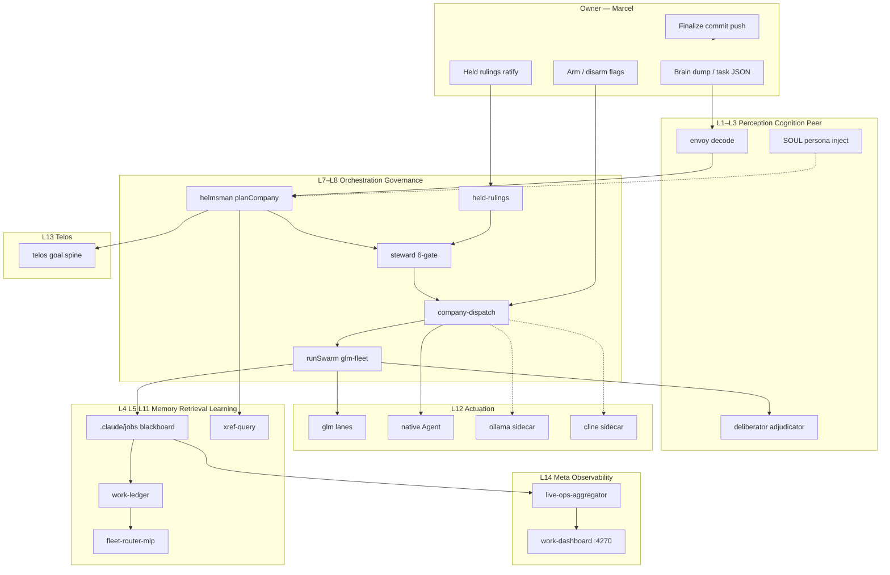

# YURI Digital Company Skeleton — MURE Adoption Research

**Date:** 2026-06-30  
**Owner:** Marcel  
**Scope:** Research + planning only (Cursor plans; GLM/Ollama builds later)  
**Related:** `proj-agentic-digital-company-2026-06-22`, `MURE_COMPANY_HEALTH_2026-06-30`, `MURE_LIVE_OPS_DASHBOARD_RESEARCH_2026-06-30`, `02_RESOURCES/RESEARCH/sakana-blueprint-2026-06-22/00-MURE-BLUEPRINT.md`

---

## Executive summary

YURI is a **14-layer die-graph skeleton** (mechanism organs + flow peripherals) with mature governance, memory, xref, and math substrates. **MURE** is a ~20-role agentic company that runs **inside** YURI but today adopts only a **narrow slice** of that skeleton: Skills & Orchestration (dispatch), Governance & Safety (6-gate charter), and partial Energy & Math (math-bridge). The foundation is real — `company.mjs`, `role-registry.mjs`, `governance.mjs`, `runSwarm`, convergence — but **wiring gaps** leave Marcel as manual orchestrator for sidecars, native substrate, observability, learning feedback, and layer binding.

**Honest verdict:** YURI has mechanisms; MURE has a company spine; the **adoption matrix** between them is ~40% wired, ~35% stub/partial, ~25% missing. This report maps every layer, compares Sakana/Fugu/real-lab patterns, defines enforcement per layer, designs reduced owner-input automation, and phases adoption through skeleton bind → learning loop → self-orchestration.

**Prerequisite build (parallel):** WS-H M0 live ops dashboard (`mure-live-ops-dashboard-ws-h-visual.json`) — observability is Phase 0 enabler, not optional polish.

---

## The YURI 14-layer skeleton (canonical)

Source: `_SYSTEM/Scripts/yuri-graph-unify.mjs` (`SECTOR_TO_LAYER`, 2026-06-16 10→14 expansion) + `02_RESOURCES/RESEARCH/yuri-die-graph.json` (232 nodes, 14 layers).

| # | Layer | Flow sectors / mechanism role | Primary YURI surfaces |
|---|-------|------------------------------|------------------------|
| L1 | **Perception & Interface** | `operator_io` | Kagami/Rick intake, `yuri-originator.mjs`, USER→RESPONSE |
| L2 | **Cognition & Persona** | `pulse_cortex` | `SOUL.md`, persona map, pulse-orchestrator |
| L3 | **Relational & Peer** | `advisors` | Codex second opinion, multi-lane peer review |
| L4 | **Memory & Subconscious** | `memory` | Track A `memory-kernel.mjs`, Track B Claude auto-memory, canonical store |
| L5 | **Retrieval & Knowledge** | `classification`, `code_intelligence` | `xref-query.mjs`, GitNexus, capability registry |
| L6 | **Self-Improvement** | `self_improvement` | memory-proposal-autopilot, evolver charter, capability-scan |
| L7 | **Skills & Orchestration** | `routing_lanes`, `command_registry` | `skills/`, `runSwarm.mjs`, workcell, llm-compat |
| L8 | **Governance & Safety** | `control_plane` | `yuri-origin.md` charter, PreToolUse hooks, `governance.mjs`, energy gate |
| L9 | **Energy & Math** | mechanism dies | `yuri-energy.mjs`, decision-sim, quantum, formula foundry |
| L10 | **Token-Efficiency & Session** | `prompt_hooks`, `initialization` | compaction, session init, aeonic-enforce |
| L11 | **Learning & Continuity** | mechanism + continuity organs | prediction-ledger, MLP router, EOT closeout |
| L12 | **Actuation & Embodiment** | `services` | glm-fleet, ollama-fleet, cline-fleet, native Agent spawn |
| L13 | **Telos & Meaning** | `telos-core` organ | goal spine, operator intent, strategic north star |
| L14 | **Hidden / Meta / Self-referential** | `unassigned`, meta dies | infra-gap-detector, staleness watch, graph unify |

**Circuitry rule:** edit `yuri-graph.json` → `yuri-graph-unify.mjs project` → flow + mechanism + die views stay lossless. MURE should **register as mechanism nodes** on this graph, not a parallel org chart.

---

## MURE adoption matrix (14 layers × status)

Legend: **WIRED** = end-to-end in live dispatch path · **PARTIAL** = module exists, seam incomplete · **STUB** = placeholder / manual · **MISSING** = no MURE binding

| Layer | MURE roles / modules | Status | Evidence | Gap |
|-------|---------------------|--------|----------|-----|
| L1 Perception | `envoy` | **PARTIAL** | `company.mjs` accepts task JSON; no `yuri-originator` decode hook | Brain-dump → spec tree not automatic |
| L2 Cognition | all roles (`buildRolePrompt`) | **PARTIAL** | Role-framed prompts; no SOUL/persona inject | Persona spine not in fleet packets |
| L3 Relational | `deliberator`, `adjudicator` | **PARTIAL** | Off-loop critics in blueprint; not auto-spawned post-swarm | Peer lanes advisory-only, manual |
| L4 Memory | `archivist`, `chronicler` | **STUB** | Roles in roster; no `memory-kernel` write on dispatch complete | Blackboard only (`.claude/jobs/`) |
| L5 Retrieval | `scout`, `synthesist` | **PARTIAL** | Task prompts say "read local"; no mandatory `xref-query` preflight | Re-discovery friction remains |
| L6 Self-Improvement | `evolver` | **STUB** | `goal-engine.mjs` + `evolver-arm.mjs` built; not in `company-dispatch` loop | Self-modify path DISARMED + unwired |
| L7 Skills & Orchestration | `helmsman`, `quartermaster` | **WIRED** | `company-dispatch.mjs` → `runCompany` → `runSwarm` | glm-max empty outputs (quality) |
| L8 Governance | `steward` | **WIRED** | `governance.mjs` + `held-rulings.mjs` + owner lock | Energy gate not in MURE path |
| L9 Energy & Math | `steward`, `architect`, `adjudicator` | **PARTIAL** | `math-bridge.mjs` imports live modules | Thin runtime use; breaker not armed in dispatch |
| L10 Token-Efficiency | `quartermaster` | **STUB** | Role exists; no token-ledger hook in dispatch | No budget cap enforcement per run |
| L11 Learning | `calibrator`, MLP | **PARTIAL** | `fleet-mlp-feedback.mjs`, `--mlp-learn` | No held-out eval; suggestions don't gate routes |
| L12 Actuation | `engineer`, `mechanic`, `artificer` | **STUB** | GLM wired; native/ollama/cline manual | `native-spawn-loop` = STUB packets |
| L13 Telos | `helmsman`, `envoy` | **MISSING** | `goalScope` on roles; no `telos-core` bind | Strategy spine not persisted across runs |
| L14 Meta | `sentinel`, dashboard | **PARTIAL** | Health reports, tests; observability split | `server.py` demo vs `work-dashboard` canonical |

### Summary counts

| Status | Layers | % |
|--------|--------|---|
| WIRED | 2 (L7, L8) | 14% |
| PARTIAL | 7 (L1–L3, L5, L9, L11, L14) | 50% |
| STUB | 4 (L4, L6, L10, L12) | 29% |
| MISSING | 1 (L13) | 7% |

**Cross-cutting:** MURE honors YURI mutation contract and protected paths via `governance.mjs` constitution veto — but does **not** call `propagation-scan.mjs`, `capability-recall.mjs`, or `yuri-closeout.mjs` in the company loop.

---

## Sakana / real-company / lab comparison

| Layer function | Sakana AI (real org + products) | Fugu / Fugu Ultra | AI Scientist / RSI Lab | YURI skeleton | MURE today |
|----------------|-----------------------------------|-------------------|------------------------|---------------|------------|
| **Strategy / telos** | CEO + research vision; RSI Lab charter | Conductor classifies query complexity | Hypothesis generation + falsification boundary | L13 Telos, NEXUS_DECIDES | helmsman owner-gated; no telos bind |
| **Intake / perception** | Business dev intake (2025) | Single API endpoint | Paper/research brief | L1 envoy, originator | task JSON only |
| **Decomposition** | PM + applied research teams | Fugu-Ultra writes agentic workflow DAG | Experiment planning loops | L7 workcell DAG | helmsman via subtasks |
| **Execution** | Engineers + applied researchers | Worker pool (Gemini, Opus, GPT…) | Code write + experiment run | L12 actuation lanes | glm-fleet primary |
| **Verification** | Peer review, benchmarks | Internal verification + synthesis | Automated peer review (Nature path) | L8 + adversarial skills | adjudicator/oracle off-loop |
| **Memory** | Institutional research corpus | Adaptive agent memory (Ultra) | Paper + artifact store | L4 Track A/B + canonical | job results dir only |
| **Learning** | RSI Lab recursive self-improve | RL-trained conductor (Ultra) | Evolutionary search on workflows | L11 prediction-ledger, MLP | thin MLP feedback |
| **Governance** | Flat hierarchy + safety culture | Learned orchestrator, not hand-coded if-stmts | Sandboxed experiment boundaries | L8 deterministic 6-gate | steward WIRED |
| **Collective intelligence** | School-of-fish thesis (群れ) | MoA + conductor synthesis | Multi-step scientific pipeline | L3 peer + swarm convergence | STAR + blackboard |
| **Observability** | Lab publishing + product metrics | Opaque orchestration tokens | Experiment logs | L14 meta + Kagami bus | split dashboard/ledger |

**Takeaway for MURE:** Sakana's product layer (Fugu) hides orchestration behind one API; YURI intentionally **exposes** the control plane. MURE should adopt Sakana's **role specialization + verification independence + learning loop** without copying opaque routing — Marcel's LinkedIn-digitization pattern maps real job functions → MURE archetypes with explicit `authority`, `substrate`, `autonomyClass`, and `learningHook` metadata (see § Digitalising real roles).

---

## Enforcement mechanisms per layer

How each layer enforces **order · structure · organisation · strategy · learning · building**:

| Layer | Order | Structure | Organisation | Strategy | Learning | Building |
|-------|-------|-----------|--------------|----------|----------|----------|
| L1 Perception | Single intake contract | Task JSON schema | envoy → helmsman chain | Intent ranking (Haki) | — | Spec before code |
| L2 Cognition | Persona load order | SOUL + adapters | Role identity in prompts | — | — | Quality bar in voice |
| L3 Relational | Peer lane rules | Independent critics | adjudicator ⊥ engineer | Second opinion gate | Disagreement capture | Refute-by-default |
| L4 Memory | Track A/B separation | memory-kernel schema | archivist role scope | — | Promotion pipeline | Durable artifacts |
| L5 Retrieval | xref-first mandate | circuitry graph | capability registry | capability-first | — | No rebuild duplicates |
| L6 Self-Improvement | DISARMED default | goal-engine caps | evolver behind oracle | — | PROPOSE→SCORE→GATE | Bounded self-modify |
| L7 Orchestration | DAG / leaf IDs | runSwarm manifest | 6 groups × 20 roles | workstream phases | roundLog | glm + native cast |
| L8 Governance | 6-gate sequential | constitution veto | steward owner-gated | held-rulings | — | Fail-closed dispatch |
| L9 Energy & Math | computeU trace | math-bridge API | role mathHooks | robustScore paths | prediction outcomes | Catastrophic veto |
| L10 Token | session hooks | compaction rules | quartermaster | budget caps | — | Cheap lanes first |
| L11 Learning | ledger append-only | MLP feature schema | calibrator role | route suggestions | Brier / held-out | Train after dispatch |
| L12 Actuation | substrate enum | fleet arm flags | multi-substrate catalog | sidecar policies | outcome → router | Real spawn, not stub |
| L13 Telos | goal spine persistence | telos-core organ | helmsman finalizeAuthority | Phase gates | — | North-star alignment |
| L14 Meta | staleness watch | die graph unify | health reports | re-run matrix | infra-gap-detector | Single ops cockpit |

---

## Scalability + reduced owner-input design

| Concern | Automate (self-governable when armed) | Stay owner-gated |
|---------|--------------------------------------|------------------|
| Task intake | envoy decode → validated task JSON | Outward-facing / client deliverables |
| Role cast | capability-match + governance gate | helmsman finalize, commit/push |
| Dispatch | runSwarm rounds + convergence | arming flags, evolver self-modify |
| Sidecars | tmux spawn hook after apply (disarmed-safe logging) | ollama/cline spend when armed |
| Verification | auto-spawn adjudicator leaf post-swarm | oracle accept for evolver proposals |
| Memory | archivist ingest on `finishedAt` | Track A promotion decisions |
| Learning | MLP weight update from ledger | Router gating dispatch (advisory only until validated) |
| Observability | live-ops-aggregator + SSE (WS-H M0) | — |
| Retry | `--retry-leaves` partial re-run | Full live `--apply` while conflicting PID |
| Strategy | telos spine file per company epoch | Phase transitions, arm lift |

**Target owner touchpoints after Phase 2:** (1) ratify held rulings, (2) arm/disarm, (3) finalize/commit, (4) telos/phase changes. Everything else should be **one-token confirm** or fully autonomous inside governance envelope.

---

## Phased adoption roadmap

### Phase 0 — Skeleton bind (WS-I)

**Goal:** MURE nodes appear on YURI die graph; every dispatch path declares layer coverage.

| Milestone | Deliverable | Owner lane |
|-----------|-------------|------------|
| P0.1 | `mure-skeleton-bind.json` — role→layer mapping + circuitry node ids | architect (GLM) |
| P0.2 | Mandatory `xref-query` preflight in `planCompany` (advisory log, not block) | engineer |
| P0.3 | `propagation-scan` on MURE mechanism nodes after bind | scout |
| P0.4 | Register MURE organs in `yuri-graph.json` + unify project | mechanic |
| P0.5 | Telos stub: `_SYSTEM/state/mure-goal-spine.json` schema | envoy + helmsman |
| P0.6 | WS-H M0 live ops (parallel) | GLM mechanic |

**Exit criteria:** adoption matrix regenerated from live code; no layer marked MISSING for bind metadata; dashboard shows leaf-level status.

### Phase 1 — Learning loop (WS-J, future)

| Milestone | Deliverable |
|-----------|-------------|
| P1.1 | archivist auto-ingest job results → memory-kernel proposals |
| P1.2 | calibrator Brier on RESULT_LABEL outcomes |
| P1.3 | MLP held-out eval gate before route suggestions surface |
| P1.4 | goal-engine cycle wired post-run (DISARMED plan-only default) |
| P1.5 | `wait-for-job.mjs` in orchestrator (no sleep polling) |

### Phase 2 — Self-orchestration (WS-K, future)

| Milestone | Deliverable |
|-----------|-------------|
| P2.1 | Native substrate: real Agent spawn from `nativeSpecs` |
| P2.2 | Auto sidecar tmux hook (disarmed-safe) |
| P2.3 | Post-swarm auto adjudicator + oracle leaves |
| P2.4 | MLP router optional gating (owner-armed) |
| P2.5 | evolver proposals → oracle → held-ruling pipeline |
| P2.6 | Partial re-run API productionized |

---

## Architecture diagram



---

## Digitalising real roles (LinkedIn → MURE archetypes)

Marcel's pattern: treat a **real worker profile** (LinkedIn, internal roster, contractor brief) as a **digitization source**, not a persona impersonation. Map function → MURE archetype; attach governance metadata.

### Mapping table (examples)

| Real-world title | MURE archetype | `group` | Typical `substrate` |
|------------------|----------------|---------|---------------------|
| CTO / Principal Architect | `architect` | orchestration | glm-max / sonnet |
| Engineering Manager | `helmsman` | orchestration | native opus |
| Staff SWE | `engineer` | engineering | glm |
| Integration engineer | `mechanic` | engineering | glm |
| QA / Test engineer | `oracle` | verification | glm-flash |
| Security engineer | `sentinel` | engineering | sonnet |
| Research scientist | `synthesist` | research | glm-max |
| Technical writer | `chronicler` | knowledge | sonnet |
| DevOps / SRE | `quartermaster` | operations | native |
| Product / TPM intake | `envoy` | operations | sonnet |

### Required metadata per digitized role

```typescript
type DigitizedRole = {
  sourceProfile: { platform: 'linkedin' | 'internal'; url?: string; capturedAt: string };
  mureArchetype: string;           // fleet-roles.json id
  authority: {
    canFinalize: boolean;          // always false except owner proxy
    canArm: boolean;
    blastCeiling: 'LOW' | 'MEDIUM' | 'HIGH';
  };
  substrate: {
    preferred: 'native' | 'glm' | 'either';
    lane: string;
    fallbackLane?: string;
  };
  autonomyClass: 'self-governable' | 'owner-gated';
  learningHook: {
    recordsTo: 'prediction-ledger' | 'work-ledger' | 'memory-kernel-proposal';
    metrics: string[];             // e.g. ['brier', 'resultLabel-conformance']
    feedbackOn: 'dispatch-complete' | 'owner-rating' | 'oracle-verdict';
  };
  capabilities: string[];          // must ⊆ archetype capability envelope
  goalScope: string[];
  independentOf?: string[];         // critic separation
};
```

**Rules:** (1) Never impersonate named individuals in prompts. (2) `authority.canFinalize` is always false for digitized roles — finalize stays Marcel/Opus. (3) `learningHook` must point at an existing YURI store (no ad-hoc JSON). (4) Promotion from digitized profile → `fleet-roles.json` entry requires steward gate + owner ruling.

---

## Top 5 adoption gaps (honest, prioritized)

1. **Skeleton bind missing** — MURE is not registered on `yuri-graph.json` / die layers; no `mure-skeleton-bind.json`; telos organ unwired (L13 MISSING).
2. **Actuation seam stub** — `native-spawn-loop.mjs` emits STUB packets; ollama/cline sidecars plan-only (manual tmux); Marcel spawns parallel lanes by hand.
3. **Observability gap** — `work-dashboard.mjs` (:4270) is the sole server; no leaf-level live feed until WS-H M0 ships.
4. **Learning loop thin** — MLP trains without held-out eval; router suggestions don't gate dispatch; archivist/calibrator not in post-run pipeline.
5. **Quality / manifest honesty** — BUILD_07 `applied` masked empty glm-max leaves; convergence fixes committed but live artifacts need partial re-run (see `MURE_COMPANY_HEALTH` re-run matrix).

---

## Recommended first GLM subtask (after WS-H M0)

**WS-I-A1-skeleton-bind-architect** — Read this report + `yuri-die-graph.json` layers; produce `_SYSTEM/config/mure-skeleton-bind.json` mapping each of 20 MURE roles to YURI layer(s) + target circuitry node ids + adoption status; extend `_SYSTEM/mure/DRILLDOWN_WIRING.md` with layer coverage table. DISARMED-safe (no dispatch). Return `02I1_SKELETON_BIND_MAP_X_PASS_COMMITTED`.

Rationale: WS-H M0 gives **visibility**; WS-I-A1 gives **structure** — without bind map, Phase 1 learning loop has no graph anchors.

---

## Checks run (research session)

```bash
node _SYSTEM/Scripts/xref-query.mjs "14 layers yuri skeleton infrastructure"
```

- Read: `_SYSTEM/yuri-origin.md` (memory, governance, charter), `_SYSTEM/INDEX.md`, `yuri-graph-unify.mjs`, `yuri-die-graph.json`
- MURE: `role-registry.mjs`, `company.mjs`, `governance.mjs`, `goal-engine.mjs`, `held-rulings.mjs`, `fleet-roles.json`
- Reports: `MURE_COMPANY_HEALTH_2026-06-30`, `MURE_LIVE_OPS_DASHBOARD_RESEARCH_2026-06-30`
- Web: Sakana RSI Lab, Fugu/Fugu Ultra technical report, ResearchLoop, governance-kernel patterns

**Codex second opinion:** Intentionally skipped — research/handoff only.

**Residual risk:** Layer node counts in die graph drift when `yuri-graph.json` changes — bind map must be regenerated via unify + architect task. glm-max timeout class of failures is operational, not architectural, but blocks "building" enforcement until retry API lands.
