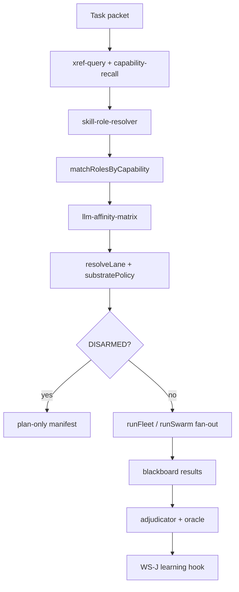
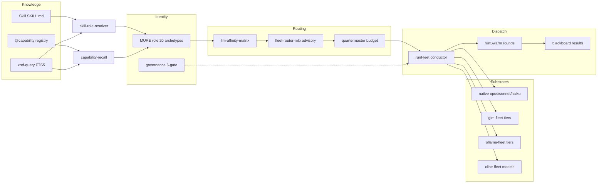

# YURI Skills & Orchestration Upgrade — Research & Roadmap

**Date:** 2026-06-30  
**Owner:** Marcel  
**Scope:** Research + planning only (Cursor plans; GLM/Ollama/Cline implement via WS-K)  
**Related:** `YURI_DIGITAL_COMPANY_SKELETON_2026-06-30`, `YURI_ACTIVE_LEARNING_MEMORY_2026-06-30`, `MURE_LIVE_OPS_DASHBOARD_RESEARCH_2026-06-30`, `02_RESOURCES/RESEARCH/sakana-blueprint-2026-06-22/00-MURE-BLUEPRINT.md`, `02_RESOURCES/TASKS/yuri-skills-orchestration-ws-k-upgrade.json`

---

## Executive summary

YURI has a **mature skills/knowledgebase layer** (~224 `@capability` mechanisms, ~120 skill packs, xref + capability-recall) and a **sound MURE role roster** (20 Sakana-modeled archetypes, validates clean). The gap is **binding and routing**: roles know *capabilities* but not *skills*; substrates beyond `native|glm|either` exist in fleet code but not in `role-registry.mjs`; ollama/cline/deepseek/mimo are **advisory sidecars** in `company.mjs` / `runFleet.mjs` but not first-class dispatch targets per role.

**Honest verdict:** Do **not** rebuild YURI or inflate the roster. **Stay at 20 roles.** Evolve via: (1) LLM affinity matrix + substrate enum extension, (2) `skill-role-binding` registry, (3) skill-triggered dispatch in `planCompany`, (4) quad-substrate orchestration policy in `runFleet`/`runSwarm`, (5) WS-I/WS-J/WS-H integration hooks.

**Role count recommendation:** **STAY** (20). Add **substrate profiles** and **skill bindings** to existing roles; reserve +1–2 roles only if a persistent gap appears (e.g. dedicated `router` judge for RouteMoA-style pre-scoring) — defer to P2.

---

## 1. Audit: 20 MURE roles vs LLM substrates

### 1.1 Current roster (canonical)

Source: `_SYSTEM/config/fleet-roles.json` + `role-registry.mjs` (`--validate` → `ok: true`, `roleCount: 20`).

| Group | Roles | Count |
|-------|-------|------:|
| orchestration | helmsman, architect, steward | 3 |
| research | ideator, scout, synthesist, evolver, deliberator | 5 |
| engineering | engineer, mechanic, artificer, sentinel, kernelsmith | 5 |
| verification | adjudicator, oracle, calibrator | 3 |
| knowledge | archivist, chronicler | 2 |
| operations | quartermaster, envoy | 2 |

**Substrate enum today:** `native | glm | either`  
**Lane enums today:** `NATIVE_LANES` (opus, sonnet, haiku, native) · `GLM_LANES` (glm-max, glm, glm-flash, glm-flashx, glm-sub-orch, glm-turbo, glm-vision, glm-ocr)

**Gap:** Four additional execution planes are **live in code** but **absent from role-registry**:

| Plane | Dispatch surface | Armed flag | In roster? |
|-------|------------------|------------|------------|
| **GLM (z.ai)** | `glm-fleet.mjs` → `llm-lane.mjs` | `YURI_GLM_FLEET` / `glm-fleet.enabled` | Partial (glm lanes only) |
| **Ollama Cloud** | `ollama-fleet.mjs` → `llm-lane.mjs` | `YURI_OLLAMA_FLEET` / `ollama-fleet.enabled` | **No** |
| **ClinePass** | `cline-fleet.mjs` (`cline -P clinepass`) | `YURI_CLINE_FLEET` / `cline-fleet.enabled` | **No** |
| **Native (Claude/Cursor)** | Agent tool / Cursor session | session | Partial (native lanes) |
| **DeepSeek / Mimo** | `llm-lane.mjs` / `llm-compat.sh` | API keys | **No** (advisory only) |

`company.mjs` `ADVISORY_SUBSTRATES` catalogs ollama + cline; `runFleet.mjs` writes sidecar task files but **does not auto-dispatch**.

### 1.2 Marcel's multi-LLM inventory (inferred from codebase)

**GLM tiers** (`glm-fleet.mjs` / `llm-lane.mjs`):

| Lane id | Model | Cost tier | Strengths (design intent) |
|---------|-------|-----------|----------------------------|
| glm-max | glm-5.2 | premium | orchestration, synthesis, adversarial depth, 1M ctx |
| glm-sub-orch | glm-5.1 | premium overflow | quota-gated glm-max substitute |
| glm | glm-4.7 | workhorse | code-gen, analysis, judgment |
| glm-turbo | glm-5-turbo | mid | faster judgment |
| glm-flash / flashx | glm-4.7-flash(x) | free/cheap | census, scan, mechanical edits |
| glm-vision | glm-4.6v | specialty | screenshots, UI |
| glm-ocr | glm-ocr | specialty | document extraction |

**Ollama Cloud tiers** (`ollama-fleet.mjs`):

| Tier | Model | Notes |
|------|-------|-------|
| flash | deepseek-v4-flash:cloud | primary bulk (quality/usage) |
| minimax | minimax-m3:cloud | efficient generalist |
| kimi | kimi-k2.7-code:cloud | code specialist |
| nemotron | nemotron-3-ultra:cloud | heavy reasoning |
| deepseek-pro | deepseek-v4-pro:cloud | true 1M; avoid bulk (~2× usage) |
| gemma | gemma4:31b-cloud | available fallback |

**ClinePass roster** (`cline-fleet.mjs`):

| Tier key | Model |
|----------|-------|
| glm | glm-5.2 |
| kimi | kimi-k2.7-code |
| deepseek | deepseek-v4-pro |
| mimo | mimo-v2.5 |
| qwen | qwen3.7-max |

**Native / Cursor:**

| Lane | Use |
|------|-----|
| opus | helmsman finalize, hard architecture, owner session |
| sonnet | scout, sentinel, chronicler, integration |
| haiku | artificer mechanical |
| Cursor Agent | primary cockpit (Marcel's live lane) |

**DeepSeek / Mimo** (`llm-compat.sh`, `llm-lane.mjs`): direct API lanes — good for advisory packets, pre-tool-gate delegation, nano-spawn; not in MURE substrate enum.

**Private quotas Marcel must fill in** (not in repo):

- z.ai GLM Coding Plan monthly caps per tier (glm-max vs flash)
- Ollama Pro concurrent=3 ceiling + per-model usage weights
- ClinePass flat monthly + which models enabled
- Anthropic weekly pool (opus/sonnet/haiku)
- DeepSeek / Mimo API budgets if used outside Cline bundle

`quartermaster` role exists but **token-ledger hook is STUB** per skeleton report — no live quota read from provider APIs.

### 1.3 Role × substrate coverage matrix (today vs needed)

| Role | Default lane | substrate | Ollama fit | Cline fit | DeepSeek/Mimo fit |
|------|-------------|-----------|------------|-----------|-------------------|
| helmsman | opus | native | — | — | advisory only |
| architect | glm-max | either | nemotron (design) | glm-5.2 | deepseek-pro (spec) |
| steward | native | native | — | — | — |
| ideator | glm | glm | flash bulk | glm/kimi | mimo divergent |
| scout | sonnet | native | flash/minimax | kimi/deepseek | deepseek-flash |
| synthesist | glm-max | glm | deepseek-pro | glm-5.2 | 1M merge |
| evolver | glm-max | glm | nemotron | glm | owner-gated |
| deliberator | glm-max | glm | nemotron/deepseek-pro | glm | depth |
| engineer | glm | either | kimi | glm/kimi | deepseek |
| mechanic | glm | either | flash | glm | — |
| artificer | haiku | either | **flash** (wired sidecar) | **glm** (wired) | flash |
| sentinel | sonnet | native | — | — | — |
| kernelsmith | glm-max | either | nemotron | glm | — |
| adjudicator | glm-max | glm | nemotron | glm-5.2 | independent critic |
| oracle | native | native | glm-flash tests | — | — |
| calibrator | native | native | — | — | — |
| archivist | native | native | — | — | — |
| chronicler | sonnet | either | glm | glm | — |
| quartermaster | native | native | — | — | — |
| envoy | sonnet | native | — | — | — |

**Finding:** Roster archetypes are sufficient; **per-role substrate profiles** are missing. `resolveLane()` only chooses native vs glm — not ollama/cline/deepseek.

---

## 2. Skills / knowledgebase architecture gaps

### 2.1 Layer inventory

| Layer | Surface | Count / status | Gap |
|-------|---------|----------------|-----|
| **Skills (organs)** | `.claude/skills/`, `skills/` | ~107 / ~121 dirs (mirror drift) | Duplicate paths; retired skills still discoverable |
| **Capabilities (mechanisms)** | `_SYSTEM/capabilities.json` | 224 auto-scanned | Rich; not outcome-weighted |
| **Skill integrity** | `_SYSTEM/skill-hash-registry.json` | ~250 hashes | Tracks `skills/` mirror; `.claude/skills` parity unchecked in dispatch |
| **Skill loader** | `yuri-skill-loader.mjs` | LIVE | Writes manifest; no role binding |
| **Capability recall** | `capability-recall.mjs` | LIVE | xref auto-surfaces; **not in planCompany** |
| **Role capabilities** | `fleet-roles.json` `capabilities[]` | 20 roles × 3–5 tags | Semantic match only; no skill IDs |
| **Skill→role binding** | — | **MISSING** | No `_SYSTEM/config/skill-role-bindings.json` |
| **Routing contract** | `llm-compat.sh` + `llm-lane.mjs` | LIVE | Active; `offload-contract.mjs` archived |
| **Persona map** | `lane-persona-map.mjs` | LIVE | Private overlay; orthogonal to MURE roles |

### 2.2 Registry drift (evidence)

1. **Dual skill trees:** `.claude/skills/` (107) vs `skills/` (121) — skill-hash-registry indexes `skills/` paths; Cursor/Claude may load from `.claude/skills/`.
2. **Retired skills still in corpus:** e.g. `parallel-clone-orchestrator` tombstone — xref still surfaces it.
3. **Roles cite capabilities, not skills:** `archivist` has `skill-library` capability but no `primarySkills: ["gitnexus", "oracle-registry", ...]`.
4. **No dispatch-time skill injection:** `buildRolePrompt` frames archetype; does not load matching `SKILL.md` bodies (contrast Claude Code native skill activation).
5. **Voyager gap:** skills are static files; no embedding retrieval of past successful skill invocations per role (WS-J P1 addresses episodic replay, not skill index).
6. **MLP substrate blind spot:** `fleet-router-mlp.mjs` documents 3 substrates + Cursor; **cline 4th bit designed not live** (WS-J health report).

### 2.3 Capability-first vs skills-as-organs (yuri-origin alignment)

From `_SYSTEM/yuri-origin.md` and CLAUDE.md mandate:

- **Capabilities** = indexed mechanisms (`@capability` → `capability-recall.mjs`) — "what code exists"
- **Skills** = procedural organs (`.claude/skills/*/SKILL.md`) — "how to run a workflow"
- **Roles** = archetype + capability envelope + default substrate — "who owns the decision"

**When to add what:**

| Need | Add | Don't add |
|------|-----|-----------|
| Reusable script/API already exists | `@capability` tag + scan | New skill duplicating mechanism |
| Multi-step workflow, prompts, checklists | Skill (`SKILL.md`) | New MURE role |
| Standing agent identity, governance, math hooks | MURE role (rare) | Skill pretending to be a persona |
| Model-specific routing preference | Substrate profile on role | Duplicate role per model |
| One-off task | Task JSON subtask | Permanent role |

---

## 3. External research synthesis

### 3.1 Multi-LLM orchestration patterns

| Pattern | Source | YURI analog | Adoption |
|---------|--------|-------------|----------|
| **Mixture-of-Agents (MoA)** | Together AI 2024 | runSwarm rounds + blackboard | **Partial** — layered refinement exists; no explicit aggregator role |
| **Sparse MoA (SMoA)** | Li et al. 2024 | concurrency caps, roundLog | **Partial** — top-k by obligation floor, not judge agent |
| **RouteMoA** | Wang et al. 2026 | fleet-router-mlp | **Stub** — lightweight scorer before inference = MLP + quartermaster |
| **Route-by-capability** | Industry standard | `matchRolesByCapability` | **WIRED** — needs skill+capability union |
| **Specialist pools** | Fugu / MoA blogs | glm/ollama/cline fleets | **WIRED** as sidecars; not role-bound |
| **Fugu Conductor** | Sakana 2026 | helmsman + MLP | Advisory; governance hard override |

**YURI should adopt:** RouteMoA-style **pre-inference scoring** (MLP + affinity matrix) + MoA-style **independent proposers** (ideator/scout/engineer fan-out) + SMoA-style **sparse activation** (quartermaster budget cap, don't spawn all substrates).

**YURI should not adopt:** Opaque single-API routing (Marcel wants exposed control plane); parametric model merge for routing (defer to evolver proposals only).

### 3.2 Sakana / lab role specialization

MURE already encodes Sakana OP-1–OP-6 (blueprint §1). Gaps vs real lab:

- **Verification independence** — adjudicator/oracle off-loop (blueprint ✓) but not auto-spawned post-swarm
- **Collective blackboard** — STAR topology ✓
- **Evolutionary self-improve** — evolver DISARMED + unwired
- **Ideas over compute** — quartermaster STUB; glm-max overused for bulk (quality issue per skeleton report)

### 3.3 Skill libraries (Voyager, AutoGPT, Claude skills)

| System | Pattern | YURI mapping |
|--------|---------|--------------|
| **Voyager** | Executable skill library + embedding retrieval | Adapt: capability-hit + episodic replay (not runtime code synthesis) |
| **AutoGPT** | Tool + memory + planner loop | `llm-lane.mjs` tool loop + company.mjs planner |
| **Claude skills** | Triggered SKILL.md injection | Native in Cursor/Claude Code; **missing in MURE dispatch** |
| **YURI @capability** | Function-indexed mechanism recall | Stronger for code; weaker for procedural workflows |

**Unified model:** Skill triggers **procedure**; capability tags **mechanism**; role selects **identity + governance + default substrate**.

---

## 4. Proposed evolution path (phased, no rip-and-replace)

### Phase P0 — Affinity matrix + registry patch (DISARMED)

1. Add `_SYSTEM/config/llm-affinity-matrix.json` — role × substrate × model × costTier × reasoningDepth
2. Extend `role-registry.mjs`:
   - `SUBSTRATES` → add `ollama`, `cline`, `deepseek` (advisory)
   - `resolveLane()` → read affinity matrix fallback chain
   - `substrateProfiles[]` optional on each role (no roster count change)
3. Publish `_SYSTEM/reports/MURE_ROLE_REGISTRY_PATCH_PROPOSAL.md` (DISARMED diff for `fleet-roles.json`)

### Phase P1 — Skill→role binding registry

1. `_SYSTEM/config/skill-role-bindings.json`:
   ```json
   {
     "bindings": [
       { "role": "scout", "skills": ["cross-reference-navigation", "agent-reach"], "trigger": ["research", "verify-external"], "priority": 1 },
       { "role": "adjudicator", "skills": ["adversarial-verification"], "trigger": ["verify"], "priority": 0 }
     ]
   }
   ```
2. `skill-role-resolver.mjs` — given `(role, need[], taskClass)` → ordered skill paths
3. Wire into `planCompany` / `buildRolePrompt` as **advisory footer** (hash-verified via skill-hash-registry)
4. xref-query preflight: union capability-recall + skill-role-resolver hits

### Phase P2 — Multi-substrate orchestration policy

1. `runFleet.mjs` / `runSwarm.mjs` policy object:
   - `substratePolicy: { primary, sidecars[], maxConcurrent, budgetCap }`
   - Auto-spawn ollama/cline when role profile says so (still DISARMED without arm flags)
2. MoA round shape: **proposer round** (parallel cheap) → **aggregator** (glm-max or helmsman) → **adjudicator leaf**
3. Skill-triggered dispatch: task tag `skill:gitnexus` → force skill load + prefer role `scout`/`mechanic`

### Phase P3 — Learning closure (feeds WS-J)

- Outcome-weighted skill ranking per role
- MLP feature: `skillMatchScore`, `substrateAffinityScore`
- archivist promotes high-success skill patterns to Track A

---

## 5. LLM-to-role affinity matrix (summary)

Full machine-readable matrix → `_SYSTEM/config/llm-affinity-matrix.json` (WS-K P0 deliverable).

| Archetype | Primary substrate | Primary model | Fallback chain | Reasoning | Cost |
|-----------|-------------------|---------------|----------------|-----------|------|
| Dispatcher (helmsman) | native | opus | sonnet → glm-max | xhigh | $$$ |
| Designer (architect) | glm | glm-max | sonnet → nemotron | high | $$ |
| Divergent (ideator) | glm | glm | flash ollama → sonnet | medium | $ |
| Researcher (scout) | either | sonnet | ollama-flash → glm | medium | $$ |
| Synthesizer (synthesist) | glm | glm-max | deepseek-pro ollama | high | $$ |
| Deep reasoner (deliberator) | glm | glm-max | nemotron → opus | xhigh | $$$ |
| Builder (engineer) | either | glm | cline-glm → kimi ollama | medium | $ |
| Integrator (mechanic) | either | glm | cline-glm → flash | medium | $ |
| Scaffolder (artificer) | either | haiku | glm-flash → ollama-flash | low | ¢ |
| Security (sentinel) | native | sonnet | glm | high | $$ |
| Perf (kernelsmith) | glm | glm-max | sonnet | high | $$ |
| Critic (adjudicator) | glm | glm-max | opus (independent) | xhigh | $$ |
| Tester (oracle) | native | native/bash | glm-flash | low | ¢ |
| Calibrator | native | native | — | low | ¢ |
| Curator (archivist) | native | native | haiku | low | ¢ |
| Writer (chronicler) | either | sonnet | glm | medium | $ |
| Budget (quartermaster) | native | native | — | low | ¢ |
| Intake (envoy) | native | sonnet | glm | medium | $ |
| Governance (steward) | native | native | — | low | ¢ |
| Evolver | glm | glm-max | opus (gated) | xhigh | $$$ |

**Cross-cutting rules:**

1. **Cheap-first bulk** — artificer, scout recon, oracle smoke → flash/haiku before glm-max
2. **Independent critic** — adjudicator never shares substrate with producer on same leaf
3. **Cline for full-IDE builds** — engineer/mechanic when GLM empty-output risk (WS-G audit)
4. **Ollama for parallel breadth** — ≤3 concurrent; flash tier default
5. **Native for finalize** — commit, owner packets, protected-path mutations

---

## 6. Orchestration upgrade patterns

### 6.1 Fan-out patterns

```
                    ┌─────────────┐
                    │   helmsman   │ planCompany
                    └──────┬──────┘
           ┌───────────────┼───────────────┐
           ▼               ▼               ▼
    ┌────────────┐  ┌────────────┐  ┌────────────┐
    │ GLM fleet  │  │Ollama side │  │Cline side  │  parallel proposers
    │ (primary)  │  │ (bulk)     │  │ (IDE build)│
    └─────┬──────┘  └─────┬──────┘  └─────┬──────┘
          └───────────────┼───────────────┘
                          ▼
                 ┌────────────────┐
                 │ blackboard      │ .claude/jobs/<run>/results/
                 └────────┬───────┘
                          ▼
                 ┌────────────────┐
                 │ synthesist /    │ MoA aggregation layer
                 │ glm-max agg     │
                 └────────┬───────┘
                          ▼
                 ┌────────────────┐
                 │ adjudicator     │ off-loop refute
                 └────────┬───────┘
                          ▼
                 ┌────────────────┐
                 │ oracle +        │
                 │ calibrator      │
                 └────────────────┘
```

### 6.2 Specialist sidecars

| Sidecar | Eligible roles (today) | Policy upgrade |
|---------|------------------------|----------------|
| ollama | scout, artificer (+ router hint) | Extend per affinity matrix |
| cline | scout, artificer, engineer, mechanic | Add kernelsmith for perf benchmarks |
| deepseek advisory | pre-tool-gate, nano-spawn | Tag as `substrate: advisory` not fleet leaf |

### 6.3 Skill-triggered dispatch



---

## 7. Integration with WS-I, WS-J, WS-H

| Workstream | Layer | WS-K contribution |
|------------|-------|-------------------|
| **WS-I** skeleton bind | L7 Skills & Orchestration | Register `skill-role-resolver`, `llm-affinity-matrix` as mechanism nodes; bind L7 WIRED → PARTIAL+ |
| **WS-J** learning | L11 | MLP features: skillMatch, substrateOutcome; episodic replay includes skill IDs used |
| **WS-H** observability | L14 | Live ops dashboard shows substrate + skill triggered per leaf |

**Cross-cutting hooks:**

- `planCompany`: `advisorySkillFooter`, `capabilityRecallHits`, `affinityChoice`
- `company-dispatch` manifest: `skillsLoaded[]`, `substratePlan`, `sidecarCommands`
- `work-ledger`: ingest skill + substrate per leaf for RouterBench-style eval later

---

## 8. Anti-patterns

| Anti-pattern | Why bad | YURI alternative |
|--------------|---------|------------------|
| **Role sprawl** (30+ roles) | Orchestration complexity, overlap | Stay 20; use substrate profiles |
| **Duplicate skills** | Drift, hash failures | Single canonical `skills/`; sync script to `.claude/skills/` |
| **glm-max on everything** | Cost, empty outputs, slow | Affinity matrix cheap-first |
| **Skill without capability** | Rebuild existing code | capability-recall FIRST |
| **Capability without skill** | Operator doesn't know procedure | skill binding for top workflows |
| **Same model critic + producer** | Echo chamber | `independentOf` + substrate split |
| **MLP overrides governance** | Safety regression | Advisory only (BaRP framing) |
| **AutoGPT-style unbounded loop** | Runaway spend | runSwarm rounds ≤3, DISARMED default |
| **New role per model** | Marcel has 15+ models | Models map to substrates, not personas |

---

## 9. Top 5 orchestration upgrades (priority order)

1. **LLM affinity matrix + `resolveLane` substrate extension** — unlocks ollama/cline/deepseek without new roles (P0)
2. **Skill→role binding registry + planCompany injection** — closes skills/knowledgebase ↔ dispatch gap (P1)
3. **Quad-substrate auto-policy in runFleet** — sidecars stop being manual (P2)
4. **MoA aggregation round** — synthesist/glm-max after parallel proposers (P2)
5. **Skill+capability union preflight in xref path** — capability-first + procedural recall at plan time (P1)

---

## 10. Residual risks

- Provider quota APIs not in repo — quartermaster cannot enforce real caps until Marcel supplies config
- glm-max empty-output class remains a quality risk; affinity matrix alone does not fix transport
- Skill mirror drift may break pre-commit skill-hash until regen
- Cline requires local `cline auth` — not CI-gatable
- Role count growth temptation — resist; use bindings

---

## Appendix A — Mermaid: Skill → Capability → Role → Substrate → Dispatch



---

## Appendix B — Routing source of truth

| Concern | Canonical surface | Notes |
|---------|-------------------|-------|
| Role roster | `_SYSTEM/config/fleet-roles.json` | Do not hand-edit; patch via proposal |
| Lane dispatch | `llm-lane.mjs` | models.json `llm_compat_lanes` |
| Shell router | `llm-compat.sh` | Advisory / pre-tool-gate |
| Fleet fan-out | `glm-fleet`, `ollama-fleet`, `cline-fleet` | DISARMED default |
| Company orchestration | `company.mjs`, `runFleet.mjs` | Sidecars manual today |
| Legacy routing | `_SYSTEM/archive/.../offload-contract.mjs` | **Retired** |
| Active contract pointer | `.cursor/rules/sync.mdc` → `Scripts/offload-contract.mjs` | **Missing at live path** — ws-k should note drift |

---

*Research only. Implementation tracked in `02_RESOURCES/TASKS/yuri-skills-orchestration-ws-k-upgrade.json`.*
