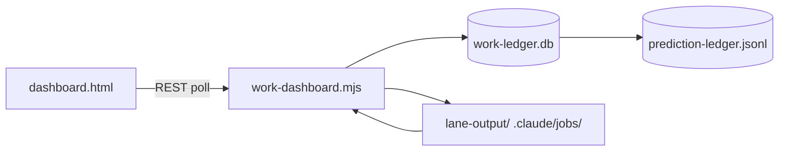

# MURE Dashboard — API Wiring

Phase 0: **realtime overview dashboard** with drill-down into runs, roles, artifacts, and trend analytics. Scales to Postgres backend and worker-based outbox for large-scale telemetry.

Architecture: zero-depend Node.js HTTP server (`work-dashboard.mjs`) + SQLite work ledger + reactive HTML dashboard (`dashboard.html`).

---

## Data flow



**Rule:** Dashboard polls every 3 seconds (`/api/overview`). Drill-down endpoints fetch on-demand. All reads are from the work ledger; UI never mutates state.

---

## Modules & responsibilities

| Module | Role |
|--------|------|
| `_SYSTEM/Scripts/work-ledger.mjs` | SQLite store: runs, artifacts, roles, convergence, productivity |
| `_SYSTEM/Scripts/work-dashboard.mjs` | HTTP server, polling handler, endpoint routing |
| `_SYSTEM/Scripts/job-pool.mjs` | Job pool stats, held queue |
| `_SYSTEM/mure/doctrine.mjs` | Doctrine axes, grade calculation, visual plan gates |
| `_SYSTEM/Scripts/prediction-ledger.mjs` | Brier calibration, prediction→outcome ledger |
| `_SYSTEM/mure/dashboard.html` | Reactive UI, drawer drill-down, constellation view |

---

## REST API

| Method | Path | Query | Returns |
|--------|------|-------|---------|
| `GET` | `/api/overview` | — | `{ company, runs, artifacts, roles, kpis, doctrineGrade, heldQueue, visualPlans, mlpFeedback }` |
| `GET` | `/api/run` | `?id=<run_id>` | `{ run, rounds, leaves, artifacts, convergence }` |
| `GET` | `/api/artifacts` | `?role=<role_id>&limit=N` | `{ role, artifacts[] }` |
| `GET` | `/api/trends` | `?type=<throughput\|convergence\|productivity>` | `{ data, labels }` |
| `GET` | `/api/router-stats` | — | `{ mlpScores, substrateDistribution }` |

### Response shapes

#### `/api/overview`

```json
{
  "company": {
    "armed": false,
    "runCount": 151,
    "artifactCount": 589,
    "activeRoles": 18
  },
  "runs": [
    {
      "id": "run_…",
      "summary": "task summary",
      "status": "running|completed|held",
      "startTime": "ISO",
      "finishTime": "ISO|null",
      "rounds": 3,
      "leaves": 8,
      "converged": true,
      "forced": false,
      "tags": ["research", "build"]
    }
  ],
  "artifacts": [
    {
      "id": "art_…",
      "role": "engineer",
      "runId": "run_…",
      "path": "relative/path/to/artifact",
      "type": "code|doc|test|report",
      "created": "ISO"
    }
  ],
  "roles": [
    {
      "id": "engineer",
      "name": "Engineer",
      "group": "engineering",
      "substrate": "glm",
      "autonomyClass": "self-governable",
      "runs": 42,
      "artifacts": 127
    }
  ],
  "kpis": {
    "throughput": 5.2,
    "convergenceRate": 0.87,
    "avgRoundTime": 234,
    "heldCount": 3
  },
  "doctrineGrade": "B+",
  "heldQueue": {
    "source": "phase5/helmsman-summary.json",
    "items": [
      {
        "taskId": "task_…",
        "role": "evolver",
        "reason": "owner-gated: blast=HIGH",
        "generatedAt": "ISO"
      }
    ]
  },
  "visualPlans": [
    {
      "taskFile": "02_RESOURCES/TASKS/mure-buildout-ws-c-visual.json",
      "summary": "MURE visual control buildout",
      "visualPlanSlug": "mure-visual-control",
      "visualPlanApproved": true
    }
  ],
  "mlpFeedback": {
    "advisory": true,
    "persisted": false,
    "skippedOutcomes": 2,
    "evalMeanBrier": null
  }
}
```

#### `/api/run?id=run_x`

```json
{
  "run": {
    "id": "run_x",
    "summary": "task summary",
    "status": "completed",
    "startTime": "ISO",
    "finishTime": "ISO",
    "rounds": 3,
    "leaves": 8,
    "converged": true,
    "forced": false,
    "tags": ["research", "build"]
  },
  "rounds": [
    {
      "round": 1,
      "leaves": [
        {
          "leafId": "leaf_1",
          "role": "engineer",
          "lane": "glm",
          "status": "completed",
          "resultLabel": "01CW_CODE_BASE_P_X_PASS_COMMITTED",
          "text": "full result text",
          "duration": 45.2
        }
      ]
    }
  ],
  "artifacts": [
    {
      "id": "art_1",
      "role": "engineer",
      "path": "_SYSTEM/mure/engine.mjs",
      "type": "code"
    }
  ],
  "convergence": {
    "score": 0.87,
    "reason": "adjudicator approved, oracle green"
  }
}
```

#### `/api/artifacts?role=engineer&limit=8`

```json
{
  "role": {
    "id": "engineer",
    "name": "Engineer",
    "group": "engineering",
    "substrate": "glm",
    "autonomyClass": "self-governable"
  },
  "artifacts": [
    {
      "id": "art_1",
      "runId": "run_x",
      "path": "_SYSTEM/mure/engine.mjs",
      "type": "code",
      "created": "ISO",
      "summary": "core domain code-gen implementation"
    }
  ]
}
```

#### `/api/trends?type=throughput`

```json
{
  "data": [4.2, 5.1, 5.2, 4.8, 5.0],
  "labels": ["Mon", "Tue", "Wed", "Thu", "Fri"]
}
```

#### `/api/trends?type=convergence`

```json
{
  "data": [0.82, 0.85, 0.87, 0.86, 0.88],
  "labels": ["Run 1", "Run 2", "Run 3", "Run 4", "Run 5"]
}
```

#### `/api/trends?type=productivity`

```json
{
  "roles": [
    {
      "id": "engineer",
      "data": [12, 15, 18, 14, 16]
    }
  ],
  "labels": ["Mon", "Tue", "Wed", "Thu", "Fri"]
}
```

#### `/api/router-stats`

```json
{
  "mlpScores": {
    "native": 0.72,
    "glm": 0.85
  },
  "substrateDistribution": {
    "native": 45,
    "glm": 106
  }
}
```

---

## UI functions (`dashboard.html`)

| Function | Behavior |
|----------|----------|
| `fetchJson(url)` | fetch wrapper with error handling, cache: no-store |
| `loadTrends(force)` | Parallel fetch of 3 trend types; 30s debounce |
| `tick()` | Main poll loop: loadTrends(false) + fetch /api/overview (3s interval) |
| `openRun(run)` | Fetch `/api/run?id=run.id`, show drawer with run detail |
| `openRole(role)` | Fetch `/api/artifacts?role=role.id&limit=8`, show drawer with role metadata |
| `showDrawer(html)` | Render drawer content, apply scrim, open transition |
| `renderRuns()` | Render convergence stream with click handlers |
| `renderKpis()` | Update KPI strip with latest values |
| `renderInsights()` | Update trend charts (sparklines, gauges) |
| `updateStar()` | Update constellation node states |

---

## Drawer UI

The detail drawer slides from right (420px, NEXUS LINK style) with:

- **Run drawer**: summary, status, rounds, leaf count, convergence flag, finish time, role tags, role outputs, artifact list
- **Role drawer**: name, archetype, group, substrate/lane, autonomy class, status, activity metrics (runs/artifacts), capabilities list, recent artifacts
- **Job drawer**: (planned) title, type, state, owner-gated badge, openmass, priority-score, priority, source, doctrine axes, detail, next action, closure condition, report

Close via: scrim click, `×` button, or `Escape` key.

---

## Live test checklist

### 0 — Boot

```bash
node _SYSTEM/Scripts/work-dashboard.mjs --serve [--port 4270]
# → http://localhost:4270
```

Default port: 4270. HTML: `_SYSTEM/mure/dashboard.html`. Fallback to built-in placeholder if absent.

### 1 — Overview poll

```bash
curl -s http://localhost:4270/api/overview | python3 -m json.tool | head
```

Expect `company`, `runs`, `artifacts`, `roles`, `kpis`, `doctrineGrade`, `heldQueue`, `visualPlans`, `mlpFeedback`.

### 2 — Run drill-down

1. Click on any run row in convergence stream
2. Or API:

```bash
curl -s 'http://localhost:4270/api/run?id=<run_id>' | python3 -m json.tool
```

Expect `run`, `rounds`, `artifacts`, `convergence` with leaf results.

### 3 — Role drill-down

1. Click on any role node in constellation
2. Or API:

```bash
curl -s 'http://localhost:4270/api/artifacts?role=engineer&limit=8' | python3 -m json.tool
```

Expect `role` metadata + `artifacts[]`.

### 4 — Trends

```bash
curl -s 'http://localhost:4270/api/trends?type=throughput' | python3 -m json.tool
curl -s 'http://localhost:4270/api/trends?type=convergence' | python3 -m json.tool
curl -s 'http://localhost:4270/api/trends?type=productivity' | python3 -m json.tool
```

Expect `data` + `labels` arrays.

### 5 — Router stats

```bash
curl -s http://localhost:4270/api/router-stats | python3 -m json.tool
```

Expect `mlpScores` + `substrateDistribution`.

### 6 — Negative checks

| Case | Expected |
|------|----------|
| Missing run ID on `/api/run` | 400 run_id_required |
| Missing role ID on `/api/artifacts` | Returns empty artifacts list |
| Invalid trend type | 400 type_invalid |

### 7 — Poll behavior

- Dashboard auto-refreshes every 3 seconds (`setInterval(tick, 3000)`)
- Trends debounce: only refetch if >30s since last fetch (or `force=true`)
- All requests use `cache: no-store`

---

## Settings / configuration

| Setting | Location | Default | Purpose |
|---------|----------|---------|---------|
| `DEFAULT_PORT` | `work-dashboard.mjs` | 4270 | HTTP bind port |
| `HTML_PATH` | `work-dashboard.mjs` | `_SYSTEM/mure/dashboard.html` | Dashboard HTML file |
| `INGEST_THROTTLE_MS` | `work-dashboard.mjs` | 5000 | Minimum ms between ledger re-ingests |
| `TREND_DEBOUNCE_MS` | `dashboard.html` | 30000 | Minimum ms between trend refetches |
| `POLL_INTERVAL_MS` | `dashboard.html` | 3000 | Overview poll interval |

No config file — server is CLI-driven. Ledger path: `_SYSTEM/state/work-ledger.db` (auto-created).

---

## Outbox (prediction ledger)

The prediction ledger (`prediction-ledger.jsonl`) is the MURE outbox for learning signals:

| Field | Purpose |
|-------|---------|
| `predId` | Unique prediction ID |
| `timestamp` | ISO prediction time |
| `features` | 12-element feature vector (always persisted) |
| `decision` | Substrate chosen (native/glm) |
| `outcome` | Observed result (success, quality, actualSubstrate, resultLabel) |
| `skipped` | Boolean — empty RESULT_LABEL or text < 16 chars |
| `confidence` | MLP score (0–1) |

Accessed via `calibrationReport()` → mean Brier score, per-confidence-bucket calibration. Used by `calibrator` role for honesty audit.

---

## MURE task reference

MURE dispatch can run bounded verification via `company.mjs`. Example task packet (DISARMED — owner arms):

```json
{
  "id": "mure-dashboard-smoke",
  "module": "mure",
  "roles": ["mechanic", "sentinel"],
  "steps": [
    "Start work-dashboard.mjs --serve on port 4270",
    "GET /api/overview validates schema",
    "GET /api/run?id= exists and returns round data",
    "GET /api/artifacts?role=engineer&limit=8 returns artifacts",
    "GET /api/trends?type=throughput returns data+labels",
    "Assert drawer opens on run click",
    "Assert drawer opens on role node click",
    "Assert tick loop refreshes overview every 3s",
    "Assert trends debounce (>30s)",
    "Stop server"
  ],
  "artifacts": ["docs/MURE-DASHBOARD-WIRING.md"]
}
```

---

## Scalability phases

| Phase | Store | Server | Outbox | Polling |
|-------|-------|--------|--------|---------|
| **0 (now)** | SQLite work-ledger.db | Node.js zero-dep HTTP | prediction-ledger.jsonl | 3s poll |
| **1** | Postgres work_ledger table | Keep Node.js server | pg-boss job queue | WebSocket push |
| **2** | Multi-tenant RLS | Redis cache layer | Sharded per-tenant outbox | Pub/sub events |
| **3** | TimescaleDB for trends | Fastify + clustering | Dead-letter queue + retry | Optimistic UI |

Postgres migration: `_SYSTEM/state/migrations/work-ledger-v1.sql` (planned). API shapes stable.

---

## Related docs

> The section below ("Nexus Calendar Service") documents the Python calendar service at
> `03_NEXUS-LINK/nexus-app/service/`. **Authoritative calendar index (tracked):**
> `docs/NEXUS-LINK-CALENDAR-INDEX.md`. **Session handoff:** `docs/SESSION-HANDOFF-2026-07-02-nexus-calendar.md`.

---

# Nexus Calendar Service — Mechanism Map & Gap Audit

**Surface:** `03_NEXUS-LINK/nexus-app/service/` (Python 3 stdlib, zero-dep).
**Source of truth read:** `calendar_store.py`, `calendar_service.py`, `server.py`,
`connectors/base.py`, `connectors/microsoft.py`, `data/calendar.json`.
**Note:** No `docs/CALENDAR-ARCHITECTURE.md` exists in this repo. The brief's
`service/calendar_*.py` resolves to `nexus-app/service/calendar_{service,store}.py`.

## REST routes (server.py Handler)

| Method | Path | Handler | Notes |
|--------|------|---------|-------|
| `GET` | `/api/calendar/events` | `cal_api.get_bundle(start,end)` | returns events + settings + booking_types + sync_state |
| `POST` | `/api/calendar/events` | `cal_api.create_event(body)` | store → outbox → propagate (sync) |
| `PUT` | `/api/calendar/events` | `cal_api.update_event(eid,body)` | `id` taken from body, not URL |
| `DELETE` | `/api/calendar/events?id=` | `cal_api.remove_event(eid)` | soft-delete (status=cancelled) |
| `PUT` | `/api/calendar/settings` | `cal_api.update_settings(body)` | shallow-merge over existing settings |
| `POST` | `/api/calendar/import/microsoft` | `cal_api.import_microsoft(start,end)` | one-time Graph ingest, source=imported |
| `POST` | `/api/calendar/propagate` | `cal_api._run_propagation(job_id)` | flush outbox (job_id optional from body) |
| `GET` | `/api/calendar/outbox` | direct `calendar_store.load()` read | last 30 jobs |

**Route shape caveat (vs REST convention):** `PUT /api/calendar/events` and
`DELETE /api/calendar/events` use the collection path with the id in the body /
query rather than `/api/calendar/events/<id>`. Functionally complete; not REST-canonical.

## Store (`calendar_store.py`) — `data/calendar.json`

Store top-level fields: `version` (1), `tenant_id` ("nexus"), `events[]`,
`settings{}`, `booking_types[]`, `outbox[]`, `sync_state{}`, `round_robin_cursor` (0).

**Event fields (canonical event shape, `upsert_event`):** `id`, `title`,
`type` (event|booking), `source` (nexus|microsoft|imported), `start`, `end`,
`allDay`, `status` (confirmed|cancelled|noshow|None), `sync` (pending|synced|failed),
`category`, `tags[]`, `busy`, `reminder`, `attendees[]`, `location`, `video`,
`notes`, `who`, `provider_ids{}` (e.g. `{"microsoft": <graph-id>}`), `created_at`,
`updated_at`.

**Outbox job fields (`enqueue_outbox`):** `id` (job_*), `action` (create|update|delete),
`event_id`, `created_at`, `status` (pending|done|failed), `targets` (["microsoft"]),
`payload` (deepcopy of event snapshot), `detail`, `finished_at`.

**Settings (`DEFAULT_SETTINGS`):** timezone, work_start, work_end,
default_reminder_min, travel_time_min, inbound_sync (auto), assignee_rule (round_robin),
source_visibility {nexus,microsoft,apple,google,holidays}.

**Booking types (`DEFAULT_BOOKING_TYPES`):** bt-erst (Erstgespräch, 30m, round_robin,
pool Mike/Atilla, buffer 15), bt-analyse (Analyse-Call, 60m, fixed→Atilla, buffer 10),
bt-team (Team-Block, 45m, load, pool Mike/Atilla/Sara, buffer 0).

## Propagation (`calendar_service._run_propagation`)

Canonical-first order: **write store → enqueue outbox → save → run propagation**.
Each create/update/remove enqueues a job, then calls `_run_propagation(job_id)`
synchronously (worker loop is planned, not built).

- Gated on `ms.connect_state() == "connected"`; if not connected → `{ok: False,
  reason: "microsoft_not_connected", processed: 0}` (job stays pending, not failed).
- `create` → `ms.create_calendar_event` → on success attach `provider_ids.microsoft`,
  set sync=synced, mark job done.
- `update` → if provider id exists: PATCH; else create (re-provision). Same success path.
- `delete` → if provider id exists: DELETE on Graph; local already soft-cancelled.
- On exception: job marked failed, event sync=failed, error collected in `errors[]`.
- `sync_state.microsoft.last_propagate` stamped on every run.

**Graph field mapping** (`_graph_event_body`): title→subject, notes→body.content,
start/end→{dateTime,timeZone}, location→location.displayName, allDay→date-only + UTC.
This mapping is lossy: `attendees`, `tags`, `category`, `busy`, `reminder`, `who`,
`video` are NOT pushed to Graph on outbound create/update.

## Import (`calendar_service.import_microsoft`)

One-time Graph ingest (`ms.fetch_calendar(start,end)`). Dedup by `provider_ids.microsoft`.
Maps Graph item → canonical event with `source=imported`, `sync=synced`, `type=event`.
Stamps `sync_state.microsoft.last_inbound`. Inbound is pull-only (no Graph webhook /
delta subscription); re-import re-scans the full window each call.

## Gaps vs Mike's canonical-first model

Mike's model (as encoded here): **canonical store is single source of truth; writes
hit the store first, then fan out to providers via an outbox; imports stamp source
and dedup by provider id.** The store/outbox/import layer implements this cleanly.
The gaps are downstream of the write path:

| # | Gap | Evidence | Severity |
|---|-----|----------|----------|
| G1 | **Booking types are dead data.** `booking_types[]` and `round_robin_cursor` are stored and served in the bundle but NEVER consumed by `create_event` / `upsert_event`. No field on the event references a booking_type; `duration`, `rule`, `pool`, `assignee`, `buffer` are not resolved. `round_robin_cursor` is initialized to 0 and never mutated. | `grep round_robin_cursor` → only def in `calendar_store.py:57,95`; `create_event` (`calendar_service.py:23`) calls `upsert_event` with raw body, no booking_type lookup. UI `calReadForm()` POSTs raw form fields, no booking_type. | HIGH — the booking-assignment feature (round-robin / fixed / load, the whole point of booking_types) is unbuilt. |
| G2 | **No availability / conflict check.** `create_event` and `update_event` accept any start/end without checking existing events for overlap or applying `work_start`/`work_end`/`travel_time_min`/`buffer`. Double-booking is structurally possible. | `create_event` has no overlap scan; `list_events` filters by range but is never called during create. | HIGH for a booking surface. |
| G3 | **Outbound Graph mapping drops fields.** `_graph_event_body` omits attendees, tags, category, busy/showAs, reminder, who, video. A Nexus-created event with attendees will not invite them in Microsoft. | `connectors/microsoft.py:_graph_event_body` builds only subject/body/start/end/location/allDay. | MED — canonical event is richer than what propagates; round-trip is lossy. |
| G4 | **Propagation is synchronous, not a worker.** Each write blocks on the Graph call inside the request handler. A Graph timeout (25s) holds the HTTP request. The outbox schema (status, targets, payload) is worker-ready but no worker exists. | `_run_propagation` called inline from `create_event`; no background thread/loop. `CALENDAR_VERIFICATION.md` lists "Worker Loop" under "Next Steps (Not in Scope)". | MED — correct for Phase 0, but a live Graph latency/timeout degrades the API. |
| G5 | **No inbound delta/webhook sync.** `import_microsoft` is a full-window re-scan; there is no Graph subscription/webhook or delta-link. Changes made directly in Outlook after import won't reflect until a manual re-import. | only `fetch_calendar` (full calendarView), no subscription calls. | MED — drift between Outlook and canonical store over time. |
| G6 | **Soft-delete orphan check absent.** `delete_event(soft=True)` sets status=cancelled but `list_events` skips cancelled events — there is no tombstone/GC or hard-delete path exercised. Cancelled events accumulate in the store forever. | `delete_event` soft branch; no caller passes `soft=False`. | LOW — storage-only, Phase 0 acceptable. |

**Not a gap (verified correct):** the canonical-first write order (store→outbox→propagate),
provider-id attach on success, import dedup by provider id, and the "not connected" gate
(leaving jobs pending rather than failing them) all match Mike's model.

## Suggested next (out of this audit's scope, not built)

1. Resolve `booking_type` in `create_event`: look up by id → apply duration, rule
   (round_robin advances `round_robin_cursor`), assignee/buffer.
2. Pre-write overlap + work-hours + buffer check in `upsert_event`.
3. Extend `_graph_event_body` with attendees + showAs (busy).
4. Background propagation worker consuming `pop_pending_jobs`.

---

- `_SYSTEM/mure/README.md` — MURE operator manual, 20 roles, governance loop
- `_SYSTEM/mure/DRILLDOWN_WIRING.md` — Dashboard drill-down wiring verification
- `_SYSTEM/reports/MURE_COMPANY_BUILD_01_SENTINEL_AUDIT.md` — Sentinel audit, endpoint smoke test
- `_SYSTEM/reports/MURE_COMPANY_BUILD_05_VISUAL_CONTROL.md` — Visual control buildout, drawer UI
- `_SYSTEM/mure/governance.mjs` — 6-gate charter, self-governance loop
- `_SYSTEM/mure/math-bridge.mjs` — Math-layer cross-reference (decision-sim, energy, quantum)
- `_SYSTEM/Scripts/work-ledger.mjs` — Ledger schema, ingest, query functions

---

## Not in Phase 0

- WebSocket push (polling only)
- Postgres backend (SQLite only)
- Worker-based outbox (inline only)
- Multi-tenant RLS
- Real-time constellation animation (static SVG only)
- Approval queue UI for held subtasks (Phase 5)

---

*This document is the authoritative wiring map for MURE dashboard APIs. All changes to endpoint shapes or behavior must update this file.*