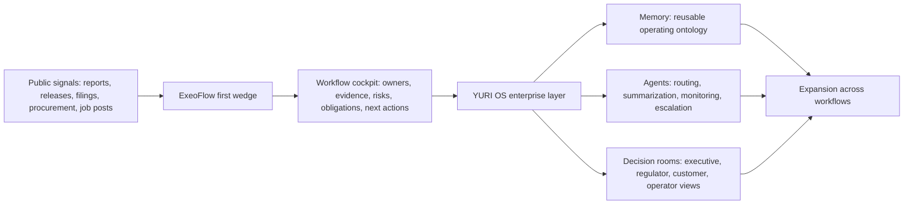

# ExeoFlow x YURI OS Enterprise Target Dossier

Prepared for Claudio. Version 2 focuses on inspectable company profiles, not generic sector labels.

## Core Position

ExeoFlow by itself is a business OS: CRM, invoicing, time tracking, expenses, accounting, smart writing, and Plane.so sync.

YURI OS turns it into an enterprise operating layer:

- Public-source intelligence before the meeting.
- Internal workflow ontology after consent.
- Evidence-backed dashboards instead of static reports.
- Agent-generated weekly operating briefs.
- Action loops from signal to owner to task to invoice to board summary.

The Palantir-depth angle should be used carefully. The useful comparison is not "we are Palantir". It is:

> We can build a smaller, faster, self-hostable operating ontology for one broken workflow, then expand from there.

## Legal Intelligence Boundary

Use public and lawful sources:

- Annual reports, investor pages, public tenders, press releases, official company pages, job posts, public procurement notices, regulator updates, sustainability reports, and public operational KPIs.
- Public role targeting: job titles, departments, official contact surfaces, procurement portals, partner pages.
- Public operational signals: passengers, parcels, revenue, capex, employees, sites, grid assets, plants, projects, regulatory programs, digital transformation programs.

Do not use:

- Leaked data, breached databases, private emails, credential dumps, private profiles, private phone numbers, non-public financials, protected systems, or security-sensitive internal details.

This is enough for a strong first pass. The first sale is a public-source operations map plus a consent-based pilot.

## Product Wedges

### Wedge 1: 14-Day Operations Map

Best for first contact.

Deliverables:

- Target-specific public-source dossier.
- Workflow pain hypothesis.
- Buying center map by role, not by private person.
- One prototype dashboard using public or sample data.
- Three first automations with estimated effort and business value.

### Wedge 2: 6-Week Operating Cockpit

Best after a discovery call.

Deliverables:

- Connected objects: client, ticket, asset, incident, document, invoice, owner, decision.
- One real workflow integrated through export, API, or manual staging.
- Weekly executive brief generated from evidence.
- Permission and audit boundary.

### Wedge 3: YURI OS Integrated Enterprise Layer

Best after proof.

Deliverables:

- Operating ontology.
- Agent workflows.
- Evidence registry.
- Internal training layer.
- Executive command dashboard.

## Scoring Factors

| Factor | What It Means |
|---|---|
| Operational intensity | Physical assets, field teams, plants, logistics, infrastructure, public service |
| Data fragmentation | Many systems, regions, subsidiaries, reporting layers, legacy tools |
| Compliance pressure | Safety, finance, ESG, public accountability, audits, regulated operations |
| Transformation signal | AI, digitalization, restructuring, capex, modernization, efficiency push |
| Budget capacity | Revenue, capex, investment program, enterprise spend capacity |
| Workflow actionability | A first workflow can be mapped without replacing the core system |

## Target Profiles

### 1. OMV

Priority: Tier 1
Sector: Energy, fuels, chemicals
Score: 29/30
Region: Austria / international

Public signals:

- 2025 annual report describes AI as a core driver of digital strategy.
- OMV reports more than 50 AI projects in use, more than 40 in development, and a pipeline of more than 210 ideas.
- Enterprise AI Hub launched as a central access point for chatbots, assistants, and agents.
- Strategic transformation toward sustainable energy, fuels, and chemicals.

Likely pain:

- Many AI initiatives but risk of weak prioritization, unclear ownership, duplicate tooling, and uneven adoption.
- Transition programs require evidence across energy, chemicals, fuels, sustainability, and finance.

Buying center:

- Chief Digital / IT.
- Strategy and transformation.
- Energy segment operations.
- Sustainability and reporting.
- Internal AI governance.

First wedge:

- "AI opportunity intake and value tracking cockpit."
- Map every AI use case to owner, source data, business value, risk, deployment status, and next action.

Outreach angle:

- "You already have AI momentum. The next bottleneck is operational governance: which ideas matter, who owns them, what value they create, and what evidence proves it."

Useful public sources:

- OMV 2025 Digitalization report.
- OMV 2025 dashboard.

### 2. VERBUND

Priority: Tier 1
Sector: Energy, grid, renewables
Score: 29/30
Region: Austria / Europe

Public signals:

- 2025 integrated report emphasizes renewables, hydropower, grid infrastructure, storage, and hydrogen.
- VERBUND communicates a goal of a functional, intelligently coordinated, sustainable electricity system.
- Multi-year investment focus includes Austrian electricity and gas networks, new renewables, and hydropower.

Likely pain:

- Many large projects across generation, grid, storage, hydrogen, permitting, and stakeholder reporting.
- ESG and security-of-supply narratives need evidence from project operations.

Buying center:

- Project portfolio management.
- Grid infrastructure.
- Sustainability.
- Finance / controlling.
- Corporate communications.

First wedge:

- "Renewables and grid project evidence cockpit."
- Track project milestones, permits, risks, suppliers, investment logic, ESG claims, and executive narrative.

Outreach angle:

- "Turn the strategic investment program into a live evidence cockpit for management, reporting, and stakeholder communication."

Useful public sources:

- VERBUND Integrated Annual Report 2025.

### 3. ASFINAG

Priority: Tier 1
Sector: Road infrastructure, traffic operations
Score: 28/30
Region: Austria

Public signals:

- 2025 result announcement reports EUR 1.6B infrastructure investment and more than EUR 12.5B planned through 2031.
- Priorities include traffic safety, modernization, maintenance, digitalization, sustainability, parking/rest areas, and multimodal traffic solutions.
- ASFINAG operates highways, tunnels, tolling, service areas, and traffic management surfaces.

Likely pain:

- Maintenance evidence, incident workflows, supplier work, traffic operations, and public accountability live across many systems.
- 24/7 operational surfaces create high coordination load.

Buying center:

- Traffic management.
- Maintenance and asset management.
- Digitalization.
- Procurement.
- Safety / quality.

First wedge:

- "Incident-to-maintenance evidence workflow."
- Connect traffic event, asset, location, owner, contractor, cost center, resolution status, and reporting summary.

Outreach angle:

- "A live operating layer for infrastructure work: from incident signal to maintenance action to executive evidence."

Useful public sources:

- ASFINAG 2025 result announcement.
- ASFINAG company reports.
- ASFINAG traffic safety program pages.

### 4. Wiener Linien

Priority: Tier 1
Sector: Public transport
Score: 27/30
Region: Vienna

Public signals:

- 2025 results report 903 million passengers.
- Around 1.3 million regular customers.
- 2025 training included hundreds of new tram, underground, and bus drivers.
- Public transport is the dominant mode for Viennese residents.

Likely pain:

- Service quality, training, incidents, asset reliability, passenger communication, and workforce scheduling all need tight operating feedback loops.

Buying center:

- Operations.
- Training.
- Customer communication.
- Digital products / WienMobil.
- Service quality.

First wedge:

- "Service quality cockpit."
- Link incident type, line, asset, driver training signal, passenger communication, root cause, and weekly management brief.

Outreach angle:

- "Make service quality inspectable: what happened, why, which line, which training or asset signal, and what action closed the loop."

Useful public sources:

- Wiener Linien 2025 results.
- Wiener Linien company pages.

### 5. Flughafen Wien

Priority: Tier 1
Sector: Airport, aviation, cargo
Score: 27/30
Region: Austria / CEE gateway

Public signals:

- 2025 records: Flughafen Wien Group reported 43.4M passengers; Vienna site reported 32.6M passengers.
- Record cargo volume was also reported.
- Airport operations combine airlines, handlers, cargo, security, retail, maintenance, and passenger experience.

Likely pain:

- Turnaround, cargo exceptions, maintenance, customer experience, and stakeholder reporting are high-friction coordination surfaces.

Buying center:

- Airport operations.
- Cargo operations.
- Digital / IT.
- Passenger experience.
- Business continuity / safety.

First wedge:

- "Airport operations issue room."
- Track daily exceptions across flight, cargo, facility, handler, owner, delay reason, and executive escalation.

Outreach angle:

- "Record volume increases the value of operational visibility. Start with one issue room for exceptions and stakeholder reporting."

Useful public sources:

- Flughafen Wien 2025 passenger and cargo announcement.
- Flughafen Wien Annual Report 2025.

### 6. Austrian Post

Priority: Tier 1
Sector: Postal, parcels, logistics
Score: 27/30
Region: Austria / CEE

Public signals:

- 2025 annual report highlights parcel/logistics operations, digitalization, energy, sustainability, and public-service obligations.
- Public reporting discusses parcel and logistics performance under changing mail volumes and market pressure.

Likely pain:

- Parcel exceptions, customer service, claims, route performance, pickup/drop-off points, subcontractor issues, and reporting.

Buying center:

- Parcel logistics.
- Customer operations.
- Digitalization.
- Claims / service quality.
- Sustainability / fleet.

First wedge:

- "Parcel exception cockpit."
- Map delayed/lost/damaged shipment signals to route, facility, owner, customer status, claim, resolution, and weekly pattern.

Outreach angle:

- "Reduce exception chaos by turning parcel issues into a traceable operating graph."

Useful public sources:

- Austrian Post Annual Report 2025.

### 7. A1 Telekom Austria Group

Priority: Tier 1
Sector: Telecom, ICT, managed services
Score: 26/30
Region: Austria / CEE

Public signals:

- 2025 results report EUR 5.58B group revenue, over EUR 2B EBITDA, and more than 30M mobile subscribers.
- A1 launched a B2B Delivery Center in 2025 for Security, Cloud, and Managed IT across markets.
- Management states transformation and new business areas are major growth drivers.

Likely pain:

- Field service, network incidents, managed service delivery, customer SLAs, cross-market reporting, and ticket-to-billing leakage.

Buying center:

- B2B services.
- Managed IT / security / cloud.
- Network operations.
- Field service.
- Finance / billing ops.

First wedge:

- "SLA and ticket-to-billing cockpit."
- Connect customer issue, SLA, field task, service owner, billing state, escalation, and postmortem.

Outreach angle:

- "Where managed services scale, leakage hides between tickets, field work, SLA reporting, and billing. We make that inspectable."

Useful public sources:

- A1 Group 2025 results.
- A1 annual financial report 2025.

### 8. Andritz

Priority: Tier 1
Sector: Industrial engineering, hydropower, pulp and paper
Score: 26/30
Region: Austria / global

Public signals:

- 2025 annual report states order intake grew, backlog reached record level, and major global projects were delivered.
- Digitalization section emphasizes autonomous operations, process optimization, AI and data, and modern digital infrastructure.
- More than a dozen AI-powered customer solutions running in plants and over 6,000 internal Copilot licenses.

Likely pain:

- Global project delivery, plant solutions, customer operations, AI solution tracking, service lifecycle, and sustainability reporting.

Buying center:

- Digitalization.
- Global service.
- Project delivery.
- Hydropower / pulp and paper business units.
- Sustainability.

First wedge:

- "Project delivery and customer value cockpit."
- Map project, plant, milestone, customer, claim, supplier, risk, AI/digital solution, and delivery evidence.

Outreach angle:

- "You already sell digital operations to customers. ExeoFlow/YURI OS can give the same operating clarity to project delivery and customer value tracking."

Useful public sources:

- Andritz Annual Report 2025.

### 9. Infineon Austria

Priority: Tier 2
Sector: Semiconductors, R&D, power systems, IoT
Score: 25/30
Region: Austria / global group

Public signals:

- 2025 fiscal year revenue around EUR 4.695B in Austria.
- 5,787 employees in Austria, including 2,506 in R&D.
- R&D expenditure of EUR 721M; research ratio around 15%.
- Strategic focus includes AI data-center power supply, quantum research, efficiency program STEP UP, digitalization, decarbonization.

Likely pain:

- R&D portfolio tracking, manufacturing efficiency, cross-site technical work, program evidence, and strategic initiative reporting.

Buying center:

- R&D leadership.
- Operations.
- Strategy / transformation.
- Finance / controlling.
- Innovation management.

First wedge:

- "R&D and efficiency portfolio cockpit."
- Track strategic initiatives, technical milestones, evidence, resources, risk, and management reporting.

Outreach angle:

- "High R&D intensity needs evidence-backed portfolio visibility, not another static project spreadsheet."

Useful public sources:

- Infineon Austria 2025 press release.
- Infineon Austria about page.

### 10. Frequentis

Priority: Tier 2
Sector: Safety-critical communication, aviation, public safety
Score: 25/30
Region: Austria / global

Public signals:

- Annual report references aviation, public safety, operational control, and major public-sector/safety customers.
- Frequentis operates in domains where reliability, documentation, procurement, and delivery evidence matter.

Likely pain:

- Complex bids, public-sector delivery, compliance evidence, safety-critical documentation, multi-year programs.

Buying center:

- Program management.
- Bid management.
- Quality / compliance.
- Public safety business domain.
- Aviation business domain.

First wedge:

- "Bid and program evidence cockpit."
- Link tender requirement, technical answer, owner, source document, compliance status, delivery milestone, and risk.

Outreach angle:

- "For safety-critical programs, the operational advantage is knowing which requirement is proven, by whom, with what evidence, and what still blocks delivery."

Useful public sources:

- Frequentis Annual Report 2025.

### 11. Kapsch TrafficCom

Priority: Tier 2
Sector: Tolling, traffic management, mobility systems
Score: 24/30
Region: Austria / international

Public signals:

- Core business areas include tolling and traffic management.
- Reports reference connected vehicle communication, roadside infrastructure, traffic management, tolling, and restructuring/deconsolidation context.

Likely pain:

- Program delivery, tenders, service contracts, traffic-system operations, maintenance, and international project evidence.

Buying center:

- Traffic management segment.
- Tolling segment.
- Bid / tender teams.
- Project management.
- Service operations.

First wedge:

- "Tender-to-delivery cockpit."
- Map opportunity, tender requirements, delivery assets, milestones, risk, operating status, and maintenance obligations.

Outreach angle:

- "Connect bids, delivery, service obligations, and operational proof into one traffic-systems command layer."

Useful public sources:

- Kapsch TrafficCom Group Report 2024/25.
- Kapsch investor announcements.

### 12. Erste Group

Priority: Tier 2
Sector: Banking, financial services
Score: 24/30
Region: Austria / CEE

Public signals:

- Annual report materials reference audited financial/reporting processes and digital solution themes.
- Banking operations are document-heavy, regulated, multi-entity, and increasingly AI-enabled.

Likely pain:

- Compliance, credit workflows, internal reporting, customer operations, AI governance, auditability.

Buying center:

- Digital transformation.
- Compliance.
- Risk.
- Operations.
- Internal communications / HR transformation.

First wedge:

- "Compliance task room."
- Track obligation, owner, source document, evidence, status, risk, and board-ready summary.

Outreach angle:

- "AI is easy to demo and hard to govern. Start with an evidence-backed task room for regulated workflows."

Useful public sources:

- Erste Group Annual Report 2025 materials.

## Expansion Targets

## Website Upgrade: What Claudio Can Inspect

The dashboard has been rebuilt as a consumer-readable interactive website instead of a dense operator console. The structure is now:

1. **Hero**
   - Explains ExeoFlow + YURI OS in one sentence: public signals -> bounded workflow -> six-week proof -> reusable operating layer.
   - Use this as the conversation opener.

2. **How to Use**
   - Shows the reader the intended flow: understand the story, pick the account, start with one wedge.
   - Use this to keep Claudio from treating the package as a static research dump.

3. **Commercial Path**
   - Three interactive stages: 14-day map, 6-week cockpit, YURI OS layer.
   - Use this to frame the ask without sounding like a platform migration.

4. **Target Explorer**
   - Searchable and filterable account cards. Only one profile opens at a time, keeping the page readable.
   - Use this for account-by-account prep.

5. **Portfolio Lens**
   - A business fit map comparing operating pressure against data and access fit.
   - Use this to prioritize which accounts Claudio should approach first.

6. **Evidence Board**
   - Public-source anchors for every target.
   - Use this when someone asks, "Why is this account on the list?"

7. **Location SITREP**
   - Interactive real-world map using Leaflet with OpenStreetMap/CARTO map tiles.
   - Supports pan, scroll zoom, zoom buttons, country focus controls, selected-target focus, and clickable markers.
   - Shows the selected profile's headquarters/operating location, official company contact route, and account-specific plan of action.
   - Uses official company channels only. No private contacts, credentialed systems, leaked data, or personal profiling.

### Operating Diagram

### Business Displays Added

| Display | Purpose | Claudio Use |
|---|---|---|
| Cinematic hero | Explains the whole ExeoFlow + YURI OS story without jargon | Use as the first screen in a meeting |
| Three-stage commercial path | Packages 14-day map, 6-week pilot, and YURI OS expansion | Use to scope a low-friction first offer |
| Target explorer | Shows one account profile at a time | Use to avoid overwhelming the reader |
| Location SITREP | Shows real map markers, zoom controls, official contacts, and action plans | Use to brief Claudio by geography and target access |
| Portfolio fit map | Shows which targets are high-pressure and high-fit | Use to prioritize the first five accounts |
| Evidence board | Keeps every target anchored to public evidence | Use to avoid unsupported claims |

### Website Interaction Notes

- Search is global. Typing a company, sector, or workflow clears the sector filter and searches the whole target list.
- Sector filters are explicit. Clicking a sector clears the search field and shows only that sector.
- Clicking a target card updates the profile panel.
- Clicking a map marker updates the contact route and plan of action.
- Map controls can focus all targets, Switzerland, Austria, or the currently selected account.
- Clicking a portfolio map point selects that target and scrolls back to the explorer.
- The page is designed to be read top-to-bottom by a non-technical buyer, not decoded like an internal HUD.

### Switzerland Priority Scan

Claudio is based in Switzerland, so the website now includes a Switzerland-first expansion set. These targets are split between national infrastructure operators and local/mid-market businesses where relationship-led entry is more realistic.

| Target | Type | Location | First wedge |
|---|---|---|---|
| SBB | Enterprise | Bern | Rail disruption and maintenance evidence cockpit |
| Swiss Post | Enterprise | Bern | Parcel exception and branch-service cockpit |
| Swisscom | Enterprise | Bern | Enterprise SLA and field-service cockpit |
| Zurich Airport | Enterprise | Zurich | Airport operations exception room |
| Swissgrid | Enterprise | Aarau / Prilly | Grid incident and obligation evidence cockpit |
| Axpo | Enterprise | Baden | Energy project and innovation validation cockpit |
| BKW | Enterprise | Bern | Grid service and building-solutions task room |
| Stadler Rail | Enterprise | Bussnang | Rail program delivery evidence cockpit |
| Planzer | Local / medium | Dietikon | Customer portal and parcel exception cockpit |
| Camion Transport | Local / medium | Wil | Tour optimization and warehouse exception room |
| Belimo | Local / medium | Hinwil | OEM and data-center sales support cockpit |
| Emmi | Local / medium | Lucerne | Quality, production, and distribution evidence cockpit |
| Galenica | Enterprise | Bern | Healthcare network task and evidence room |
| VAT Group | Local / medium | Haag | Semiconductor supplier delivery and quality cockpit |
| Komax | Local / medium | Dierikon | Installed-base service and automation project cockpit |
| Bossard | Local / medium | Zug | C-parts logistics and customer productivity cockpit |
| Bucher Industries | Local / medium | Niederweningen | Multi-location industrial portfolio cockpit |
| u-blox | Local / medium | Thalwil | Technical support and product feedback cockpit |

### DACH enterprise targets

| Target | Sector | First wedge |
|---|---|---|
| Siemens | Industrial automation, mobility, energy | Factory / infrastructure program ontology |
| Deutsche Bahn | Rail, infrastructure | Maintenance and disruption cockpit |
| DHL Group | Logistics | Parcel and freight exception cockpit |
| Lufthansa Technik | Aviation MRO | Parts, maintenance, compliance workflow |
| RWE / E.ON | Energy | Grid and transition evidence cockpit |
| BASF / Bayer / Merck KGaA | Chemicals, pharma | Plant, R&D, compliance cockpit |
| Rheinmetall / Hensoldt | Defense | Program delivery and compliance evidence workspace |
| Roche / Novartis | Life sciences | R&D and regulated documentation workflow |
| SBB / Swiss Post | Public transport, logistics | Public-service operating cockpit |
| UBS / Swiss Re / Zurich | Finance, insurance | Risk, audit, claims, and regulated reporting cockpit |

### Claudio-first local targets

These are better for relationship-led entry or proof-of-concept:

| Target Type | Why It Fits |
|---|---|
| Swiss agencies with 20-100 employees | CRM, time, billing, delivery, client reporting pain |
| Construction and architecture offices | Project, supplier, invoice, evidence, site update workflows |
| Medical clinics and private healthcare groups | Appointments, documents, compliance, billing, patient communication |
| Industrial SMEs with export business | Quote, project, service, documentation, and reporting loops |
| Logistics SMEs | Dispatch, exceptions, invoicing, customer updates |
| Event and production companies | Crew, gear, project, invoice, asset, client status workflows |

## Outreach Message Skeleton

Subject: Operating cockpit for `company` workflows

Message:

> We mapped public signals around `company`: `signal 1`, `signal 2`, `signal 3`. The pattern suggests one workflow that may be expensive to manage manually: `workflow`.
>
> ExeoFlow + YURI OS can prototype a small operating cockpit for that workflow in 14 days using public or sanitized sample data. The point is not another dashboard. It is a live map of owners, evidence, tickets, assets, obligations, and next actions.
>
> If useful, we can show a one-page prototype for `specific use case`.

## What Claudio Should Ask In Discovery

1. Which operational workflow is still managed by spreadsheets, email, or meetings?
2. Where does work fall between systems?
3. Which report takes too long to prepare every week or month?
4. Which team owns the data but does not own the decision?
5. Which compliance, ESG, or executive claim needs evidence?
6. What can be tested with sanitized data in two weeks?

## Best First Moves

1. Use OMV as the flagship narrative: "AI momentum needs governance."
2. Use VERBUND as the infrastructure narrative: "investment programs need evidence."
3. Use ASFINAG as the operating narrative: "infrastructure incidents need traceability."
4. Use Wiener Linien as the public-service narrative: "service quality needs a live loop."
5. Use A1 as the commercial workflow narrative: "managed service tickets must connect to SLA and billing."

## Source Index

- [Palantir Architecture Center](https://www.palantir.com/docs/foundry/architecture-center/overview/)
- [OMV Digitalization, Combined Annual Report 2025](https://reports.omv.com/en/annual-report/2025/directors-report-management-review/company/digitalization.html)
- [OMV Dashboard 2025](https://reports.omv.com/en/annual-report/2025/services/dashboard.html)
- [VERBUND Integrated Annual Report 2025](https://www.verbund.com/en/group/integrated-annual-report-2025)
- [Austrian Post Annual Report 2025](https://report.post.at/en/)
- [Wiener Linien 2025 Results](https://www.wienerlinien.at/web/wl-en/news/wiener-linien-reports-results-for-2025)
- [ASFINAG 2025 Results](https://www.ots.at/presseaussendung/OTS_20260428_OTS0081/asfinag-mit-stabilem-jahresergebnis-fuer-2025-investitionen-von-16-milliarden-euro-in-verkehrssicherheit-aus-eigener-kraft)
- [Flughafen Wien 2025 Passenger and Cargo Record](https://www.ots.at/presseaussendung/OTS_20260120_OTS0003/flughafen-wien-verzeichnet-2025-mit-434-mio-gruppe-und-326-mio-standort-wien-neue-passagierrekorde-und-ein-rekord-frachtaufkommen)
- [A1 Group 2025 Results](https://newsroom.a1.com/news-very-solid-financial-year-2025-for-a1-group-with-revenue-and-ebitda-growth?id=236895&l=english&menueid=14594)
- [ANDRITZ Annual Report 2025](https://www.andritz.com/group-en/annual-report)
- [Infineon Austria 2025](https://www.infineon.com/regional/austria/press-release/2025/fiscal-year-25)
- [Infineon Austria About](https://www.infineon.com/regional/austria/about)
- [Frequentis Annual Report 2025](https://www.frequentis.com/sites/default/files/support/2026-04/Frequentis_AnnualReport_2025.pdf)
- [Kapsch TrafficCom FY 2024/25 Result](https://www.kapsch.net/en/ir/announcements/ktc-20250625-cr-en)
- [voestalpine Annual Report 2024/25](https://reports.voestalpine.com/2425/ar/management-report/non-financial-statement/general-information/esrs-2-strategy/sbm-1-strategy-business-model-and-value-chain.html)
- [SBB Help and Contact](https://company.sbb.ch/content/internet/sbb/en/support.html)
- [Swiss Post Help and Contact](https://www.post.ch/en/help-and-contact)
- [Swisscom Enterprise Contact](https://www.swisscom.ch/en/business/enterprise/contact.html)
- [Zurich Airport Contact](https://www.flughafen-zuerich.ch/en/passengers/practical/contact)
- [Swissgrid Contact](https://www.swissgrid.ch/de/home/about-us/contact.html)
- [Axpo About and Contact](https://www-prod.axpo.com/ch/en/about-us.html)
- [BKW Contact](https://www.bkw.ch/en/contact)
- [Stadler Contact](https://www.stadlerrail.com/contact)
- [Planzer Contact](https://www.planzer.ch/en/contact-2/)
- [Camion Transport Website](https://www.camiontransport.ch/de/)
- [Belimo Contacts](https://www.belimo.com/ch/en_GB/contact)
- [Emmi Contacts](https://group.emmi.com/che/en/about-emmi/contacts)
- [Emmi Switzerland Locations](https://group.emmi.com/che/en/about-emmi/our-locations)
- [Galenica Website and Contact](https://www.galenica.com/en/)
- [VAT Group Contact](https://www.vatgroup.com/contact)
- [Komax Contacts and Locations](https://www.komaxgroup.com/de-ch/about-komax/contacts-and-locations)
- [Bossard Contact](https://www.bossard.com/global-en/about-us/contact/)
- [Bucher Industries Locations](https://www.bucherindustries.com/en/about-us/locations)
- [u-blox Contact](https://www.u-blox.com/en/contact-u-blox)
