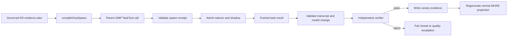

# YURI MoE Model Admission and GPT-5.6 Context Correction

**Date:** 2026-07-12  
**Status:** Approved design  
**Owner:** Marcel Spatz

## Objective

Admit these exact worker routes into YURI's MoE only after live OMP execution proves them:

| Provider surface | Requested model | Canonical selector target |
|---|---|---|
| Ollama Cloud | DeepSeek V4 Flash | `ollama-cloud/deepseek-v4-flash:cloud` |
| Ollama Cloud | Kimi K2.7 Code | `ollama-cloud/kimi-k2.7-code:cloud` |
| Ollama Cloud | Nemotron 3 Ultra | `ollama-cloud/nemotron-3-ultra:cloud` |
| OpenAI/Codex OAuth | GPT-5.6 Luna | `openai-codex/gpt-5.6-luna` |
| z.ai | GLM-5.1 | `zai/glm-5.1` |
| Cursor | Composer 2.5 | exact live-discovered Cursor selector, expected `cursor/composer-2.5` or its catalog-normalized equivalent |
| Cursor | Grok 4.5 | exact live-discovered Cursor selector, expected `cursor/grok-4.5` or its region-qualified catalog equivalent |

The work also corrects YURI's local GPT-5.6 context metadata without routing OpenAI models through Cursor.

## Confirmed Current State

1. The seven requested worker routes are not currently admitted. Existing candidate routes fail closed as `unproven_route`, are absent from the provider route registry, or have no generated executable card.
2. Candidate role cards resolve to `disabled/mure-route-unavailable`. Several requested routes are also absent from the native dispatch `WORKER_BINDINGS` allowlist.
3. The MURE native dispatch boundary is stale relative to the current OMP TaskTool contract:
   - `compileOmpSpawn` emits top-level `agent` and `tasks[0].assignment/id/description/role`.
   - The active TaskTool requires each entry to carry `task`, `name`, and `agent`.
   - No parent-adapter translation currently bridges these shapes.
4. Official OpenAI model documentation specifies the same limits for Sol, Terra, and Luna:
   - context window: **1,050,000 tokens**
   - maximum input: **922,000 tokens**
   - maximum output: **128,000 tokens**
5. OMP's cached `openai-codex` catalog currently reports **372,000** context tokens for all three GPT-5.6 tiers. Its Cursor entries report **200,000**. YURI's default OpenAI binding uses `openai-codex`, not Cursor.
6. OMP supports a user-level `models.yml` override at `providers.<provider>.modelOverrides.<model>.contextWindow`; model overrides are re-applied after runtime discovery.
7. The official OpenAI API limit does not, by itself, prove that OMP's `openai-codex` OAuth transport serves the same window. Raising local metadata before proving the transport limit could delay compaction beyond the backend's real cap and cause hard mid-session failures.

## Sources of Truth

Admission is governed by these layers, in order:

1. A real OMP child dispatch and pushed completion.
2. Receipt and transcript validation by the MURE parent adapter.
3. Independent verifier success for the R2 canary.
4. `provider-route-registry.json` with admissible, model-matching canary evidence and no later failed canary.
5. Generated MURE projection and `task.disabledAgents` state.

Catalog presence, direct HTTP success, provider marketing, and previous-session anecdotes are not admission evidence.

Official GPT-5.6 limits:

- [GPT-5.6 Sol](https://developers.openai.com/api/docs/models/gpt-5.6-sol)
- [GPT-5.6 Terra](https://developers.openai.com/api/docs/models/gpt-5.6-terra)
- [GPT-5.6 Luna](https://developers.openai.com/api/docs/models/gpt-5.6-luna)

## Approaches Considered

### A. Governed bootstrap and admission — selected

Repair the native parent-to-TaskTool contract, add purpose-limited bootstrap cards, execute each candidate as an R2 OMP evidence task, admit only transcript-proven routes, and regenerate normal role cards.

This preserves the registry's meaning: `canary-proven` means the exact OMP route executed successfully under the current harness.

### B. Direct provider probes followed by manual promotion — rejected

A direct provider HTTP request or vendor CLI invocation can establish provider reachability but does not prove OMP agent-card resolution, TaskTool dispatch, transcript capture, tool availability, or model identity. It therefore cannot satisfy Yuri's admission contract.

### C. Promote from catalog declarations — rejected

Writing `canary-proven` entries from static catalog claims would make the dashboard green without proving the runtime. This violates the fail-closed provider route policy.

## Architecture

### 1. Current TaskTool contract repair

Update the native compiler and parent adapter so every compiled spawn is directly valid for the active OMP TaskTool:

```text
legacy compiled unit
  agent: <card-id>
  tasks[0]: { assignment, id, description, role }

current TaskTool unit
  tasks[0]: { task, name, agent }
```

The change must preserve:

- exactly one dispatched unit per TaskTool call;
- parent-session-only TaskTool invocation;
- deterministic task naming and correlation;
- strict worker allowlisting;
- Sol/Yuri child-worker prohibition;
- accepted-receipt admission before completion handling;
- transcript model-match enforcement;
- reducer/shadow lockstep;
- pushed completion handling with no polling.

Because these modules are load-bearing, GitNexus impact analysis and the adjacent native-dispatch tests are required before mutation.

### 2. Purpose-limited bootstrap cards

Normal candidate cards cannot execute because the admission projection intentionally disables unproven routes. The bootstrap path must therefore be explicit rather than silently bypassing the gate.

For each exact requested selector:

1. Add or update the canonical catalog mapping.
2. Add the corresponding native `WORKER_BINDINGS` entry.
3. Generate an isolated canary card bound to that exact model.
4. Restrict the card to `purpose: evidence`; it must not be selectable for ordinary producer work.
5. Keep the normal role card disabled until promotion.
6. Remove or disable the bootstrap card after the route reaches a terminal admission result.

A fresh OMP session is required after card/config projection changes because `task.disabledAgents` and model bindings are startup-loaded.

### 3. Native R2 canary lifecycle

Each route is canaried separately through the user-invoked MURE native dispatch loop:



A successful producer completion must include:

- TaskTool status `completed`;
- a valid admitted job ID and agent ID;
- exactly one transcript session event;
- exactly one transcript `model_change` matching the requested selector;
- at least one thinking-level event;
- the required canary result label/evidence;
- independent verifier verdict `{"verdict":"pass"}`.

Availability, transport, quota, rate-limit, timeout, and authentication failures follow the reducer's availability-fallback rules. Semantic or model-mismatch failures fail loud. A later failed canary blocks admission until a newer successful canary is observed.

### 4. Registry promotion and projection

For each successful route:

1. Persist the exact observed canary fields in `_SYSTEM/config/provider-route-registry.json`.
2. Set the route to `canary-proven` only when `isAdmissibleCanaryEvidence` accepts the evidence.
3. Preserve any failed-latest event so stale historical success cannot mask current failure.
4. Add missing catalog/provider mappings, including the exact live-discovered Grok 4.5 selector.
5. Run the MURE sync generator.
6. Verify the normal card resolves to the intended model rather than `disabled/mure-route-unavailable`.
7. Verify the card is absent from `task.disabledAgents` in the generated project config.

Failed routes remain catalogued but disabled, with their concrete failure reason recorded. Scope is never silently reduced from "all requested routes" to "whatever happened to pass."

### 5. GPT-5.6 context-window investigation and conditional correction

Treat the OpenAI API specification and OMP's `openai-codex` transport as separate evidence surfaces.

1. Trace the installed pi-catalog source, package version, and upstream provenance for the existing `372000` value. Determine whether it is an intentional Codex OAuth serving cap or stale metadata.
2. Query any supported, non-secret Codex/OMP model-catalog surface that reports the active transport's limit.
3. Compare that evidence with the official OpenAI API specification of 1,050,000 context / 922,000 maximum input / 128,000 maximum output.
4. Do not infer the `openai-codex` transport limit from Cursor. Cursor is a separate provider and serving surface.
5. If direct evidence establishes that `openai-codex` supports 1,050,000 tokens, create `~/.omp/agent/models.yml` with:

```yaml
providers:
  openai-codex:
    modelOverrides:
      gpt-5.6-sol:
        contextWindow: 1050000
      gpt-5.6-terra:
        contextWindow: 1050000
      gpt-5.6-luna:
        contextWindow: 1050000
```

6. After a fresh OMP session, verify the overridden runtime metadata and run a safe boundary test proving the transport accepts input beyond 372,000 tokens before allowing compaction thresholds to rely on 1,050,000. Any high-usage live boundary probe requires an explicit, bounded payload and must not expose repository or user data.
7. If the transport cap remains 372,000 or cannot be established safely, do not write the override. Report the official API-versus-Codex-transport distinction as the resolved explanation and keep the conservative runtime limit.

The correction, when proven, changes only OMP's local metadata for the provider YURI actually uses. It never reroutes OpenAI requests through Cursor, ZenMux, or another provider, and it keeps the existing 128,000 output limit.

## Error Handling and Safety

- **Schema mismatch:** block dispatch until compiler/adapter tests prove the current TaskTool shape.
- **Unknown or drifted model ID:** fail closed; do not normalize to a nearby model silently.
- **Disabled or missing card:** block the canary and repair bootstrap projection; do not substitute the parent/default model.
- **Receipt/transcript mismatch:** fail loud and do not write canary evidence.
- **Quota or availability failure:** record the failed latest canary and keep the route disabled.
- **Verifier rejection:** run only the reducer-selected quality escalation; do not self-retry outside the state machine.
- **Context limit unproven or contradicted:** keep the conservative 372,000 runtime value; never raise compaction thresholds from API documentation alone.
- **Provider auth:** use existing authenticated provider surfaces. Never read or expose credentials.

## Verification

### Focused unit and integration checks

1. Native compiler emits the active TaskTool schema.
2. Parent adapter admits a valid receipt and rejects malformed/mismatched receipts.
3. Pushed completion translation correlates by admitted job ID.
4. Transcript validation rejects missing, duplicate, or mismatched model-change events.
5. R2 producer success chains to an independent verifier.
6. Verifier reject follows quality escalation; verifier pass reaches terminal acceptance.
7. Bootstrap cards cannot execute ordinary producer tasks.
8. Registry validation accepts only complete, model-matching evidence.
9. Resolver and projection enable only successful requested routes.
10. Generated `disabledAgents` contains every failed route and none of the admitted routes.
11. Provenance establishes whether 372,000 is stale metadata or an intentional `openai-codex` transport cap.
12. If and only if the transport supports it, runtime metadata and a bounded boundary test confirm operation beyond 372,000 before accepting the 1,050,000 override.
13. Negative checks prove no OpenAI route resolves through Cursor.

### Focused command families

- Native dispatch and boundary unit tests beside the four MURE modules.
- Provider route registry and OMP model resolver tests.
- MURE fleet validation, projection sync check, and generated-config consistency checks.
- One live R2 canary per requested route, driven only by the parent TaskTool and pushed results.

Project-wide suites are not required unless focused checks expose propagation beyond the touched surfaces.

## Sequencing

1. **Repair the native dispatch boundary before bootstrap cards.** Bootstrap work would otherwise target a TaskTool payload the current runtime rejects.
2. **Project bootstrap cards before live canaries.** Candidate normal cards are deliberately disabled, and OMP card/config state loads at session startup.
3. **Run live canaries before registry promotion.** Promotion without execution evidence would corrupt the admission gate.
4. **Promote routes before regenerating normal cards.** Projection derives executability from registry state.
5. **Regenerate and restart before runtime verification.** The active OMP session does not hot-reload all card and disabled-agent settings.
6. **Run adversarial verification before commit/push.** First-run success is evidence to attack, not a shipping verdict.

## Acceptance Criteria

The work is complete only when all of the following are directly observed:

- the native parent adapter emits and accepts the current TaskTool payload;
- all seven requested exact selectors have live OMP canary attempts;
- every successful route has current, admissible registry evidence and no later failure;
- every requested route is executable in normal MURE projection; any live provider failure is recorded with exact evidence and blocks completion rather than silently shrinking scope;
- DeepSeek Flash, Kimi K2.7 Code, Nemotron 3 Ultra, Luna, GLM-5.1, Composer 2.5, and Grok 4.5 are present in the MoE catalog and role topology;
- normal cards for admitted routes no longer use the disabled sentinel and are not listed in `task.disabledAgents`;
- the GPT-5.6 context discrepancy is resolved with provenance: Sol, Terra, and Luna report 1,050,000 through `openai-codex` only if the transport is directly proven beyond 372,000; otherwise the conservative 372,000 cap remains and the API/transport distinction is documented;
- no OpenAI model is routed through Cursor;
- focused tests, negative checks, projection checks, and the adversarial audit pass;
- repo changes are committed and pushed with explicit pathspecs; any proven user-level OMP override is separately verified because it is not tracked by git.
