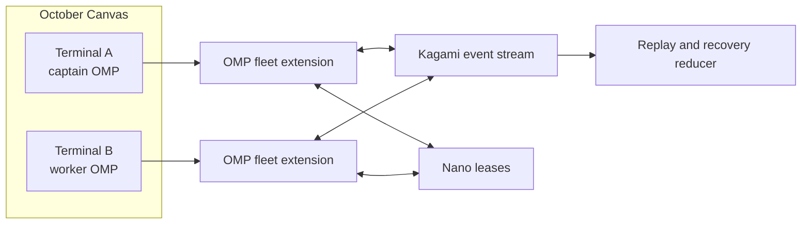
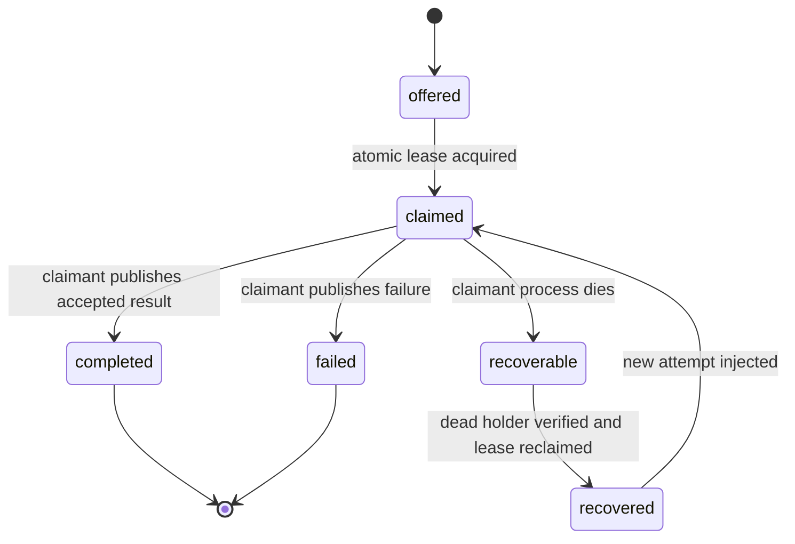

# October OMP Two-Terminal Fleet Bridge

**Date:** 2026-07-15  
**Status:** Approved design  
**Owner:** Marcel Spatz

## Objective

Prove that two independent, normal OMP TUI processes running in separate October terminals can collaborate without manual copy/paste, an OMP core patch, tmux injection, a network service, or replacement of the normal TUI.

Phase 1 is successful only when the two OMP processes:

1. discover one another inside the same canonical project scope;
2. exchange an acknowledged peer message;
3. offer, atomically claim, and complete one task;
4. preserve normal OMP idle/streaming behavior;
5. recover peer identity, pending messages, and an unfinished task after one process restarts;
6. reject duplicate live peer identities and cross-project events;
7. expose every transition as durable, inspectable evidence.

The initial peers are:

| Fleet ID | Role | Startup command |
|---|---|---|
| `captain` | Goal ownership, task offers, acceptance | `YURI_FLEET_ID=captain omp` |
| `worker` | Task claim, execution, result publication | `YURI_FLEET_ID=worker omp` |

The two processes remain independent OMP sessions with independent model context. Either process may still use OMP's in-process `task` fleet for its own subagents.

## Confirmed Current State

### OMP process boundary

1. OMP IRC uses a process-global in-memory `IrcBus` and `AgentRegistry`; separate OMP processes cannot discover or message each other's agents.
2. OMP `task` subagents are child `AgentSession` instances inside one parent process and can communicate through the process-global IRC bus.
3. OMP `/collab` shares one authoritative host session with guest replicas. It does not create independent collaborating main agents.
4. OMP `launch` shares managed processes, names, logs, and state across OMP instances in one canonical project scope, but it is not an agent message bus.
5. OMP RPC mode can host structured independent sessions, but it replaces the ordinary interactive TUI with a JSONL host protocol.

### Extension seam

The installed OMP extension contract confirms that a project extension can:

- register tools, slash commands, event handlers, and message renderers;
- receive asynchronous local events after runtime initialization;
- call `pi.sendMessage(...)` or `pi.sendUserMessage(...)`;
- start an agent turn while idle with `triggerTurn: true`;
- queue a follow-up while the agent is streaming;
- persist extension state through custom session entries;
- close resources during `session_shutdown`.

Project extensions are discovered from `<cwd>/.omp/extensions`. Discovery is cwd-scoped and does not walk parent directories, so both terminals must start from the repository root for Phase 1.

### Reusable YURI primitives

YURI already has the two substrate primitives the bridge needs:

| Primitive | Existing path | Reuse |
|---|---|---|
| Durable append-only event stream | `_SYSTEM/Scripts/kagami-event-bus.mjs` | Peer messages, acknowledgements, task lifecycle, recovery replay |
| Atomic cross-process lease | `_SYSTEM/Scripts/nano-lease.mjs` | Duplicate peer rejection, liveness, task ownership, crash reclaim |

Relevant Kagami exports include `appendKagamiEvent`, `readKagamiEventsSince`, `buildKagamiEvent`, and `rotateEventLog`.

Relevant nano-lease exports include `acquireLease`, `renewLease`, `releaseLease`, `reclaimLeases`, and `inspectLeases`.

`_SYSTEM/runtime/session-conductor.mjs` and `_SYSTEM/Scripts/worker-bridge.mjs` contain useful historical terminal-management patterns but are not the Phase 1 transport. October terminals are not inherently tmux-managed, and blind key injection would discard OMP's structured extension lifecycle.

## Sources of Truth

Implementation and verification follow this order:

1. Live two-process October/OMP smoke behavior.
2. Installed OMP runtime documentation:
   - `omp://extensions.md`
   - `omp://extension-loading.md`
   - `omp://tools/irc.md`
   - `omp://tools/task.md`
   - `omp://tools/launch.md`
   - `omp://collab.md`
   - `omp://rpc.md`
3. Direct current YURI source for the Kagami bus and nano-lease contracts.
4. Unit tests for the pure protocol reducer and cursor/idempotency behavior.
5. This design document.

October's visual connection lines are not a source of truth for delivery. No public October contract proves that a canvas edge routes terminal messages.

## Approaches Considered

### A. OMP extension + Kagami events + nano-lease — selected

A project extension runs inside both ordinary OMP TUIs. It tails a durable shared event stream, injects addressed messages through OMP's supported extension API, and uses nano-lease for exclusive identities and task claims.

This preserves the desired October experience while reusing existing YURI substrate primitives.

### B. OMP RPC supervisor — rejected for Phase 1

RPC provides structured prompting, lifecycle events, host tools, and state inspection. It is a strong future substrate for headless agents, but it replaces the ordinary OMP TUI and would require an additional UI host before it fits October's visible-terminal workflow.

### C. OMP `IrcBus` transport patch — rejected unless the extension seam fails

Adding a cross-process transport under `IrcBus` would give elegant native semantics, but it creates an OMP maintenance fork or upstream patch. The installed extension API already supplies idle wake and streaming follow-up behavior, so a core change has not earned its blast radius.

### D. MCP-only message broker — rejected

MCP tools are model-invoked and therefore pull-based. An MCP server cannot independently wake an idle OMP session. MCP may expose fleet data later, but it cannot satisfy the Phase 1 push-delivery requirement alone.

### E. Tmux/session-conductor key injection — rejected

October terminals are not guaranteed to be tmux sessions. Key injection is sensitive to focus and terminal state, cannot provide structured acknowledgements, and would recreate the blind-terminal failure in a more elaborate costume.

### F. New daemon or TCP service — rejected for Phase 1

Both OMP processes run on the same machine and share the YURI repository. A new server, port, authentication surface, and process lifecycle are unnecessary for the two-terminal proof. The design may graduate to a broker only if measured event-stream contention or platform limitations justify it.

## Architecture



The design introduces no direct process-to-process connection. Each extension communicates through the durable event stream and observes exclusivity through nano-lease.

## Components

### 1. Project OMP extension

Proposed path:

```text
.omp/extensions/fleet-bridge.ts
```

Responsibilities:

- validate project scope and fleet identity during `session_start`;
- acquire and renew the peer identity lease;
- watch the Kagami event stream and reconcile from the durable cursor;
- filter, deduplicate, acknowledge, render, and inject addressed events;
- register the model-callable fleet tool;
- register human-facing fleet slash commands;
- publish peer, message, task, and recovery events;
- release resources during `session_shutdown`;
- preserve ordinary OMP behavior when the bridge is unavailable.

The extension must not contain task-state reconstruction logic beyond invoking the pure protocol module.

### 2. Pure fleet protocol module

Proposed path:

```text
_SYSTEM/Scripts/omp-fleet-protocol.mjs
```

Responsibilities:

- closed event-kind constants;
- event validation and normalization;
- canonical project identity;
- message and task envelope construction;
- event filtering by project and recipient;
- deterministic event folding into peer/message/task state;
- acknowledgement tracking;
- bounded event-ID deduplication;
- recovery decision calculation;
- authorization checks by role;
- size and field validation.

The pure module performs no OMP session calls and starts no timers. This keeps protocol behavior deterministically testable.

### 3. Protocol tests

Proposed path:

```text
_SYSTEM/Scripts/omp-fleet-protocol.test.mjs
```

Tests defend observable contracts: identity exclusivity, event ordering, deduplication, acknowledgement state, task transitions, restart reconstruction, terminal-state invariants, and project isolation.

### 4. Two-process smoke harness

Proposed path:

```text
_SYSTEM/Scripts/omp-fleet-smoke.mjs
```

The harness checks substrate behavior that a pure reducer cannot prove: two independent processes, live extension loading, idle wake, streaming follow-up, atomic claim, and restart recovery.

The final acceptance is still exercised in two visible October terminals. The harness supports deterministic local reproduction; it does not replace the user-visible smoke.

## Identity and Project Scope

### Canonical project ID

Every bridge event and lease is scoped to a canonical project ID derived from the repository root's real path. Symlink aliases must resolve to the same project ID. Two unrelated repositories must never share peers, messages, or task leases even when their fleet IDs match.

If the existing OMP launch project-scope helper is publicly reusable, the bridge should use it. Otherwise the protocol module must reproduce its canonical-realpath behavior explicitly and cover symlink equivalence in tests.

### Stable fleet ID

`YURI_FLEET_ID` is the human-stable logical identity:

```text
captain
worker
```

Allowed IDs are lowercase alphanumeric words separated by single hyphens, with a bounded length. Missing or invalid IDs disable the bridge with a visible diagnostic; they do not prevent OMP from starting.

### Per-process lease owner ID

The nano-lease resource uses the stable fleet ID:

```text
fleet-peer:<projectId>:<fleetId>
```

The nano-lease owner (`nanoId`) must be unique to the live process:

```text
<fleetId>:<pid>:<processUuid>
```

The process UUID is generated at extension startup and is never reused.

This distinction is mandatory. `renewLease` and `releaseLease` authenticate by exact `nanoId`; using only `worker` would let a second duplicate process renew the first process's lease. With a unique owner ID, a duplicate live `YURI_FLEET_ID` receives the existing `heldBy` owner and fails closed. After a crash, dead-holder detection permits the restarted process to reclaim the stable fleet resource with a new owner ID.

Lease metadata must include at least:

- `fleetId`;
- `pid`;
- `processUuid`;
- `projectId`;
- OMP session ID when available;
- acquisition timestamp.

### Phase 1 runtime constants

Phase 1 uses fixed, test-visible constants rather than environment-tuned behavior:

| Constant | Value | Purpose |
|---|---:|---|
| Peer lease TTL | 20 seconds | Bound stale presence after an ungraceful exit |
| Peer/task lease renewal interval | 5 seconds | Maintain liveness with four missed renewals before TTL |
| Cursor reconciliation interval | 2 seconds | Recover coalesced or missed filesystem notifications |
| Inline peer-message body | 8 KiB maximum | Keep the event stream bounded |
| Inline task contract/result summary | 32 KiB maximum | Permit complete contracts while routing large output through artifacts |
| Artifact URIs | 16 maximum, 2,048 characters each | Bound envelope size and parsing work |
| Recent event-ID deduplication set | 4,096 IDs | Cover replay/rotation without unbounded memory growth |

Dead-holder detection may allow safe lease reclaim before the TTL expires. The TTL is the fallback, not permission to steal a lease from a holder still reported alive.

These values may change only from measured smoke evidence or a later approved design; Phase 1 does not add configuration knobs.

## Event Contract

### Closed event kinds

Phase 1 admits only:

```text
fleet.peer.joined
fleet.peer.left
fleet.message.sent
fleet.message.acknowledged
fleet.task.offered
fleet.task.claimed
fleet.task.completed
fleet.task.failed
fleet.task.recovered
```

Unknown `fleet.*` kinds fail validation and are not injected.

### Common envelope

Every event contains:

```json
{
  "type": "fleet.message.sent",
  "id": "event-id",
  "projectId": "canonical-project-id",
  "traceId": "bridge-proof-001",
  "from": "captain",
  "to": "worker",
  "createdAt": "2026-07-15T15:00:00.000Z",
  "payload": {}
}
```

Common constraints:

- `id` is globally unique;
- `projectId`, `from`, and `to` are validated identifiers;
- `traceId` is required for messages and tasks;
- timestamps are normalized ISO-8601 UTC strings;
- payloads have per-kind schemas;
- message bodies and inline results have strict byte caps;
- larger outputs travel through artifact URIs rather than event payloads;
- secrets and raw environment values are prohibited.

### Peer events

`fleet.peer.joined` records successful lease acquisition. It does not grant identity by itself; the lease is authoritative for live ownership.

`fleet.peer.left` records graceful shutdown. Absence of this event does not imply liveness because crashes may skip shutdown.

### Message events

`fleet.message.sent` payload:

```json
{
  "messageId": "msg-001",
  "body": "Reply with BRIDGE-7319.",
  "replyTo": null,
  "artifactUris": [],
  "authority": "peer"
}
```

`fleet.message.acknowledged` payload:

```json
{
  "messageId": "msg-001",
  "recipient": "worker",
  "disposition": "injected"
}
```

Acknowledgement means the recipient extension accepted and injected the message. It does not mean the model completed a reply.

### Task events

`fleet.task.offered` contains the task ID, target peer, complete task contract, and acceptance criteria.

`fleet.task.claimed` is valid only after the claimant acquires:

```text
fleet-task:<projectId>:<taskId>
```

`fleet.task.completed` and `fleet.task.failed` are accepted only from the active claimant. Completion carries a bounded summary and artifact URIs.

`fleet.task.recovered` records a restart recovery decision, the prior attempt, the new attempt number, and the evidence that made recovery safe.

## Cursor, Rotation, and Idempotency

The Kagami reader contract requires both cursor dimensions:

```text
afterId
and
afterTs
```

The bridge must pass both to `readKagamiEventsSince` and independently deduplicate by event `id`. An `afterId`-only cursor is prohibited because rotation may drop or replay events around segment boundaries.

Each live extension keeps:

- latest accepted `afterId`;
- latest accepted `afterTs`;
- a bounded recent-event ID set;
- acknowledged message IDs;
- injected task-attempt IDs.

The extension persists the durable cursor and protocol snapshot through an OMP custom session entry. On startup it rebuilds from the event stream before accepting new delivery.

Delivery rule:

> The same message ID or task-attempt ID must never be injected twice into one live OMP session.

Filesystem notifications are an acceleration signal, not the source of truth. The source of truth is the cursor-based read. The extension performs:

1. immediate reconciliation at startup;
2. reconciliation when the event-bus directory reports create, rename, or modify activity, so log rotation does not strand a watcher on an old inode;
3. low-frequency reconciliation as missed-notification recovery;
4. final best-effort acknowledgement flush during shutdown.

Rotation and concurrent append behavior must be exercised in protocol tests.

## Delivery Semantics

### Idle recipient

When the recipient is idle, the extension injects a typed custom fleet message and starts a genuine turn using the supported extension action with `triggerTurn: true`.

### Streaming recipient

A normal incoming peer message must use follow-up delivery. It must not interrupt active work or abort remaining tool calls.

Urgent steering and cancellation are outside Phase 1. No event kind may select `deliverAs: "steer"` until a later design defines authority and interruption policy.

### Typed authority

Peer traffic is rendered and presented as peer traffic. It must never be injected as:

- a system message;
- an owner instruction;
- a hidden policy message;
- raw terminal input;
- executable shell text.

The message shown to the model includes sender, trace ID, message kind, body, and the expected reply route. Existing owner, safety, protected-path, and mutation rules remain authoritative.

### Delivery failure

If injection fails, the extension emits no acknowledgement and records a visible local diagnostic. The sender sees the message as pending or undelivered. The bridge does not silently mark failed delivery as success.

## Fleet Tool and Slash Commands

### Model-callable tool

Register one tool named `fleet` with a closed operation union:

```text
peers
send
offerTask
claimTask
completeTask
failTask
status
```

The tool validates role authority before emitting events or acquiring leases.

Role rules for Phase 1:

| Operation | Captain | Worker |
|---|---:|---:|
| List peers/status | Yes | Yes |
| Send peer message | Yes | Yes |
| Offer task | Yes | No |
| Claim task targeted to self | No | Yes |
| Complete/fail owned task | No | Yes |

### Human commands

Register:

```text
/fleet-status
/fleet-peers
/fleet-send <peer> <message>
/fleet-task <peer> <task>
/fleet-inbox
/fleet-leave
```

Commands use the same protocol functions as the model tool. There is one implementation path for validation, authorization, and event construction.

## Task State Machine



Invariants:

1. A task has at most one live claimant.
2. Only the active lease owner may complete or fail a task.
3. `completed` and `failed` are terminal.
4. A terminal task is never auto-reexecuted.
5. A restart does not imply automatic recovery; dead-holder and event evidence must agree.
6. Ambiguous execution state becomes `needs-review` in the reconstructed view and is not reinjected automatically.
7. Each recovery increments the attempt number and uses a new attempt ID.

## Restart Recovery

On extension startup:

1. validate `YURI_FLEET_ID` and canonical project scope;
2. generate a new process UUID and unique `nanoId`;
3. acquire or safely reclaim the stable peer lease;
4. reject startup bridge activation when another live holder owns the same fleet ID;
5. read the Kagami stream with the full cursor contract;
6. reconstruct peer, message, acknowledgement, and task state;
7. replay unacknowledged messages addressed to this peer once;
8. inspect tasks previously claimed by this stable fleet ID;
9. verify the old process holder is dead and the task has no terminal event;
10. reclaim the task lease;
11. emit `fleet.task.recovered` with a new attempt ID;
12. inject the recovered task once.

If the old holder appears live, recovery is refused. If the event history cannot prove a safe state, recovery is refused and the task is surfaced for manual review.

## Rendering and Operator UX

Register a custom renderer for fleet messages and task events. A message should show:

```text
Fleet message  captain → worker
Trace          bridge-proof-001
Message        Reply with BRIDGE-7319.
Delivery       injected
```

A recovered task should show:

```text
Fleet task recovered
Task           launch-broker-audit
Previous peer  worker
Attempt        2
Reason         prior process dead; no terminal task event
```

`/fleet-status` must show:

- current fleet ID and process owner ID;
- canonical project ID;
- peer lease state;
- event cursor timestamp and ID;
- pending/unacknowledged message count;
- owned/open task count;
- last reconciliation time;
- extension errors.

No October-specific API is required. October supplies the two terminal surfaces and preserves their startup commands.

## Security and Trust Boundaries

1. **Local filesystem only.** Phase 1 opens no TCP port and accepts no remote traffic.
2. **Project isolation.** Every event and lease is scoped by canonical project ID.
3. **Peer authority only.** Peer messages cannot override owner/system instructions.
4. **No transport execution.** The bridge never passes event text to a shell or terminal input function.
5. **Bounded payloads.** Large output uses artifact URIs; malformed or oversized events are rejected.
6. **No secret propagation.** Environment values, credentials, and collab links are prohibited event content.
7. **Duplicate peer rejection.** A live stable fleet ID can have exactly one unique process owner.
8. **Normal OMP gates remain active.** Tool approvals, protected paths, role constraints, and mutation policy apply to work initiated through the bridge.
9. **Captain authority is bounded.** Captain may offer work but cannot bypass the worker's normal OMP safety and tool gates.
10. **Extension failure degrades safely.** Bridge activation may fail without preventing the base OMP session from operating; failure is visible and no delivery is acknowledged.

## Error Handling

| Failure | Required behavior |
|---|---|
| Missing/invalid `YURI_FLEET_ID` | Disable bridge, show diagnostic, leave OMP usable |
| Duplicate live fleet ID | Reject bridge activation with current holder evidence |
| Kagami append failure | Return tool/command error; do not claim send success |
| Cursor read failure | Keep prior cursor, surface degraded status, retry reconciliation |
| Malformed/unknown event | Reject and log event ID; do not inject |
| Recipient absent | Leave message pending/undelivered; expose in status |
| Message injection failure | Do not acknowledge |
| Task lease held | Return current holder; do not emit claimed event |
| Lease renew failure | Mark peer degraded and stop accepting new tasks |
| Ambiguous restart state | Mark `needs-review`; do not reinject |
| Shutdown timeout | Best-effort release only; TTL/dead-holder reclaim remains authoritative |

## Verification Strategy

### Unit contracts

Tests must cover:

1. stable fleet ID versus unique process owner ID;
2. duplicate live identity rejection;
3. dead-holder restart reclaim;
4. canonical project isolation, including symlink aliases;
5. event-kind schema rejection;
6. `afterId` plus `afterTs` cursor progression;
7. event-ID deduplication across rotation/replay;
8. message acknowledgement semantics;
9. out-of-order acknowledgement reconstruction;
10. task claim exclusivity;
11. claimant-only completion;
12. terminal-state immutability;
13. safe recovery versus ambiguous `needs-review`;
14. bounded payload rejection;
15. unauthorized worker task offers.

Tests must defend behavior rather than inspect source text.

### Live two-terminal smoke

#### Gate A: discovery

- Start captain and worker in separate October terminals at the repository root.
- Both list the other peer.
- A third process started with `YURI_FLEET_ID=worker` is rejected while the first worker is alive.

#### Gate B: acknowledged message round trip

- Captain sends `Reply with BRIDGE-7319.` to worker.
- Idle worker begins a turn without manual input.
- Worker replies through the fleet tool.
- Captain receives the reply and both sides show acknowledgement evidence.

#### Gate C: streaming behavior

- Worker starts a multi-step task.
- Captain sends a normal message while worker streams.
- The message becomes a follow-up and does not interrupt active tool execution.

#### Gate D: atomic task lifecycle

- Captain offers one task to worker.
- Worker claims the task.
- A competing claim fails with holder evidence.
- Worker completes the task with a result artifact.
- Captain observes the terminal completion state.

#### Gate E: restart recovery

- Worker claims a nonterminal task.
- Worker process is stopped.
- Worker restarts with the same stable fleet ID and a new process owner ID.
- Dead-holder evidence permits peer and task lease reclaim.
- The task is recovered once with attempt 2.
- Previously acknowledged messages and terminal tasks are not replayed.

#### Gate F: isolation and negative cases

- Another project cannot see or consume the events.
- Unknown peer messages remain undelivered.
- Malformed and oversized events are rejected.
- Peer text resembling a shell command is displayed as content and never executed by transport.
- Bridge failure leaves normal OMP interaction operational.

## Implementation Boundary

Phase 1 may add only:

```text
.omp/extensions/fleet-bridge.ts
_SYSTEM/Scripts/omp-fleet-protocol.mjs
_SYSTEM/Scripts/omp-fleet-protocol.test.mjs
_SYSTEM/Scripts/omp-fleet-smoke.mjs
```

Existing Kagami and nano-lease modules may be changed only when direct evidence proves a missing capability that cannot be supplied by the bridge adapter. Such a change requires separate impact analysis and explicit design amendment.

Phase 1 must not add:

- an OMP core patch;
- a network daemon;
- a new database;
- tmux as a runtime requirement;
- October automation or private API integration;
- five-peer role routing;
- worktree/path ownership policy beyond recording artifact references;
- remote-machine support;
- automatic urgent steering or cancellation;
- automatic task reassignment after ambiguous failure.

## Scale-Out Boundary

The two-terminal proof precedes the five-terminal fleet because later roles depend on verified delivery, ownership, and recovery semantics. Scaling before those invariants hold would multiply duplicate work, conflicting ownership, and lost-message failure modes while hiding the transport defect under more agents.

After Phase 1 passes, a separate design may add:

```text
captain
architect
builder
researcher
verifier
```

That design must cover per-role model routing, isolated writer worktrees, path claims, dependency-aware task scheduling, captain-only integration, and an October fleet status surface. None of those concerns may enter the Phase 1 implementation by convenience.